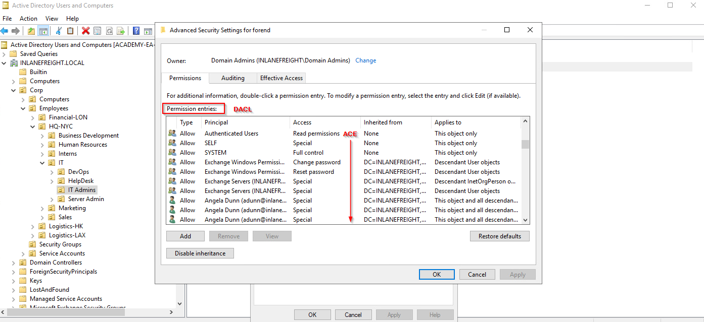
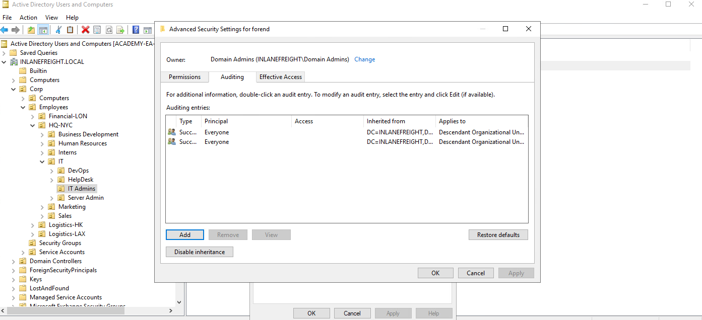
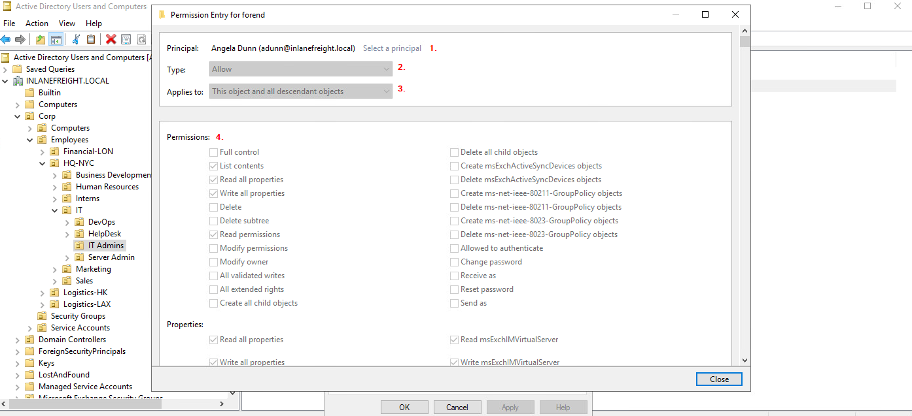
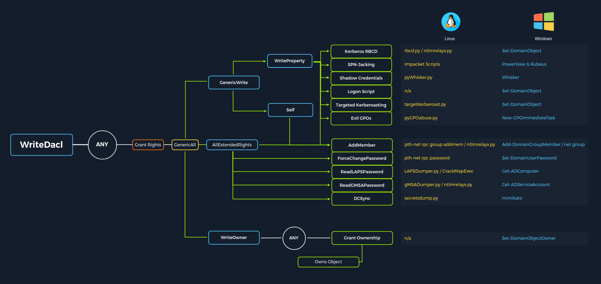

# Access Control List (ACL) (THEORIE)

***

### <mark style="color:red;">Access Control List (ACL) Overview</mark>

Dans leur forme la plus simple, les <mark style="color:orange;">**ACLs (Access Control Lists)**</mark> sont des listes qui définissent :\
a) **Qui** a accès à quelle ressource ou quel actif.\
b) **Le niveau d'accès** qui leur est attribué.

Les paramètres définis dans une ACL sont appelés <mark style="color:orange;">**ACE (Access Control Entries)**</mark>. Chaque **ACE** est associée à un utilisateur, un groupe ou un processus (**appelé aussi principal de sécurité**) et spécifie les droits accordés à ce principal.

Chaque objet possède une ACL, mais peut contenir **plusieurs ACEs**, car plusieurs utilisateurs ou groupes peuvent y avoir accès. De plus, les ACLs peuvent également être utilisées pour **auditer l'accès** aux objets dans Active Directory.

#### <mark style="color:green;">Il existe deux types d'ACLs :</mark>

1. <mark style="color:orange;">**Discretionary Access Control List (DACL)**</mark>
   * Détermine **quels utilisateurs, groupes ou processus** ont accès à un objet, ou en sont exclus.
   * Elle est constituée d'ACEs qui **autorisent ou refusent** l'accès.
   * Lorsqu'un utilisateur tente d'accéder à un objet, le système vérifie la **DACL** pour savoir si l'accès est autorisé.
   * **Si aucune DACL n'existe pour un objet**, tous les utilisateurs ont un accès **complet**.
   * **Si une DACL existe mais ne contient aucune ACE**, alors **tous les accès sont refusés**.
2. <mark style="color:orange;">**System Access Control List (SACL)**</mark>
   * Permet aux administrateurs **d'enregistrer** les tentatives d'accès aux objets sécurisés, afin d'assurer un suivi et une surveillance.

#### <mark style="color:green;">Exemple d'ACL sur un compte utilisateur</mark>

Dans l'image mentionnée, on voit l'ACL associée au compte utilisateur **forend**.

* Chaque **entrée sous "Permission entries"** constitue la **DACL** du compte utilisateur.
* Chaque **ACE individuelle** (par exemple **Full Control** ou **Change Password**) indique les droits accordés à différents utilisateurs et groupes sur cet objet utilisateur.

<mark style="color:orange;">**Viewing forend's ACL**</mark>

<figure><figcaption></figcaption></figure>

The SACLs can be seen within the `Auditing` tab.

<mark style="color:orange;">**Viewing the SACLs through the Auditing Tab**</mark>

<figure><figcaption></figcaption></figure>

***

### <mark style="color:red;">Access Control Entries (ACEs)</mark>

As stated previously, Access Control Lists (ACLs) contain ACE entries that name a user or group and the level of access they have over a given securable object. There are **`three` main types of ACEs** that can be applied to all securable objects in AD:

<table data-header-hidden data-full-width="true"><thead><tr><th></th><th></th></tr></thead><tbody><tr><td><strong>ACE</strong></td><td><strong>Description</strong></td></tr><tr><td><code>Access denied ACE</code></td><td>Used within a DACL to show that a user or group is explicitly denied access to an object</td></tr><tr><td><code>Access allowed ACE</code></td><td>Used within a DACL to show that a user or group is explicitly granted access to an object</td></tr><tr><td><code>System audit ACE</code></td><td>Used within a SACL to generate audit logs when a user or group attempts to access an object. It records whether access was granted or not and what type of access occurred</td></tr></tbody></table>

<mark style="color:orange;">**Each ACE is made up of the following**</mark><mark style="color:orange;">**&#x20;**</mark><mark style="color:orange;">**`four`**</mark><mark style="color:orange;">**&#x20;**</mark><mark style="color:orange;">**components:**</mark>

1. The security identifier (SID) of the user/group that has access to the object (or principal name graphically)
2. A flag denoting the type of ACE (access denied, allowed, or system audit ACE)
3. A set of flags that specify whether or not child containers/objects can inherit the given ACE entry from the primary or parent object
4. An [access mask](https://docs.microsoft.com/en-us/openspecs/windows_protocols/ms-dtyp/7a53f60e-e730-4dfe-bbe9-b21b62eb790b?redirectedfrom=MSDN) which is a 32-bit value that defines the rights granted to an object

We can view this graphically in `Active Directory Users and Computers` (`ADUC`). In the example image below, we can see the following for the ACE entry for the user `forend`:

<figure><figcaption></figcaption></figure>

<mark style="color:green;">**Viewing Permissions through Active Directory Users & Computers**</mark>

1. The security principal is Angela Dunn (adunn@inlanefreight.local)
2. The ACE type is `Allow`
3. Inheritance applies to the "This object and all descendant objects,” meaning any child objects of the `forend` object would have the same permissions granted
4. The rights granted to the object, again shown graphically in this example

***

### <mark style="color:red;">Why are ACEs Important?</mark>

Les attaquants utilisent les entrées ACE pour obtenir un accès supplémentaire ou établir une persistance.\
Celles-ci peuvent être très utiles pour nous en tant que testeurs d'intrusion, car de nombreuses organisations ne sont pas conscientes des ACE appliquées à chaque objet ou de l'impact qu'elles peuvent avoir si elles sont mal appliquées.\
Elles ne peuvent pas être détectées par les outils d'analyse de vulnérabilités et restent souvent non corrigées pendant de nombreuses années, en particulier dans les environnements vastes et complexes.\
Lors d'une évaluation où le client a déjà corrigé toutes les failles et mauvaises configurations Active Directory les plus évidentes, l'abus des ACL peut être un excellent moyen pour nous de progresser latéralement/verticalement et même d'obtenir une compromission complète du domaine.

Quelques exemples de permissions de sécurité sur les objets Active Directory sont les suivants.\
Elles peuvent être énumérées (et visualisées) à l'aide d'un outil comme **BloodHound**, et sont toutes exploitables avec **PowerView**, entre autres outils :

* **ForceChangePassword** exploité avec **Set-DomainUserPassword**
* **Add Members** exploité avec **Add-DomainGroupMember**
* **GenericAll** exploité avec **Set-DomainUserPassword** ou **Add-DomainGroupMember**
* **GenericWrite** exploité avec **Set-DomainObject**
* **WriteOwner** exploité avec **Set-DomainObjectOwner**
* **WriteDACL** exploité avec **Add-DomainObjectACL**
* **AllExtendedRights** exploité avec **Set-DomainUserPassword** ou **Add-DomainGroupMember**
* **AddSelf** exploité avec **Add-DomainGroupMember**

Dans ce module, nous couvrirons l'énumération et l'exploitation de **quatre ACE spécifiques** afin de mettre en évidence la puissance des attaques ACL :

* **ForceChangePassword** - Nous donne le droit de réinitialiser le mot de passe d'un utilisateur sans connaître son mot de passe actuel (**doit être utilisé avec prudence** et il est généralement préférable de consulter notre client avant de réinitialiser des mots de passe).
* **GenericWrite** - Nous donne le droit d'écrire sur tout attribut non protégé d'un objet.
  * Si nous avons cet accès sur un **utilisateur**, nous pourrions lui attribuer un **SPN** et effectuer une attaque **Kerberoasting** (qui repose sur un mot de passe faible défini pour le compte cible).
  * Sur un **groupe**, cela signifie que nous pourrions nous ajouter nous-mêmes ou ajouter un autre principal de sécurité à ce groupe donné.
  * Enfin, si nous avons cet accès sur un **objet ordinateur**, nous pourrions effectuer une attaque de **délégation restreinte basée sur les ressources**, ce qui est hors du cadre de ce module.
* **AddSelf** - Montre les groupes de sécurité auxquels un utilisateur peut s'ajouter lui-même.
* **GenericAll** - Nous accorde un **contrôle total** sur un objet cible.
  * Selon que cela soit accordé à un **utilisateur ou à un groupe**, nous pourrions **modifier l'appartenance au groupe**, **forcer un changement de mot de passe**, ou **effectuer une attaque ciblée de Kerberoasting**.
  * Si nous avons cet accès sur un **objet ordinateur** et que la solution **LAPS (Local Administrator Password Solution)** est utilisée dans l'environnement, nous pouvons **lire le mot de passe LAPS** et obtenir un accès administrateur local à la machine, ce qui pourrait nous aider dans le **mouvement latéral** ou l'**élévation de privilèges** dans le domaine si nous pouvons obtenir des contrôles privilégiés ou un certain type d'accès privilégié.

Ce schéma, adapté d'un graphique créé par **Charlie Bromberg (Shutdown)**, montre une excellente répartition des différentes attaques ACE possibles et des outils permettant d'exécuter ces attaques sous **Windows et Linux** (si applicable).

<figure><figcaption></figcaption></figure>

Nous allons régulièrement rencontrer d'autres **ACE (privilèges)** intéressants dans Active Directory.\
La méthodologie pour **énumérer les attaques possibles via les ACL**, en utilisant des outils comme **BloodHound** et **PowerView**, ainsi que les outils de gestion intégrés d'Active Directory, doit être suffisamment **flexible** pour nous aider à identifier et exploiter de nouveaux privilèges que nous ne connaissons pas encore.

💡 **Exemple** :\
Si nous importons des données dans **BloodHound** et voyons qu’un utilisateur sous notre contrôle (ou que nous pouvons potentiellement prendre en main) **a le droit de lire le mot de passe d’un Group Managed Service Account (gMSA)** via l’**edge** **ReadGMSAPassword**, nous pourrions exploiter cela.\
Dans ce cas, nous pourrions utiliser des outils comme **GMSAPasswordReader**, ainsi que d'autres méthodes, pour récupérer le mot de passe du compte de service concerné.

Parfois, nous pourrions aussi découvrir des **droits étendus** tels que :\
🔹 **Unexpire-Password** (Empêcher l'expiration des mots de passe)\
🔹 **Reanimate-Tombstones** (Restaurer des objets supprimés dans Active Directory)

Ces permissions peuvent être trouvées avec **PowerView**, mais nécessitent parfois **des recherches supplémentaires** pour comprendre comment les exploiter.

Il est donc **utile de se familiariser** avec **toutes les connexions (edges) de BloodHound** et **autant de "Extended Rights" Active Directory que possible**, car on peut toujours **tomber sur un privilège méconnu** lors d’un audit de sécurité.

***

### <mark style="color:red;">ACL Attacks in the Wild</mark>

We can use ACL attacks for:

* Lateral movement
* Privilege escalation
* Persistence

Some common attack scenarios may include:

<table data-full-width="true"><thead><tr><th>Attack</th><th>Description</th></tr></thead><tbody><tr><td><code>Abusing forgot password permissions</code></td><td>Help Desk and other IT users are often granted permissions to perform password resets and other privileged tasks. If we can take over an account with these privileges (or an account in a group that confers these privileges on its users), we may be able to perform a password reset for a more privileged account in the domain.</td></tr><tr><td><code>Abusing group membership management</code></td><td>It's also common to see Help Desk and other staff that have the right to add/remove users from a given group. It is always worth enumerating this further, as sometimes we may be able to add an account that we control into a privileged built-in AD group or a group that grants us some sort of interesting privilege.</td></tr><tr><td><code>Excessive user rights</code></td><td>We also commonly see user, computer, and group objects with excessive rights that a client is likely unaware of. This could occur after some sort of software install (Exchange, for example, adds many ACL changes into the environment at install time) or some kind of legacy or accidental configuration that gives a user unintended rights. Sometimes we may take over an account that was given certain rights out of convenience or to solve a nagging problem more quickly.</td></tr></tbody></table>


**Note:** Some ACL attacks can be considered "destructive," such as changing a user's password or performing other modifications within a client's AD domain. If in doubt, it's always best to run a given attack by our client before performing it to have written documentation of their approval in case an issue arises. We should always carefully document our attacks from start to finish and revert any changes. This data should be included in our report, but we should also highlight any changes we make clearly so that the client can go back and verify that our changes were indeed reverted properly.

