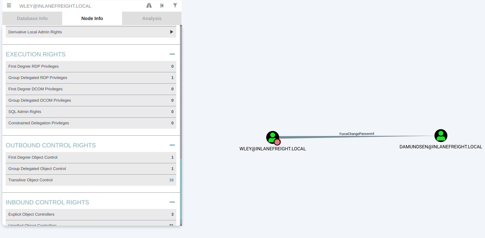
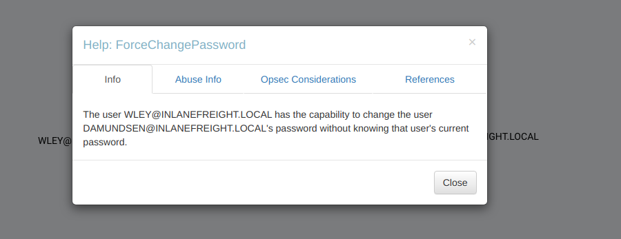
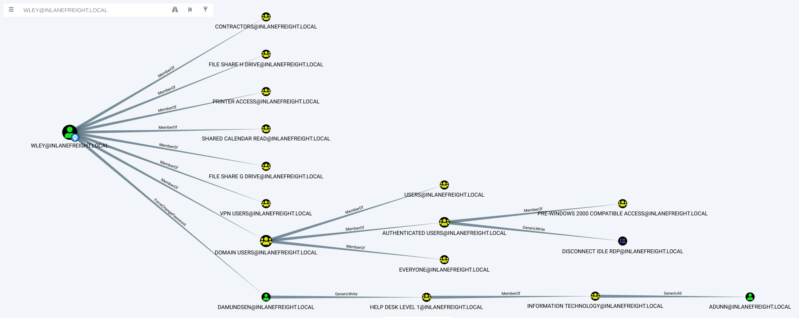

# ACL Enumeration

***

### <mark style="color:red;">Enumerating ACLs with PowerView</mark>

<mark style="color:green;">**Using Find-InterestingDomainAcl**</mark>


```powershell-session
PS C:\htb> Find-InterestingDomainAcl
```


Now, there is a way to use a tool such as PowerView more effectively -- by performing targeted enumeration

```powershell-session
PS C:\htb> Import-Module .\PowerView.ps1
PS C:\htb> $sid = Convert-NameToSid wley
```

We can then use the <mark style="color:orange;">**`Get-DomainObjectACL`**</mark> function to perform our targeted search. In the below example, we are using this function to find all domain objects that our user has rights over by mapping the user's SID using the **`$sid` variable to the `SecurityIdentifier`** property which is what tells us _who_ has the given right over an object. One important thing to note is that if we search without the flag `ResolveGUIDs`, we will see results like the below, where the right `ExtendedRight` does not give us a clear picture of what ACE entry the user `wley` has over `damundsen`. This is because the `ObjectAceType` property is returning a GUID value that is not human readable.

Note that this command will take a while to run, especially in a large environment. It may take 1-2 minutes to get a result in our lab.

<mark style="color:green;">**Using Get-DomainObjectACL**</mark>


```powershell-session
PS C:\htb> Get-DomainObjectACL -Identity * | ? {$_.SecurityIdentifier -eq $sid}
```


We could Google for the GUID value `00299570-246d-11d0-a768-00aa006e0529` and uncover [this](https://docs.microsoft.com/en-us/windows/win32/adschema/r-user-force-change-password) page showing that the user has the right to force change the other user's password. Alternatively, we could do a reverse search using PowerShell to map the right name back to the GUID value.

<mark style="color:green;">**Performing a Reverse Search & Mapping to a GUID Value**</mark>


```powershell-session
PS C:\htb> $guid= "00299570-246d-11d0-a768-00aa006e0529"
PS C:\htb> Get-ADObject -SearchBase "CN=Extended-Rights,$((Get-ADRootDSE).ConfigurationNamingContext)" -Filter {ObjectClass -like 'ControlAccessRight'} -Properties * |Select Name,DisplayName,DistinguishedName,rightsGuid| ?{$_.rightsGuid -eq $guid} | fl
```


This gave us our answer, but would be highly inefficient during an assessment. PowerView has the `ResolveGUIDs` flag, which does this very thing for us. Notice how the output changes when we include this flag to show the human-readable format of the `ObjectAceType` property as `User-Force-Change-Password`.

<mark style="color:green;">**Using the -ResolveGUIDs Flag**</mark>


```powershell-session
PS C:\htb> Get-DomainObjectACL -ResolveGUIDs -Identity * | ? {$_.SecurityIdentifier -eq $sid} 
```


<mark style="color:green;">**Creating a List of Domain Users**</mark>


```powershell-session
PS C:\htb> Get-ADUser -Filter * | Select-Object -ExpandProperty SamAccountName > ad_users.txt
```


<mark style="color:green;">**A Useful foreach Loop**</mark>


```powershell-session
PS C:\htb> foreach($line in [System.IO.File]::ReadLines("C:\Users\htb-student\Desktop\ad_users.txt")) {get-acl  "AD:\$(Get-ADUser $line)" | Select-Object Path -ExpandProperty Access | Where-Object {$_.IdentityReference -match 'INLANEFREIGHT\\wley'}}
```


Once we have this data, we could follow the same methods shown above to convert the GUID to a human-readable format to understand what rights we have over the target user.

**So, to recap, we started with the user `wley` and now have control over the user `damundsen` via the `User-Force-Change-Password` extended right.** Let's use Powerview to hunt for where, if anywhere, control over the `damundsen` account could take us.

<mark style="color:green;">**Further Enumeration of Rights Using damundsen**</mark>


```powershell-session
PS C:\htb> $sid2 = Convert-NameToSid damundsen
PS C:\htb> Get-DomainObjectACL -ResolveGUIDs -Identity * | ? {$_.SecurityIdentifier -eq $sid2} -Verbose
```


**Now we can see that our user `damundsen` has `GenericWrite` privileges over the `Help Desk Level 1` group.** This means, among other things, that we can add any user (or ourselves) to this group and inherit any rights that this group has applied to it. A search for rights conferred upon this group does not return anything interesting.

Let's look and see if this group is nested into any other groups, remembering that nested group membership will mean that any users in group A will inherit all rights of any group that group A is nested into (a member of). A quick search shows us that the `Help Desk Level 1` group is nested into the `Information Technology` group, meaning that we can obtain any rights that the `Information Technology` group grants to its members if we just add ourselves to the `Help Desk Level 1` group where our user `damundsen` has `GenericWrite` privileges.

<mark style="color:green;">**Investigating the Help Desk Level 1 Group with Get-DomainGroup**</mark>

```powershell-session
PS C:\htb> Get-DomainGroup -Identity "Help Desk Level 1" | select memberof

memberof                                                                      
--------                                                                      
CN=Information Technology,OU=Security Groups,OU=Corp,DC=INLANEFREIGHT,DC=LOCAL
```

* We have control over the user `wley` whose hash we retrieved earlier in the module (assessment) using Responder and cracked offline using Hashcat to reveal the cleartext password value
* We enumerated objects that the user `wley` has control over and found that we could force change the password of the user `damundsen`
* From here, we found that the `damundsen` user can add a member to the `Help Desk Level 1` group using `GenericWrite` privileges
* The `Help Desk Level 1` group is nested into the `Information Technology` group, which grants members of that group any rights provisioned to the `Information Technology` group

Now let's look around and see if members of `Information Technology` can do anything interesting. Once again, doing our search using `Get-DomainObjectACL` shows us that members of the `Information Technology` group have `GenericAll` rights over the user `adunn`, which means we could:

* Modify group membership
* Force change a password
* Perform a targeted Kerberoasting attack and attempt to crack the user's password if it is weak

<mark style="color:green;">**Investigating the Information Technology Group**</mark>


```powershell-session
PS C:\htb> $itgroupsid = Convert-NameToSid "Information Technology"
PS C:\htb> Get-DomainObjectACL -ResolveGUIDs -Identity * | ? {$_.SecurityIdentifier -eq $itgroupsid} -Verbose

```


Finally, let's see if the `adunn` user has any type of interesting access that we may be able to leverage to get closer to our goal.

<mark style="color:green;">**Looking for Interesting Access**</mark>


```powershell-session
PS C:\htb> $adunnsid = Convert-NameToSid adunn 
PS C:\htb> Get-DomainObjectACL -ResolveGUIDs -Identity * | ? {$_.SecurityIdentifier -eq $adunnsid} -Verbose
```


The output above shows that our `adunn` user has **`DS-Replication-Get-Changes` and `DS-Replication-Get-Changes-In-Filtered-Set`** rights over the domain object. This means that this user can be leveraged to perform a DCSync attack. We will cover this attack in-depth in the `DCSync` section.

***

### <mark style="color:red;">Enumerating ACLs with BloodHound</mark>

&#x20;we can set the `wley` user as our starting node, select the `Node Info` tab and scroll down to `Outbound Control Rights`. This option will show us objects we have control over directly, via group membership, and the number of objects that our user could lead to us controlling via ACL attack paths under `Transitive Object Control`. If we click on the `1` next to `First Degree Object Control`, we see the first set of rights that we enumerated, `ForceChangePassword` over the `damundsen` user.

<mark style="color:green;">**Viewing Node Info through BloodHound**</mark>

<figure><figcaption></figcaption></figure>

If we right-click on the line between the two objects, a menu will pop up. If we select `Help`, we will be presented with help around abusing this ACE, including:

* More info on the specific right, tools, and commands that can be used to pull off this attack
* Operational Security (Opsec) considerations
* External references.

We'll dig into this menu more later on.

<mark style="color:green;">**Investigating ForceChangePassword Further**</mark>

<figure><figcaption></figcaption></figure>

If we click on the `16` next to `Transitive Object Control`, we will see the entire path that we painstakingly enumerated above. From here, we could leverage the help menus for each edge to find ways to best pull off each attack.

<mark style="color:green;">**Viewing Potential Attack Paths through BloodHound**</mark>

<figure><figcaption></figcaption></figure>

Finally, we can use the pre-built queries in BloodHound to confirm that the `adunn` user has DCSync rights.

**Viewing Pre-Build queries through BloodHound**


