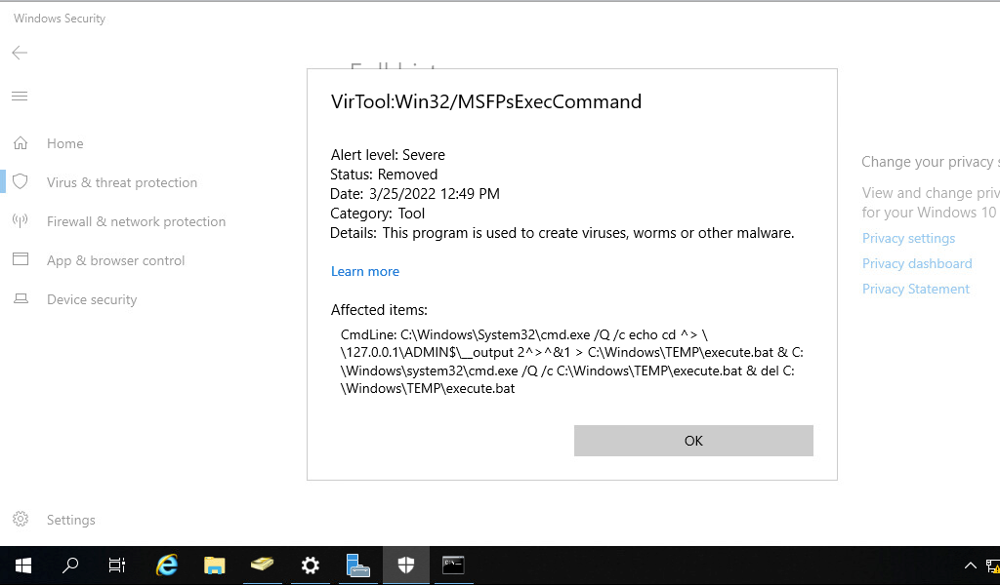

# Bleeding Edge Vulnerabilities

***

### <mark style="color:red;">Windows Defender & SMBEXEC.py Considerations</mark>

If Windows Defender (or another AV or EDR product) is enabled on a target, our shell session may be established, but issuing any commands will likely fail. The first thing smbexec.py does is create a service called `BTOBTO`.&#x20;

Another service called `BTOBO` is created, and any command we type is sent to the target over SMB inside a .bat file called `execute.bat`. With each new command we type, a new batch script is created and echoed to a temporary file that executes said script and deletes it from the system. Let's look at a Windows Defender log to see what behavior was considered malicious.

**Windows Defender Quarantine Log**

<figure><figcaption></figcaption></figure>

If opsec or being "quiet" is a consideration during an assessment, we would most likely want to avoid a tool like smbexec.py. The focus of this module is on tactics and techniques. We will refine our methodology as we progress in more advanced modules, but we first must obtain a solid base in enumerating and attacking Active Directory.

***

***
