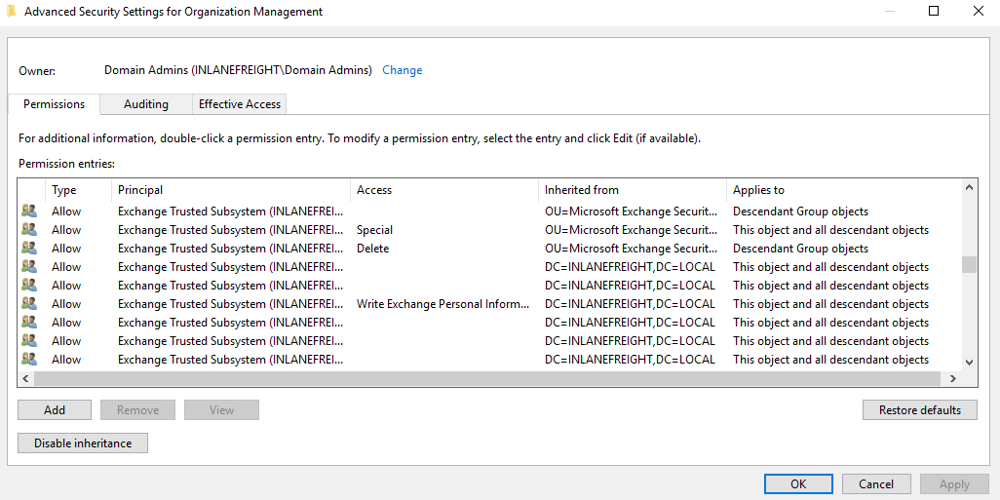

# Exchange Related Group Membership

### <mark style="color:blue;">Exchange Related Group Membership</mark>

Une installation par défaut de Microsoft Exchange dans un environnement Active Directory (sans modèle d'administration séparée) expose de nombreux vecteurs d'attaque. En effet, Exchange dispose généralement de privilèges étendus au sein du domaine via les utilisateurs, les groupes et les ACL (Listes de Contrôle d’Accès).

* <mark style="color:orange;">**Le groupe "Exchange Windows Permissions"**</mark> n'est pas considéré comme un groupe protégé, mais ses membres ont la capacité de modifier la DACL (Discretionary Access Control List) de l’objet de domaine. Cela peut être exploité pour accorder à un utilisateur des privilèges **DCSync**, lui permettant d’extraire les hashes des mots de passe des comptes Active Directory.
* Un attaquant peut ajouter des comptes à ce groupe en exploitant une **mauvaise configuration des DACL** (si possible) ou en utilisant un **compte compromis** appartenant au groupe **Account Operators**.
* Il est courant de voir des comptes d’utilisateurs et même des **ordinateurs** membres de ce groupe. Les **utilisateurs avancés** et le **personnel de support** dans les bureaux distants y sont souvent ajoutés pour leur permettre de **réinitialiser des mots de passe**.
* Un dépôt GitHub (mentionné dans le texte) décrit plusieurs techniques permettant d'exploiter **Exchange pour une élévation de privilèges** dans un environnement Active Directory.

#### **Le groupe "Organization Management" d’Exchange**

* Il s'agit d'un groupe **extrêmement puissant**, équivalent à **"Domain Admins"** mais pour **Exchange**.
* Il a accès aux **boîtes mail de tous les utilisateurs** du domaine.
* Il n’est **pas rare** que des administrateurs système soient membres de ce groupe.
* Ce groupe possède **un contrôle total** sur l’Unité d’Organisation **Microsoft Exchange Security Groups**, qui contient notamment le groupe **Exchange Windows Permissions**.

👉 **Conclusion** : Une configuration par défaut d’Exchange peut être exploitée pour obtenir **des privilèges élevés** dans le domaine, en abusant des permissions accordées à ces groupes.

<figure><figcaption></figcaption></figure>

Si nous parvenons à compromettre un serveur Exchange, cela mènera souvent à des privilèges de Domain Admin. De plus, extraire les identifiants stockés en mémoire sur un serveur Exchange permettra d'obtenir des dizaines, voire des centaines, d'identifiants en clair ou de hash NTLM. Cela s'explique par le fait que les utilisateurs se connectent via Outlook Web Access (OWA) et qu'Exchange met en cache leurs identifiants en mémoire après une connexion réussie.
