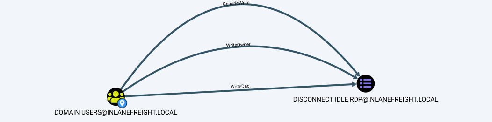
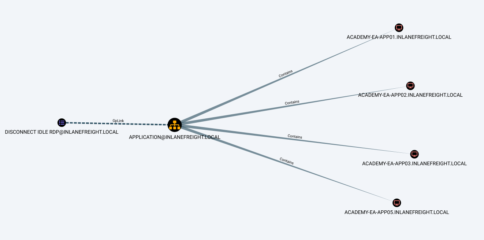

# Group Policy Object (GPO) Abuse

### <mark style="color:blue;">Group Policy Object (GPO) Abuse</mark>

Les **stratégies de groupe (Group Policy)** fournissent aux administrateurs de nombreuses **paramètres avancés** pouvant être appliqués aux **objets utilisateurs et ordinateurs** dans un environnement **Active Directory (AD)**.

Lorsqu'elles sont bien utilisées, les stratégies de groupe sont un **excellent outil** pour **renforcer la sécurité** d’un environnement AD en configurant **les paramètres utilisateurs, les systèmes d’exploitation et les applications**.

Cela étant dit, les **stratégies de groupe peuvent aussi être exploitées par des attaquants**.

Si nous pouvons **obtenir des droits** sur un **objet de stratégie de groupe (GPO)** à cause d'une **mauvaise configuration des ACL (Listes de contrôle d'accès)**, nous pourrions **l’exploiter** pour :\
✔ **le déplacement latéral** (_lateral movement_),\
✔ **l’élévation de privilèges** (_privilege escalation_),\
✔ **la compromission du domaine**,\
✔ **et comme un mécanisme de persistance** à l’intérieur du domaine.

**Comprendre comment énumérer et attaquer les GPOs** peut nous donner un **avantage** et peut parfois être **la clé** pour atteindre notre objectif dans un environnement **fortement sécurisé**.

**Enumerating GPO Names with PowerView**

```powershell-session
PS C:\htb> Get-DomainGPO |select displayname

displayname
-----------
Default Domain Policy
Default Domain Controllers Policy
Deny Control Panel Access
Disallow LM Hash
Deny CMD Access
Disable Forced Restarts
Block Removable Media
Disable Guest Account
Service Accounts Password Policy
Logon Banner
Disconnect Idle RDP
Disable NetBIOS
AutoLogon
GuardAutoLogon
Certificate Services
```

This can be helpful for us to begin to see what types of security measures are in place (such as denying cmd.exe access and a separate password policy for service accounts). We can see that autologon is in use which may mean there is a readable password in a GPO, and see that Active Directory Certificate Services (AD CS) is present in the domain. If Group Policy Management Tools are installed on the host we are working from, we can use various built-in [GroupPolicy cmdlets](https://docs.microsoft.com/en-us/powershell/module/grouppolicy/?view=windowsserver2022-ps) such as `Get-GPO` to perform the same enumeration.

<mark style="color:green;">**Enumerating GPO Names with a Built-In Cmdlet**</mark>

```powershell-session
PS C:\htb> Get-GPO -All | Select DisplayName

DisplayName
-----------
Certificate Services
```

Next, we can check if a user we can control has any rights over a GPO. Specific users or groups may be granted rights to administer one or more GPOs. A good first check is to see if the entire Domain Users group has any rights over one or more GPOs.

<mark style="color:green;">**Enumerating Domain User GPO Rights**</mark>


```powershell-session
PS C:\htb> $sid=Convert-NameToSid "Domain Users"
PS C:\htb> Get-DomainGPO | Get-ObjectAcl | ?{$_.SecurityIdentifier -eq $sid}

ObjectDN              : CN={7CA9C789-14CE-46E3-A722-83F4097AF532},CN=Policies,CN=System,DC=INLANEFREIGHT,DC=LOCAL
ObjectSID             :
ActiveDirectoryRights : CreateChild, DeleteChild, ReadProperty, WriteProperty, Delete, GenericExecute, WriteDacl,
                        WriteOwner
BinaryLength          : 36
AceQualifier          : AccessAllowed
IsCallback            : False
OpaqueLength          : 0
AccessMask            : 983095
SecurityIdentifier    : S-1-5-21-3842939050-3880317879-2865463114-513
AceType               : AccessAllowed
AceFlags              : ObjectInherit, ContainerInherit
IsInherited           : False
InheritanceFlags      : ContainerInherit, ObjectInherit
PropagationFlags      : None
AuditFlags            : None
```



Ici, nous pouvons voir que le groupe **Domain Users** possède **différentes permissions** sur une **GPO**, telles que **WriteProperty** et **WriteDacl**, que nous pourrions exploiter pour **prendre le contrôle total** de cette GPO et exécuter **de nombreuses attaques** qui seraient appliquées à tous les **utilisateurs et ordinateurs** situés dans les **Unités Organisationnelles (OUs)** où cette **GPO** est appliquée.

Nous pouvons utiliser le **GUID de la GPO** combiné avec la commande **Get-GPO** pour voir **le nom d'affichage** de la GPO.

***

#### **📌 Explication des termes compliqués :**

🔹 **GPO (Group Policy Object) :**\
Un objet de stratégie de groupe qui applique des **règles de configuration** aux utilisateurs et aux ordinateurs dans un domaine Active Directory.

🔹 **Domain Users :**\
C'est **le groupe par défaut contenant tous les utilisateurs du domaine**. Si ce groupe a des droits sur une GPO, alors **chaque utilisateur du domaine** peut potentiellement modifier cette GPO, ce qui représente un **gros risque de sécurité**.

🔹 **WriteProperty :**\
Cette permission permet de **modifier les propriétés** d'un objet Active Directory, ici une **GPO**. Cela signifie qu'un attaquant pourrait **changer les paramètres de la GPO** pour exécuter du code malveillant sur les machines du domaine.

🔹 **WriteDacl (Write Discretionary Access Control List) :**\
Cette permission permet **de modifier la liste des permissions (DACL) d’un objet AD**, en l’occurrence une GPO. **Cela signifie que l’attaquant peut ajouter ses propres permissions**, lui donnant un **contrôle total** sur la GPO.

🔹 **Exploiter la GPO pour attaquer le domaine :**\
Si un attaquant prend le contrôle d'une GPO, il peut y insérer des configurations malveillantes qui seront **appliquées automatiquement** aux **ordinateurs et utilisateurs** du domaine. Par exemple :\
✅ **Créer un compte administrateur caché** sur toutes les machines du domaine.\
✅ **Déployer un script malveillant** exécuté à chaque connexion d'un utilisateur.\
✅ **Désactiver les antivirus et les pare-feu Windows.**\
✅ **Modifier les droits des utilisateurs pour leur donner plus de privilèges.**


<mark style="color:green;">**Converting GPO GUID to Name**</mark>

```powershell-session
PS C:\htb Get-GPO -Guid 7CA9C789-14CE-46E3-A722-83F4097AF532

DisplayName      : Disconnect Idle RDP
DomainName       : INLANEFREIGHT.LOCAL
Owner            : INLANEFREIGHT\Domain Admins
Id               : 7ca9c789-14ce-46e3-a722-83f4097af532
GpoStatus        : AllSettingsEnabled
Description      :
CreationTime     : 10/28/2021 3:34:07 PM
ModificationTime : 4/5/2022 6:54:25 PM
UserVersion      : AD Version: 0, SysVol Version: 0
ComputerVersion  : AD Version: 0, SysVol Version: 0
WmiFilter        :
```

Checking in BloodHound, we can see that the `Domain Users` group has several rights over the `Disconnect Idle RDP` GPO, which could be leveraged for full control of the object.

<figure><figcaption></figcaption></figure>

If we select the GPO in BloodHound and scroll down to `Affected Objects` on the `Node Info` tab, we can see that this GPO is applied to one OU, which contains four computer objects.

<figure><figcaption></figcaption></figure>

Nous pourrions utiliser un outil comme **SharpGPOAbuse** pour exploiter cette mauvaise configuration de la GPO, en effectuant des actions telles que l'ajout d'un utilisateur sous notre contrôle au groupe des administrateurs locaux sur l'un des hôtes affectés, la création d'une tâche planifiée sur un des hôtes pour obtenir un reverse shell, ou encore configurer un script de démarrage malveillant pour nous donner un reverse shell ou autre.

Lors de l'utilisation d'un tel outil, il faut être prudent, car les commandes peuvent affecter tous les ordinateurs dans l'OU (unité organisationnelle) à laquelle la GPO est liée. Si nous trouvons une GPO modifiable qui s'applique à une OU contenant 1 000 ordinateurs, nous ne voudrions pas faire l'erreur de nous ajouter en tant qu'administrateur local sur tous ces hôtes. Certaines des options d'attaque disponibles avec cet outil nous permettent de spécifier un utilisateur ou un hôte cible.

#### 🆚 **Différence principale**

| 🏷              | **GPO**                                                              | **ACL**                                                     |
| --------------- | -------------------------------------------------------------------- | ----------------------------------------------------------- |
| **Rôle**        | Configuration et gestion des stratégies système                      | Gestion des autorisations d’accès                           |
| **Portée**      | Affecte utilisateurs et ordinateurs via Active Directory             | Affecte fichiers, dossiers, objets spécifiques              |
| **Utilisation** | Appliquer des règles de sécurité, restreindre des fonctionnalités    | Définir qui peut voir, modifier ou supprimer un fichier     |
| **Exemple**     | Désactiver le panneau de configuration pour un groupe d’utilisateurs | Autoriser un seul utilisateur à modifier un fichier partagé |

#### 🔥 **En résumé**

* **GPO** = Gestion centralisée des **stratégies et configurations** des machines et utilisateurs.
* **ACL** = Gestion des **droits d'accès** aux ressources (fichiers, dossiers, objets).
