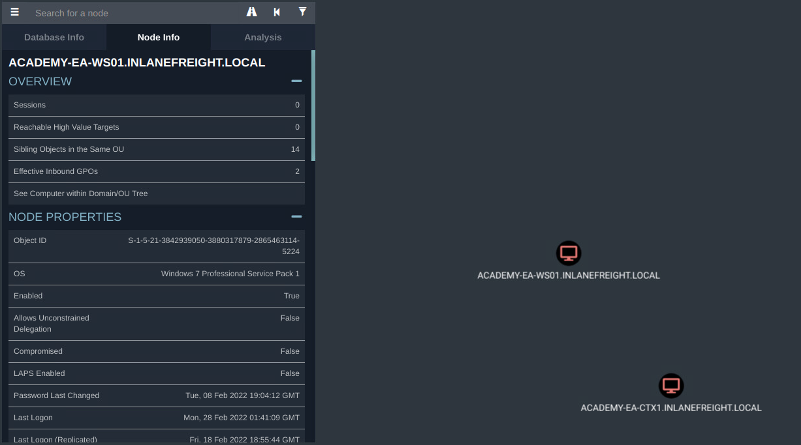

# Credentialed Enumeration - from Windows

***

### <mark style="color:red;">ActiveDirectory PowerShell Module</mark>

<mark style="color:green;">**Discover Modules**</mark>


```powershell-session
PS C:\htb> Get-Module
```


<mark style="color:green;">**Load ActiveDirectory Module**</mark>


```powershell-session
PS C:\htb> Import-Module ActiveDirectory
PS C:\htb> Get-Module
```


#### <mark style="color:green;">Get Domain Info</mark>

```powershell-session
PS C:\htb> Get-ADDomain
```

This will print out helpful information like the domain SID, domain functional level, any child domains, and more.&#x20;

<mark style="color:green;">**Get-ADUser**</mark>


```powershell-session
PS C:\htb> Get-ADUser -Filter {ServicePrincipalName -ne "$null"} -Properties ServicePrincipalName
```


<mark style="color:green;">**Checking For Trust Relationships**</mark>

```powershell-session
PS C:\htb> Get-ADTrust -Filter *
```


This cmdlet will print out any trust relationships the domain has. We can determine if they are trusts within our forest or with domains in other forests, the type of trust, the direction of the trust, and the name of the domain the relationship is with. This will be useful later on when looking to take advantage of child-to-parent trust relationships and attacking across forest trusts.&#x20;


<mark style="color:green;">**Group Enumeration**</mark>

```powershell-session
PS C:\htb> Get-ADGroup -Filter * | select name
```

We can take the results and feed interesting names back into the cmdlet to get more detailed information about a particular group like so:

<mark style="color:green;">**Detailed Group Info**</mark>

```powershell-session
PS C:\htb> Get-ADGroup -Identity "Backup Operators"
```

Now that we know more about the group, let's get a member listing using the [Get-ADGroupMember](https://docs.microsoft.com/en-us/powershell/module/activedirectory/get-adgroupmember?view=windowsserver2022-ps) cmdlet.

#### <mark style="color:green;">Group Membership</mark>


```powershell-session
PS C:\htb> Get-ADGroupMember -Identity "Backup Operators"
```


***

### <mark style="color:red;">PowerView</mark>

[PowerView](https://github.com/PowerShellMafia/PowerSploit/tree/master/Recon) is a tool written in PowerShell to help us gain situational awareness within an AD environment.&#x20;

<table data-header-hidden data-full-width="true"><thead><tr><th></th><th></th></tr></thead><tbody><tr><td><strong>Command</strong></td><td><strong>Description</strong></td></tr><tr><td><code>Export-PowerViewCSV</code></td><td>Append results to a CSV file</td></tr><tr><td><code>ConvertTo-SID</code></td><td>Convert a User or group name to its SID value</td></tr><tr><td><code>Get-DomainSPNTicket</code></td><td>Requests the Kerberos ticket for a specified Service Principal Name (SPN) account</td></tr><tr><td><strong>Domain/LDAP Functions:</strong></td><td></td></tr><tr><td><code>Get-Domain</code></td><td>Will return the AD object for the current (or specified) domain</td></tr><tr><td><code>Get-DomainController</code></td><td>Return a list of the Domain Controllers for the specified domain</td></tr><tr><td><code>Get-DomainUser</code></td><td>Will return all users or specific user objects in AD</td></tr><tr><td><code>Get-DomainComputer</code></td><td>Will return all computers or specific computer objects in AD</td></tr><tr><td><code>Get-DomainGroup</code></td><td>Will return all groups or specific group objects in AD</td></tr><tr><td><code>Get-DomainOU</code></td><td>Search for all or specific OU objects in AD</td></tr><tr><td><code>Find-InterestingDomainAcl</code></td><td>Finds object ACLs in the domain with modification rights set to non-built in objects</td></tr><tr><td><code>Get-DomainGroupMember</code></td><td>Will return the members of a specific domain group</td></tr><tr><td><code>Get-DomainFileServer</code></td><td>Returns a list of servers likely functioning as file servers</td></tr><tr><td><code>Get-DomainDFSShare</code></td><td>Returns a list of all distributed file systems for the current (or specified) domain</td></tr><tr><td><strong>GPO Functions:</strong></td><td></td></tr><tr><td><code>Get-DomainGPO</code></td><td>Will return all GPOs or specific GPO objects in AD</td></tr><tr><td><code>Get-DomainPolicy</code></td><td>Returns the default domain policy or the domain controller policy for the current domain</td></tr><tr><td><strong>Computer Enumeration Functions:</strong></td><td></td></tr><tr><td><code>Get-NetLocalGroup</code></td><td>Enumerates local groups on the local or a remote machine</td></tr><tr><td><code>Get-NetLocalGroupMember</code></td><td>Enumerates members of a specific local group</td></tr><tr><td><code>Get-NetShare</code></td><td>Returns open shares on the local (or a remote) machine</td></tr><tr><td><code>Get-NetSession</code></td><td>Will return session information for the local (or a remote) machine</td></tr><tr><td><code>Test-AdminAccess</code></td><td>Tests if the current user has administrative access to the local (or a remote) machine</td></tr><tr><td><strong>Threaded 'Meta'-Functions:</strong></td><td></td></tr><tr><td><code>Find-DomainUserLocation</code></td><td>Finds machines where specific users are logged in</td></tr><tr><td><code>Find-DomainShare</code></td><td>Finds reachable shares on domain machines</td></tr><tr><td><code>Find-InterestingDomainShareFile</code></td><td>Searches for files matching specific criteria on readable shares in the domain</td></tr><tr><td><code>Find-LocalAdminAccess</code></td><td>Find machines on the local domain where the current user has local administrator access</td></tr><tr><td><strong>Domain Trust Functions:</strong></td><td></td></tr><tr><td><code>Get-DomainTrust</code></td><td>Returns domain trusts for the current domain or a specified domain</td></tr><tr><td><code>Get-ForestTrust</code></td><td>Returns all forest trusts for the current forest or a specified forest</td></tr><tr><td><code>Get-DomainForeignUser</code></td><td>Enumerates users who are in groups outside of the user's domain</td></tr><tr><td><code>Get-DomainForeignGroupMember</code></td><td>Enumerates groups with users outside of the group's domain and returns each foreign member</td></tr><tr><td><code>Get-DomainTrustMapping</code></td><td>Will enumerate all trusts for the current domain and any others seen.</td></tr></tbody></table>


For more on PowerView, check out the [Active Directory PowerView module](https://academy.hackthebox.com/course/preview/active-directory-powerview). Below we will experiment with a few of them.


<mark style="color:green;">**Domain User Information**</mark>


```powershell-session
PS C:\htb> Get-DomainUser -Identity mmorgan -Domain inlanefreight.local | Select-Object -Property name,samaccountname,description,memberof,whencreated,pwdlastset,lastlogontimestamp,accountexpires,admincount,userprincipalname,serviceprincipalname,useraccountcontrol
```


<mark style="color:green;">**Recursive Group Membership**</mark>


```powershell-session
PS C:\htb>  Get-DomainGroupMember -Identity "Domain Admins" -Recurse
```


<mark style="color:green;">**Trust Enumeration**</mark>

```powershell-session
PS C:\htb> Get-DomainTrustMapping
```

We can use the [Test-AdminAccess](https://powersploit.readthedocs.io/en/latest/Recon/Test-AdminAccess/) function to test for local admin access on either the current machine or a remote one.

<mark style="color:green;">**Testing for Local Admin Access**</mark>

```powershell-session
PS C:\htb> Test-AdminAccess -ComputerName ACADEMY-EA-MS01
```

<mark style="color:green;">**Finding Users With SPN Set**</mark>

```powershell-session
PS C:\htb> Get-DomainUser -SPN -Properties samaccountname,ServicePrincipalName
```

***

### <mark style="color:red;">SharpView</mark>


The BC-SECURITY version of [PowerView](https://github.com/BC-SECURITY/Empire/blob/master/empire/server/data/module_source/situational_awareness/network/powerview.ps1) has some new functions such as `Get-NetGmsa`, used to hunt for [Group Managed Service Accounts](https://docs.microsoft.com/en-us/windows-server/security/group-managed-service-accounts/group-managed-service-accounts-overview), which is out of scope for this module.&#x20;



```powershell-session
PS C:\htb> .\SharpView.exe Get-DomainUser -Help
```


Here we can use SharpView to enumerate information about a specific user, such as the user `forend`, which we control.


```powershell-session
PS C:\htb> .\SharpView.exe Get-DomainUser -Identity forend
```


***

### <mark style="color:red;">Snaffler</mark>


[Snaffler](https://github.com/SnaffCon/Snaffler) is a tool that can help us acquire credentials or other sensitive data in an Active Directory environment. Snaffler works by obtaining a list of hosts within the domain and then enumerating those hosts for shares and readable directories. Once that is done, it iterates through any directories readable by our user and hunts for files that could serve to better our position within the assessment. Snaffler requires that it be run from a domain-joined host or in a domain-user context.


<mark style="color:green;">**Snaffler Execution**</mark>

```bash
Snaffler.exe -s -d inlanefreight.local -o snaffler.log -v data
```

Avec **Snaffler**, `-s` affiche les résultats à l’écran, `-d` précise le domaine, `-o` écrit dans un fichier log, et `-v` règle la verbosité.&#x20;

Comme l’outil génère beaucoup de données, il est recommandé de les exporter dans un fichier et de ne garder à l’écran que l’essentiel. Les logs bruts peuvent aussi être fournis aux clients pour identifier rapidement les partages sensibles à sécuriser en priorité

<mark style="color:green;">**Snaffler in Action**</mark>


```powershell-session
PS C:\htb> .\Snaffler.exe  -d INLANEFREIGHT.LOCAL -s -v data
```


***

## <mark style="color:red;">BloodHound</mark>

If we run SharpHound with the `--help` option, we can see the options available to us.

<mark style="color:green;">**SharpHound in Action**</mark>

```powershell-session
PS C:\htb>  .\SharpHound.exe --help
```

We'll start by running the SharpHound.exe collector from the MS01 attack host.


```powershell-session
PS C:\htb> .\SharpHound.exe -c All --zipfilename ILFREIGHT
```


* Recherche du domaine **INLANEFREIGHT.LOCAL** → plus de 550 hôtes et relations de confiance avec deux autres domaines.
* L’onglet **Analysis** propose des requêtes utiles, comme _Find Computers with Unsupported Operating Systems_.
* Ces hôtes anciens (ex. Windows 7, Windows Server 2008) sont souvent conservés pour des raisons de compatibilité mais créent des **risques de sécurité** (failles connues comme MS08-067).
* Prudence lors des tests sur ces systèmes, car ils peuvent être fragiles ou critiques pour l’entreprise.
* Recommandations possibles : **segmenter ces hôtes**, planifier leur **retrait/remplacement**, et **nettoyer Active Directory** pour supprimer les enregistrements obsolètes.

**Unsupported Operating Systems**

<figure><figcaption></figcaption></figure>

* Certains utilisateurs conservent des **droits d’administrateur local** (temporaires non révoqués ou liés à leur poste élevé).
* On observe parfois une **attribution excessive** de ces droits (groupes IT, voire _Domain Users_).
* Cela constitue une **opportunité d’attaque** : un simple compte compromis peut donner accès à plusieurs hôtes.
* La requête **Find Computers where Domain Users are Local Admin** aide à identifier ces situations.
* Ces accès facilitent la collecte de **mots de passe en mémoire** ou de données sensibles.

***

We have a great picture of the domain's layout, strengths, and weaknesses. We have credentials for several users and have enumerated a wealth of information such as users, groups, computers, GPOs, ACLs, local admin rights, access rights (RDP, WinRM, etc.), accounts configured with Service Principal Names (SPNs), and more.&#x20;
