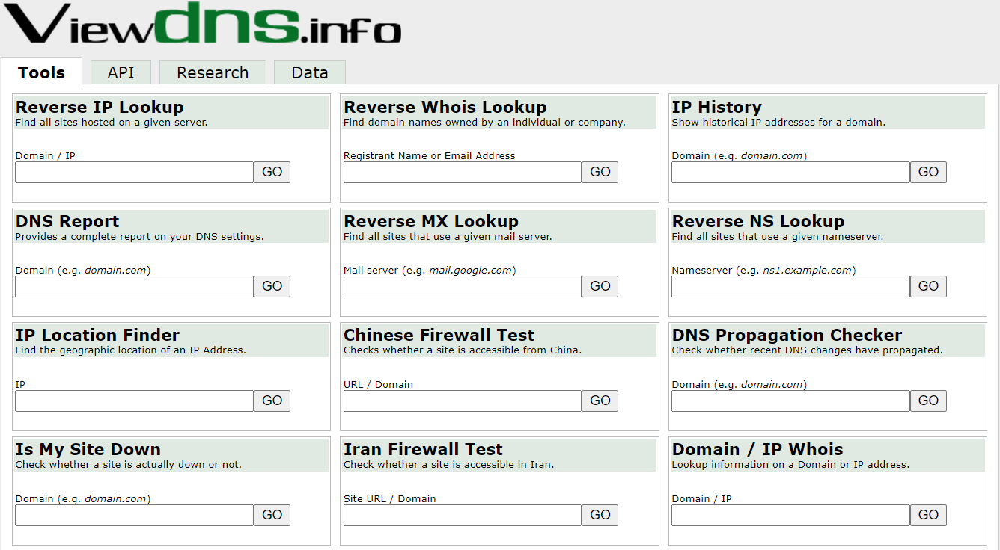
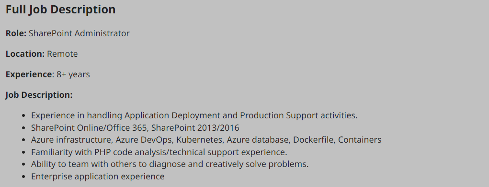
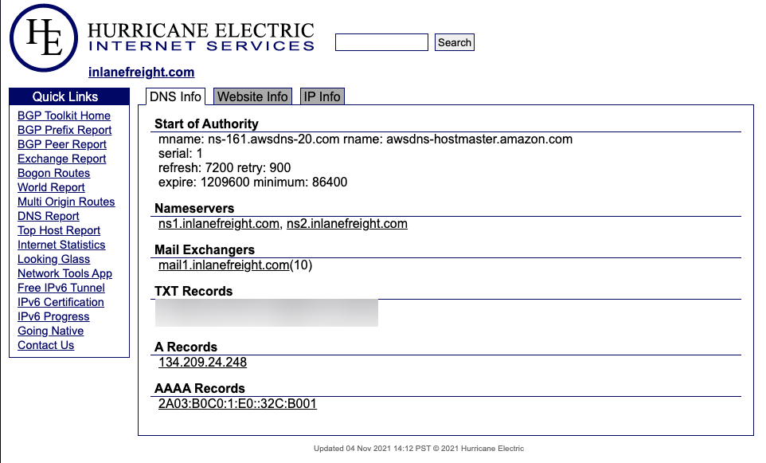
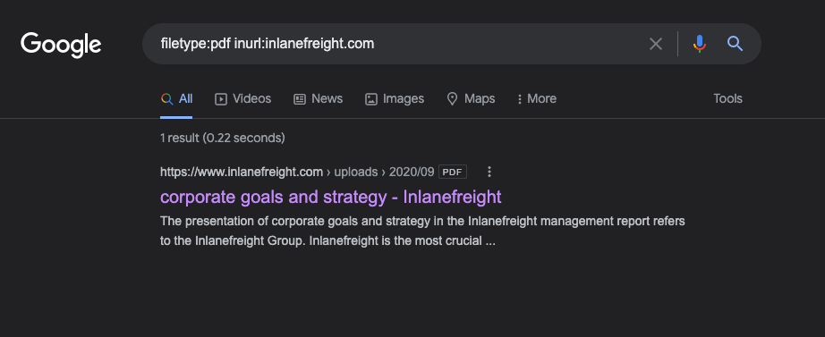
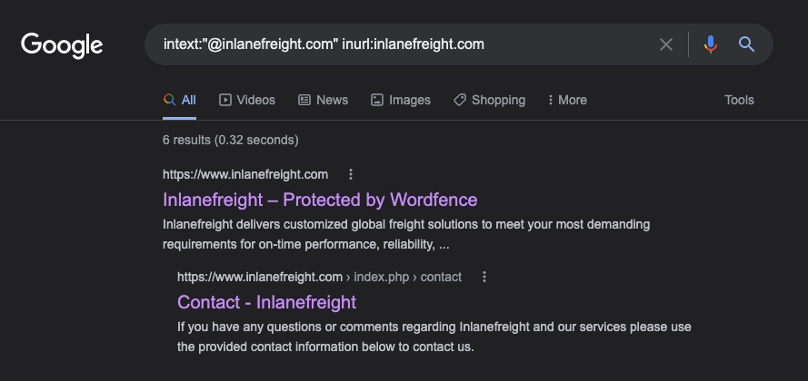
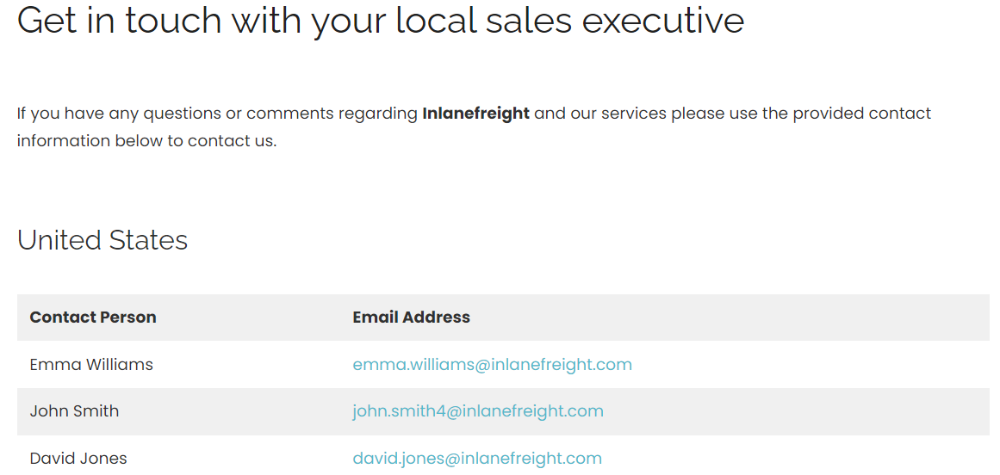

# External Recon and Enumeration Principles

***

Before kicking off any pentest, it can be beneficial to perform <mark style="color:orange;">**`external reconnaissance`**</mark>&#x20;

* <mark style="color:orange;">**Validating information provided**</mark> to you in the scoping document from the client
* Ensuring you are <mark style="color:orange;">**taking actions against the appropriate scope**</mark> when working remotely
* Looking for any <mark style="color:orange;">**information that is publicly accessible**</mark> that can affect the outcome of your test, such as leaked credentials

That also means identifying any potential information leaks and breach data out in the world..

***

### <mark style="color:blue;">What Are We Looking For?</mark>

<table data-header-hidden data-full-width="true"><thead><tr><th></th><th></th></tr></thead><tbody><tr><td><strong>Data Point</strong></td><td><strong>Description</strong></td></tr><tr><td><code>IP Space</code></td><td><ul><li><mark style="color:orange;"><strong>Valid ASN</strong></mark> </li></ul><ul><li><strong>Netblocks</strong> </li><li><strong>Cloud presence</strong> and the <strong>hosting providers</strong></li><li><strong>DNS record</strong> entries, etc</li></ul></td></tr><tr><td><code>Domain Information</code></td><td><ul><li>DNS, and site registrations. </li></ul><ul><li><strong>Administers</strong> </li><li><strong>Subdomains</strong> </li><li> Publicly accessible <strong>domain services</strong> </li><li> (Mailservers, DNS, Websites, VPN portals, etc.)</li><li> Can we determine what kind of <strong>defenses</strong> are in place? (SIEM, AV, IPS/IDS in use, etc.)</li></ul></td></tr><tr><td><code>Schema Format</code></td><td><ul><li> Organization's <strong>email accounts</strong></li><li>AD usernames</li><li> P<strong>assword policies</strong></li></ul></td></tr><tr><td><code>Data Disclosures</code></td><td>P<strong>ublicly accessible files</strong> ( .pdf, .ppt, .docx, .xlsx, etc. ) </td></tr><tr><td><code>Breach Data</code></td><td>Any publicly released usernames, passwords, or other critical information that can help an attacker gain a foothold.</td></tr></tbody></table>

***

### <mark style="color:blue;">Where Are We Looking?</mark>

<table data-header-hidden data-full-width="true"><thead><tr><th></th><th></th></tr></thead><tbody><tr><td><strong>Resource</strong></td><td><strong>Examples</strong></td></tr><tr><td><code>ASN / IP registrars</code></td><td><p><a href="https://www.iana.org/">IANA</a>, <a href="https://www.arin.net/">arin</a> for searching the Americas,</p><p><a href="https://www.ripe.net/">RIPE</a> for searching in Europe, <a href="https://bgp.he.net/">BGP Toolkit</a></p></td></tr><tr><td><code>Domain Registrars &#x26; DNS</code></td><td><a href="https://www.domaintools.com/">Domaintools</a>, <a href="http://ptrarchive.com/">PTRArchive</a>, <a href="https://lookup.icann.org/lookup">ICANN</a>, manual DNS record requests against the domain in question or against well known DNS servers, such as <code>8.8.8.8</code>.</td></tr><tr><td><code>Social Media</code></td><td>Searching Linkedin, Twitter, Facebook, your region's major social media sites, news articles, and any relevant info you can find about the organization.</td></tr><tr><td><code>Public-Facing Company Websites</code></td><td>News articles, embedded documents, and the "About Us" and "Contact Us" pages can also be gold mines.</td></tr><tr><td><code>Cloud &#x26; Dev Storage Spaces</code></td><td><a href="https://github.com/">GitHub</a>, <a href="https://grayhatwarfare.com/">AWS S3 buckets &#x26; Azure Blog storage containers</a>, <a href="https://www.exploit-db.com/google-hacking-database">Google searches using "Dorks"</a></td></tr><tr><td><code>Breach Data Sources</code></td><td><p><a href="https://haveibeenpwned.com/">HaveIBeenPwned</a> </p><p></p><p><a href="https://www.dehashed.com/">Dehashed</a> to search for corporate emails with cleartext passwords or hashes we can try to crack offline. </p><p></p><p>We can then try these passwords against any exposed login portals (Citrix, RDS, OWA, 0365, VPN, VMware Horizon, custom applications, etc.) that may use AD authentication.</p></td></tr></tbody></table>

#### <mark style="color:green;">Finding Address Spaces</mark>

<figure><figcaption></figcaption></figure>


<mark style="color:green;">**BGP-Toolkit**</mark>&#x20;

(de Hurricane Electric) est un outil utile pour identifier les blocs d’adresses IP assignés à une organisation et l’**ASN** (**Autonomous System Number**) auquel ils appartiennent. En saisissant un domaine ou une adresse IP, on peut obtenir des informations précieuses.

* **Grandes entreprises** : Elles gèrent souvent leur propre infrastructure avec leur propre ASN.
* **Petites entreprises** : Elles hébergent généralement leur infrastructure via des fournisseurs tiers (comme Cloudflare, AWS, Google Cloud ou Azure).

Lors des tests, il est essentiel de savoir où se trouve l’infrastructure pour éviter d’interagir avec des ressources hors périmètre (scope). Tester des services tiers pourrait causer des dommages à d'autres organisations partageant la même infrastructure.

* **À faire avant les tests** :
  * Confirmer si l’infrastructure est auto-hébergée ou gérée par un tiers.
  * Préciser clairement la portée (scope) dans les documents de cadrage.
  * Obtenir des autorisations écrites des fournisseurs si nécessaire. Par exemple :
    * AWS a des lignes directrices spécifiques et n’exige pas toujours une autorisation préalable.
    * Oracle demande une notification de test de sécurité.

En cas de doute, il est recommandé d’escalader la question avant d’attaquer un service externe. **Toujours s'assurer d’avoir une permission explicite** pour tester des hôtes, internes ou externes, et clarifier le périmètre par écrit si nécessaire.


#### <mark style="color:green;">DNS</mark>


DNS can be a valuable tool for validating the scope and discovering additional hosts not listed in the client's scoping document. **Websites like domaintools and viewdns.info offer a wealth of data, including DNS records, DNSSEC testing, and access restrictions** in certain countries. This can lead to finding unlisted hosts or subdomains that may be within scope, which can then be discussed with the client for inclusion


<mark style="color:green;">**Viewdns.info**</mark>

<figure><figcaption></figcaption></figure>

#### <mark style="color:green;">Public Data</mark>

<figure><figcaption></figcaption></figure>


Don't discount public information such as job postings or social media. You can learn a lot about an organization just from what they post, and a well-intentioned post could disclose data relevant to us as penetration testers.



Tools like [Trufflehog](https://github.com/trufflesecurity/truffleHog) and sites like [Greyhat Warfare](https://buckets.grayhatwarfare.com/) are fantastic resources for finding these breadcrumbs.


***

### <mark style="color:blue;">Example Enumeration Process</mark>

<mark style="color:green;">**Check for ASN/IP & Domain Data**</mark>

<figure><figcaption></figcaption></figure>

From this first look, we have already gleaned some interesting info. BGP.he is reporting:

* IP Address: 134.209.24.248
* Mail Server: mail1.inlanefreight.com
* Nameservers: qS1.inlanefreight.com & NS2.inlanefreight.com

For now, this is what we care about from its output. Inlanefreight is not a large corporation, so we didn't expect to find that it had its own ASN. Now let's validate some of this information.

<mark style="color:green;">**Viewdns Results**</mark>

<figure><figcaption></figcaption></figure>

In the request above, we utilized `viewdns.info` to validate the IP address of our target. Both results match, which is a good sign. Now let's try another route to validate the two nameservers in our results.

```shell-session
mrroboteLiot@htb[/htb]$ nslookup ns1.inlanefreight.com
```

We now have `two` new IP addresses to add to our list for validation and testing.&#x20;

The first check we ran was looking for any documents. Using `filetype:pdf inurl:inlanefreight.com` as a search, we are looking for PDFs.

<figure><figcaption></figcaption></figure>

<mark style="color:green;">**Hunting E-mail Addresses**</mark>

<figure><figcaption></figcaption></figure>

<mark style="color:green;">**E-mail Dork Results**</mark>

Browsing the [contact page](https://www.inlanefreight.com/index.php/contact/), we can see several emails for staff in different offices around the globe. We now have an idea of their email naming convention (first.last) and where some people work in the organization. This could be handy in later password spraying attacks or if social engineering/phishing were part of our engagement scope.

<figure><figcaption></figcaption></figure>

<mark style="color:green;">**Username Harvesting**</mark>


We can use a tool such as [linkedin2username](https://github.com/initstring/linkedin2username) to scrape data from a company's LinkedIn page and create various mashups of usernames (flast, first.last, f.last, etc.) that can be added to our list of potential password spraying targets.


<mark style="color:green;">**Credential Hunting**</mark>


[Dehashed](http://dehashed.com/) is an excellent tool for hunting for cleartext credentials and password hashes in breach data.&#x20;


```shell-session
mrroboteLiot@htb[/htb]$ sudo python3 dehashed.py -q inlanefreight.local -p
```
