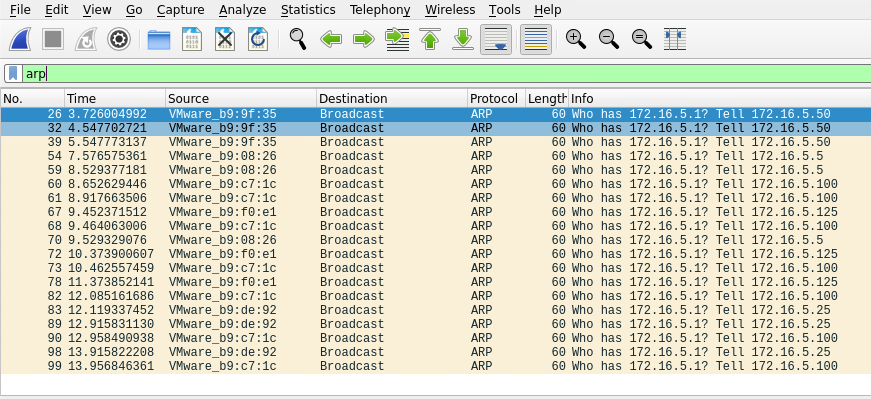
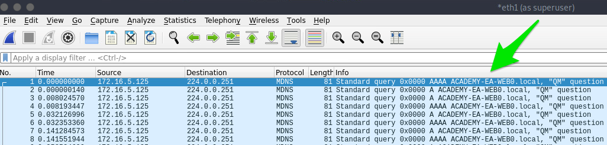

# Initial Enumeration of the Domain

***

### <mark style="color:red;">Setting Up</mark>

Le test de pénétration se déroule dans un environnement interne en fonction

1. <mark style="color:green;">**Configurations possibles pour le test**</mark> <mark style="color:green;"></mark><mark style="color:green;">:</mark>
   * Une machine virtuelle Linux dans l'infrastructure interne, communiquant avec un serveur de saut (jump host) via VPN.
   * Un appareil physique branché à un port Ethernet, avec une connexion VPN pour le contrôle à distance.
   * Une présence physique sur site avec un ordinateur connecté à leur réseau.
   * Une machine virtuelle Linux sur Azure/AWS ayant accès au réseau interne, contrôlée par SSH avec IP publique autorisée.
   * Un accès VPN au réseau interne (limité pour certaines attaques comme LLMNR/NBT-NS Poisoning).
   * Un ordinateur portable connecté au VPN de l’entreprise.
   * Une station de travail gérée localement ou via VDI (Virtual Desktop Interface) avec diverses options d'accès (local admin, protection des points de terminaison en mode surveillance, etc.).
2. <mark style="color:green;">**Méthodes de test selon les informations fournies par le client**</mark> <mark style="color:green;"></mark><mark style="color:green;">:</mark>
   * **Approche Grey box** : Le client fournit une liste limitée d’adresses IP ou de plages réseau.
   * **Approche Black box** : L’équipe de test doit découvrir l’ensemble du réseau sans information préalable.
   * Approches **évasives** (tests furtifs) ou **non évasives** (tests visibles), ou un mélange des deux.

***

3. <mark style="color:green;">**Cas d’étude avec Inlanefreight**</mark> <mark style="color:green;"></mark><mark style="color:green;">:</mark>
   * **Configuration choisie** :
     * Une VM de test personnalisée dans leur réseau interne, accessible via SSH depuis un serveur de saut.
     * Une machine Windows supplémentaire pour charger des outils.
   * **Type de test** :
     * Approche **Grey box** avec une plage réseau fournie : **172.16.5.0/23**.
     * **Non évasif** : Pas de techniques furtives.
     * Départ **non authentifié**, mais un compte utilisateur standard a été fourni (**htb-student**) pour explorer les ressources internes.

***

### <mark style="color:red;">Tasks</mark>

* Enumerate the **internal network**, identifying **hosts**, critical **services**, and potential avenues for a **foothold**.
* This can include **active and passive measures** to identify users, hosts, and vulnerabilities we may be able to take advantage of to further our access.

**Key Data Points**

<table data-header-hidden data-full-width="true"><thead><tr><th></th><th></th></tr></thead><tbody><tr><td><strong>Data Point</strong></td><td><strong>Description</strong></td></tr><tr><td><code>AD Users</code></td><td>We are trying to enumerate valid user accounts we can target for password spraying.</td></tr><tr><td><code>AD Joined Computers</code></td><td>Key Computers include Domain Controllers, file servers, SQL servers, web servers, Exchange mail servers, database servers, etc.</td></tr><tr><td><code>Key Services</code></td><td>Kerberos, NetBIOS, LDAP, DNS</td></tr><tr><td><code>Vulnerable Hosts and Services</code></td><td>Anything that can be a quick win. ( a.k.a an easy host to exploit and gain a foothold)</td></tr></tbody></table>

***

### <mark style="color:red;">TTPs</mark>

On commence par une identification **passive** des hôtes présents sur le réseau, suivie d’une validation **active** pour obtenir plus d’informations sur chaque hôte (services actifs, noms, vulnérabilités potentielles, etc.).&#x20;


Une fois les hôtes identifiés, on les analyse pour recueillir des données intéressantes. Ensuite, on fait un point pour analyser les informations obtenues. L'objectif est de trouver des identifiants ou un compte utilisateur permettant de prendre pied sur un hôte connecté au domaine, ou de commencer une énumération avec des droits depuis notre machine d'attaque Linux.


#### <mark style="color:green;">Identifying Hosts</mark>

&#x20;We can use **`Wireshark`** and **`TCPDump`** to "put our ear to the wire" and see what hosts and types of network traffic&#x20;

We notice some [<mark style="color:orange;">**ARP**</mark>](https://en.wikipedia.org/wiki/Address_Resolution_Protocol) <mark style="color:orange;">**requests and replies**</mark>

[<mark style="color:orange;">**MDNS**</mark>](https://en.wikipedia.org/wiki/Multicast_DNS)<mark style="color:orange;">**, and other basic**</mark> [<mark style="color:orange;">**layer two**</mark>](https://www.juniper.net/documentation/us/en/software/junos/multicast-l2/topics/topic-map/layer-2-understanding.html) <mark style="color:orange;">**packets**</mark> (since we are on a switched network, we are limited to the current broadcast domain) some of which we can see below. This is a great start that gives us a few bits of information about the customer's network setup.


```shell-session
┌─[htb-student@ea-attack01]─[~]
└──╼ $sudo -E wireshark
```


**Wireshark Output**

<figure><figcaption></figcaption></figure>

* ARP packets make us aware of the hosts: **172.16.5.5, / 172.16.5.25 / 172.16.5.50 / 172.16.5.100, and 172.16.5.125.**

<figure><figcaption></figcaption></figure>

* **MDNS makes us aware of the ACADEMY-EA-WEB01 host.**

***

If we are on a host without a GUI (which is typical), we can use [tcpdump](https://linux.die.net/man/8/tcpdump), [net-creds](https://github.com/DanMcInerney/net-creds), and [NetMiner](https://www.netminer.com/en/product/netminer.php), etc.,&#x20;

<mark style="color:orange;">**Tcpdump Output**</mark>

```shell-session
mrroboteLiot@htb[/htb]$ sudo tcpdump -i ens224 
```

<figure><figcaption></figcaption></figure>

Now let's utilize a tool called `Responder` to analyze network traffic and determine if anything else in the domain pops up.


[Responder](https://github.com/lgandx/Responder-Windows) is a tool built to listen, analyze, and poison `LLMNR`, `NBT-NS`, and `MDNS` requests and response

#### <mark style="color:yellow;">1.</mark> <mark style="color:yellow;"></mark><mark style="color:yellow;">**LLMNR (Link-Local Multicast Name Resolution)**</mark>

* **Fonction** : LLMNR est utilisé pour résoudre les noms d'hôtes dans un réseau local sans avoir besoin d'un serveur DNS. Il permet à un appareil de rechercher un autre appareil sur le même réseau en utilisant un nom d'hôte au lieu de l'adresse IP.
* **Sécurité** : LLMNR est vulnérable aux attaques telles que le **spoofing** où un attaquant peut répondre à une requête LLMNR avec de fausses informations, trompant ainsi la victime.

#### <mark style="color:yellow;">2.</mark> <mark style="color:yellow;"></mark><mark style="color:yellow;">**NBT-NS (NetBIOS Name Service)**</mark>

* **Fonction** : NBT-NS est utilisé dans les réseaux Windows pour résoudre les noms NetBIOS en adresses IP. Ce protocole est souvent utilisé pour identifier et localiser des ressources sur un réseau local (comme des fichiers ou des imprimantes partagées).
* **Sécurité** : Comme LLMNR, NBT-NS est également vulnérable aux attaques par **spoofing**, où un attaquant répond à une requête NBT-NS en se faisant passer pour une autre machine sur le réseau.

#### <mark style="color:yellow;">3.</mark> <mark style="color:yellow;"></mark><mark style="color:yellow;">**MDNS (Multicast DNS)**</mark>

* **Fonction** : MDNS est utilisé pour la résolution de noms dans des réseaux locaux, principalement dans les environnements où un serveur DNS traditionnel n'est pas disponible. Par exemple, il est utilisé par des appareils comme les imprimantes, caméras, ou autres dispositifs IoT pour se découvrir et se connecter entre eux sans avoir besoin d'un serveur DNS.
* **Sécurité** : MDNS peut aussi être sujet à des attaques de **spoofing**, où un attaquant pourrait répondre à une requête MDNS en prétendant être un autre appareil sur le réseau.


<mark style="color:green;">**Starting Responder**</mark>

```bash
sudo responder -I ens224 -A 
```

**Responder Results**

<figure><figcaption></figcaption></figure>

Our passive checks have given us a few hosts to note down for a more in-depth enumeration. Now let's perform some active checks starting with a quick ICMP sweep of the subnet using `fping`.


[Fping](https://fping.org/) Il nous fournit une fonctionnalité similaire à celle de l'application standard _ping_ dans la mesure où il utilise des requêtes et réponses ICMP pour interagir avec un hôte. Là où _fping_ se distingue, c'est par sa capacité à envoyer des paquets ICMP vers une liste de plusieurs hôtes à la fois et sa possibilité de script. De plus, il fonctionne de manière _round-robin_, interrogeant les hôtes de manière cyclique au lieu d'attendre que plusieurs requêtes d'un seul hôte retournent avant de passer au suivant. Ces vérifications nous aideront à déterminer si d'autres hôtes sont actifs sur le réseau interne. ICMP n'est pas la solution unique, mais c'est un moyen facile d'obtenir une idée initiale de ce qui existe. D'autres ports ouverts et protocoles actifs peuvent indiquer de nouveaux hôtes à cibler plus tard.&#x20;


<mark style="color:green;">**FPing Active Checks**</mark>

**Here we'll start `fping` with a few flags: `a` to show targets that are alive, `s` to print stats at the end of the scan, `g` to generate a target list from the CIDR network, and `q` to not show per-target results.**

```shell-session
mrroboteLiot@htb[/htb]$ fping -asgq 172.16.5.0/23
```

<mark style="color:green;">**Nmap Scanning**</mark>

Now that we have a list of active hosts within our network, we can enumerate those hosts further. We are looking to determine what services each host is running, identify critical hosts such as `Domain Controllers` and `web servers`, and identify potentially vulnerable hosts to probe later.&#x20;

```bash
sudo nmap -v -A -iL hosts.txt -oN /home/htb-student/Documents/host-enum
```

<mark style="color:green;">**NMAP Result Highlights**</mark>


```shell-session
Nmap scan report for inlanefreight.local (172.16.5.5)
Host is up (0.069s latency).
Not shown: 987 closed tcp ports (conn-refused)
PORT     STATE SERVICE       VERSION
53/tcp   open  domain        Simple DNS Plus
88/tcp   open  kerberos-sec  Microsoft Windows Kerberos (server time: 2022-04-04 15:12:06Z)
135/tcp  open  msrpc         Microsoft Windows RPC
139/tcp  open  netbios-ssn   Microsoft Windows netbios-ssn
389/tcp  open  ldap          Microsoft Windows Active Directory LDAP (Domain: INLANEFREIGHT.LOCAL0., Site: Default-First-Site-Name)
|_ssl-date: 2022-04-04T15:12:53+00:00; -1s from scanner time.
| ssl-cert: Subject:
| Subject Alternative Name: DNS:ACADEMY-EA-DC01.INLANEFREIGHT.LOCAL
| Issuer: commonName=INLANEFREIGHT-CA
| Public Key type: rsa
| Public Key bits: 2048
| Signature Algorithm: sha256WithRSAEncryption
| Not valid before: 2022-03-30T22:40:24
| Not valid after:  2023-03-30T22:40:24
| MD5:   3a09 d87a 9ccb 5498 2533 e339 ebe3 443f
|_SHA-1: 9731 d8ec b219 4301 c231 793e f913 6868 d39f 7920
445/tcp  open  microsoft-ds?
464/tcp  open  kpasswd5?
593/tcp  open  ncacn_http    Microsoft Windows RPC over HTTP 1.0
636/tcp  open  ssl/ldap      Microsoft Windows Active Directory LDAP (Domain: INLANEFREIGHT.LOCAL0., Site: Default-First-Site-Name)
<SNIP>  
3268/tcp open  ldap          Microsoft Windows Active Directory LDAP (Domain: INLANEFREIGHT.LOCAL0., Site: Default-First-Site-Name)
3269/tcp open  ssl/ldap      Microsoft Windows Active Directory LDAP (Domain: INLANEFREIGHT.LOCAL0., Site: Default-First-Site-Name)
3389/tcp open  ms-wbt-server Microsoft Terminal Services
| rdp-ntlm-info:
|   Target_Name: INLANEFREIGHT
|   NetBIOS_Domain_Name: INLANEFREIGHT
|   NetBIOS_Computer_Name: ACADEMY-EA-DC01
|   DNS_Domain_Name: INLANEFREIGHT.LOCAL
|   DNS_Computer_Name: ACADEMY-EA-DC01.INLANEFREIGHT.LOCAL
|   DNS_Tree_Name: INLANEFREIGHT.LOCAL
|   Product_Version: 10.0.17763
|_  System_Time: 2022-04-04T15:12:45+00:00
<SNIP>
5357/tcp open  http          Microsoft HTTPAPI httpd 2.0 (SSDP/UPnP)
|_http-title: Service Unavailable
|_http-server-header: Microsoft-HTTPAPI/2.0
Service Info: Host: ACADEMY-EA-DC01; OS: Windows; CPE: cpe:/o:microsoft:windows
```


Our scans have provided us with the naming standard used by NetBIOS and DNS, we can see some hosts have RDP open, and they have pointed us in the direction of the <mark style="color:blue;">**primary**</mark><mark style="color:blue;">**&#x20;**</mark><mark style="color:blue;">**`Domain Controller`**</mark><mark style="color:blue;">**&#x20;**</mark><mark style="color:blue;">**for the INLANEFREIGHT.LOCAL domain (ACADEMY-EA-DC01.INLANEFREIGHT.LOCAL)**</mark>**.** The results below show some interesting results surrounding a possibly outdated host (not in our current lab).


```shell-session
mrroboteLiot@htb[/htb]$ nmap -A 172.16.5.100

Starting Nmap 7.92 ( https://nmap.org ) at 2022-04-08 13:42 EDT
Nmap scan report for 172.16.5.100
Host is up (0.071s latency).
Not shown: 989 closed tcp ports (conn-refused)
PORT      STATE SERVICE      VERSION
80/tcp    open  http         Microsoft IIS httpd 7.5
|_http-title: Site doesn't have a title (text/html).
|_http-server-header: Microsoft-IIS/7.5
| http-methods: 
|_  Potentially risky methods: TRACE
135/tcp   open  msrpc        Microsoft Windows RPC
139/tcp   open  netbios-ssn  Microsoft Windows netbios-ssn
443/tcp   open  https?
445/tcp   open  microsoft-ds Windows Server 2008 R2 Standard 7600 microsoft-ds
1433/tcp  open  ms-sql-s     Microsoft SQL Server 2008 R2 10.50.1600.00; RTM
| ssl-cert: Subject: commonName=SSL_Self_Signed_Fallback
| Not valid before: 2022-04-08T17:38:25
|_Not valid after:  2052-04-08T17:38:25
|_ssl-date: 2022-04-08T17:43:53+00:00; 0s from scanner time.
| ms-sql-ntlm-info: 
|   Target_Name: INLANEFREIGHT
|   NetBIOS_Domain_Name: INLANEFREIGHT
|   NetBIOS_Computer_Name: ACADEMY-EA-CTX1
|   DNS_Domain_Name: INLANEFREIGHT.LOCAL
|   DNS_Computer_Name: ACADEMY-EA-CTX1.INLANEFREIGHT.LOCAL
|_  Product_Version: 6.1.7600
Host script results:
| smb2-security-mode: 
|   2.1: 
|_    Message signing enabled but not required
| ms-sql-info: 
|   172.16.5.100:1433: 
|     Version: 
|       name: Microsoft SQL Server 2008 R2 RTM
|       number: 10.50.1600.00
|       Product: Microsoft SQL Server 2008 R2
|       Service pack level: RTM
|       Post-SP patches applied: false
|_    TCP port: 1433
|_nbstat: NetBIOS name: ACADEMY-EA-CTX1, NetBIOS user: <unknown>, NetBIOS MAC: 00:50:56:b9:c7:1c (VMware)
| smb-os-discovery: 
|   OS: Windows Server 2008 R2 Standard 7600 (Windows Server 2008 R2 Standard 6.1)
|   OS CPE: cpe:/o:microsoft:windows_server_2008::-
|   Computer name: ACADEMY-EA-CTX1
|   NetBIOS computer name: ACADEMY-EA-CTX1\x00
|   Domain name: INLANEFREIGHT.LOCAL
|   Forest name: INLANEFREIGHT.LOCAL
|   FQDN: ACADEMY-EA-CTX1.INLANEFREIGHT.LOCAL
|_  System time: 2022-04-08T10:43:48-07:00

<SNIP>
```


D'après les résultats, on voit qu'il y a potentiellement un hôte avec un système d'exploitation obsolète (Windows 7, 8 ou Server 2008) qui peut offrir des vulnérabilités comme EternalBlue ou MS08-067, permettant d’obtenir un accès SYSTEM.&#x20;

Les résultats des scans nous montrent où commencer à rechercher des informations sur les utilisateurs de domaine. Nous avons découvert plusieurs serveurs de services de domaine (DC01, MX01, WS01, etc.), et maintenant nous pouvons tenter d'énumérer les utilisateurs.

Le but final est de trouver un compte utilisateur de domaine ou un accès SYSTEM sur un hôte du domaine pour commencer l'exploration en profondeur.

***

### <mark style="color:red;">Identifying Users</mark>

#### <mark style="color:green;">Kerbrute - Internal AD Username Enumeration</mark>

Kerbrute peut être une option plus discrète pour l'énumération des comptes de domaine. Il profite du fait que les échecs de pré-authentification Kerberos ne déclenchent souvent pas de journaux ou d'alertes.&#x20;

Nous allons utiliser Kerbrute en combinaison avec les listes d'utilisateurs `jsmith.txt` ou `jsmith2.txt` provenant d'Insidetrust.&#x20;

<mark style="color:orange;">**Cloning Kerbrute GitHub Repo**</mark>

```shell-session
mrroboteLiot@htb[/htb]$ sudo git clone https://github.com/ropnop/kerbrute.git
```

Typing `make help` will show us the compiling options available.

<mark style="color:orange;">**Listing Compiling Options**</mark>

```shell-session
mrroboteLiot@htb[/htb]$ make help

help:            Show this help.
windows:  Make Windows x86 and x64 Binaries
linux:  Make Linux x86 and x64 Binaries
mac:  Make Darwin (Mac) x86 and x64 Binaries
clean:  Delete any binaries
all:  Make Windows, Linux and Mac x86/x64 Binaries
```

We can choose to compile just one binary or type `make all` and compile one each for use on Linux, Windows, and Mac systems (an x86 and x64 version for each).

<mark style="color:orange;">**Compiling for Multiple Platforms and Architectures**</mark>

```shell-session
mrroboteLiot@htb[/htb]$ sudo make all

<SNIP>
```

The newly created `dist` directory will contain our compiled binaries.

<mark style="color:orange;">**Listing the Compiled Binaries in dist**</mark>


```shell-session
mrroboteLiot@htb[/htb]$ ls dist/

kerbrute_darwin_amd64  kerbrute_linux_386  kerbrute_linux_amd64  kerbrute_windows_386.exe  kerbrute_windows_amd64.exe
```


We can then test out the binary to make sure it works properly. We will be using the x64 version on the supplied Parrot Linux attack host in the target environment.

<mark style="color:orange;">**Testing the kerbrute\_linux\_amd64 Binary**</mark>


```shell-session
mrroboteLiot@htb[/htb]$ ./kerbrute_linux_amd64 
```


We can add the tool to our PATH to make it easily accessible from anywhere on the host.

<mark style="color:orange;">**Adding the Tool to our Path**</mark>


```shell-session
mrroboteLiot@htb[/htb]$ echo $PATH
```


<mark style="color:orange;">**Moving the Binary**</mark>

```shell-session
mrroboteLiot@htb[/htb]$ sudo mv kerbrute_linux_amd64 /usr/local/bin/kerbrute
```

<mark style="color:orange;">**Enumerating Users with Kerbrut**</mark>


```shell-session
mrroboteLiot@htb[/htb]$ kerbrute userenum -d INLANEFREIGHT.LOCAL --dc 172.16.5.5 jsmith.txt -o valid_ad_users

2021/11/17 23:01:46 >  Using KDC(s):
2021/11/17 23:01:46 >   172.16.5.5:88
2021/11/17 23:01:46 >  [+] VALID USERNAME:       jjones@INLANEFREIGHT.LOCAL
```


***

### <mark style="color:red;">Identifying Potential Vulnerabilities</mark>

The [local system](https://docs.microsoft.com/en-us/windows/win32/services/localsystem-account) account `NT AUTHORITY\SYSTEM` is a built-in account in Windows operating systems. It has the highest level of access in the OS and is used to run most Windows services. It is also very common for third-party services to run in the context of this account by default. A `SYSTEM` account on a `domain-joined` host will be able to enumerate Active Directory by impersonating the computer account, which is essentially just another kind of user account. Having SYSTEM-level access within a domain environment is nearly equivalent to having a domain user account.


There are several ways to gain SYSTEM-level access on a host, including but not limited to:

* Remote Windows exploits such as MS08-067, EternalBlue, or BlueKeep.
* Abusing a service running in the context of the `SYSTEM account`, or abusing the service account `SeImpersonate` privileges using [Juicy Potato](https://github.com/ohpe/juicy-potato). This type of attack is possible on older Windows OS' but not always possible with Windows Server 2019.
* Local privilege escalation flaws in Windows operating systems such as the Windows 10 Task Scheduler 0-day.
* Gaining admin access on a domain-joined host with a local account and using Psexec to launch a SYSTEM cmd windows


***
