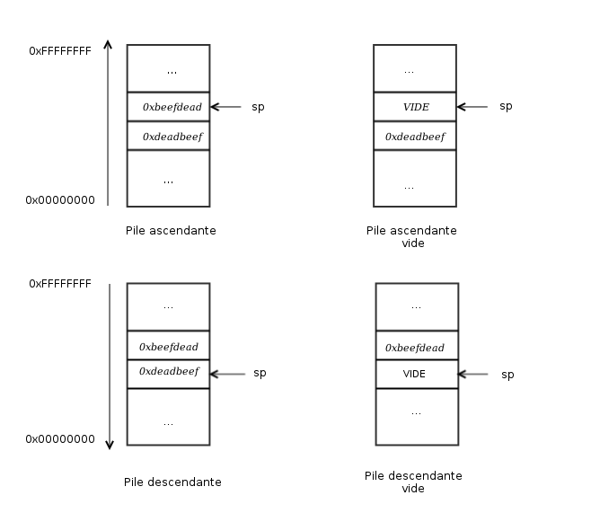

# All about Users

## <mark style="color:red;">Comptes Utilisateurs et Machines</mark>

Les comptes utilisateurs sont créés à la fois sur les systèmes locaux (non joints à AD) et dans Active Directory pour donner à une personne ou à un programme (comme un service système) la capacité de se connecter à un ordinateur et d'accéder aux ressources en fonction de leurs droits.&#x20;

Lorsqu'un utilisateur se connecte, le système vérifie son mot de passe et crée un jeton d'accès. Ce jeton décrit le contexte de sécurité d'un processus ou d'un thread et inclut l'identité de sécurité de l'utilisateur et son appartenance aux groupes. Chaque fois qu'un utilisateur interagit avec un processus, ce jeton est présenté. Les comptes utilisateurs sont utilisés pour permettre aux employés/contractuels de se connecter à un ordinateur et d'accéder aux ressources, d'exécuter des programmes ou des services sous un contexte de sécurité spécifique (c'est-à-dire en s'exécutant en tant qu'utilisateur hautement privilégié au lieu d'un compte de service réseau), et de gérer l'accès aux objets et leurs propriétés tels que les partages de fichiers réseau, les fichiers, les applications, etc.&#x20;

Les utilisateurs peuvent être assignés à des groupes qui peuvent contenir un ou plusieurs membres. Ces groupes peuvent également être utilisés pour contrôler l'accès aux ressources. Il peut être plus facile pour un administrateur d'assigner des privilèges une seule fois à un groupe (que tous les membres du groupe héritent) plutôt que plusieurs fois à chaque utilisateur individuel. Cela aide à simplifier l'administration et facilite l'octroi et la révocation des droits des utilisateurs.

La capacité de provisionner et de gérer les comptes utilisateurs est l'un des éléments centraux d'Active Directory.&#x20;

Typiquement, chaque entreprise que nous rencontrons aura au moins un compte utilisateur AD provisionné par utilisateur. Certains utilisateurs peuvent avoir deux comptes ou plus provisionnés en fonction de leur rôle professionnel (par exemple, un administrateur IT ou un membre du support technique).&#x20;

Outre les comptes utilisateurs standard et admin liés à un utilisateur spécifique, nous verrons souvent de nombreux comptes de service utilisés pour exécuter une application ou un service particulier en arrière-plan ou effectuer d'autres fonctions vitales dans l'environnement de domaine.&#x20;

Une organisation de 1 000 employés pourrait avoir 1 200 comptes utilisateurs actifs ou plus ! Nous pouvons également voir des organisations avec des centaines de comptes désactivés d'anciens employés, d'employés temporaires/saisonniers, de stagiaires, etc. Certaines entreprises doivent conserver des enregistrements de ces comptes à des fins d'audit, elles les désactiveront donc (et supprimeront espérons-le tous les privilèges) une fois l'employé licencié, mais elles ne les supprimeront pas. Il est courant de voir une OU telle que `ANCIENS EMPLOYÉS` qui contiendra de nombreux comptes désactivés.

<figure><figcaption></figcaption></figure>

Comme nous le verrons plus tard dans ce module, les comptes utilisateurs peuvent se voir octroyer de nombreux droits dans Active Directory.&#x20;

Ils peuvent être configurés comme des utilisateurs essentiellement en lecture seule qui ont un accès en lecture à la majeure partie de l'environnement (ce qui sont les permissions qu'un utilisateur de domaine standard reçoit) jusqu'à Enterprise Admin (avec un contrôle complet de chaque objet dans le domaine) et d'innombrables combinaisons entre les deux.&#x20;

Parce que les utilisateurs peuvent avoir tant de droits qui leur sont assignés, ils peuvent également être mal configurés relativement facilement et se voir accorder des droits non intentionnels qu'un attaquant ou un testeur d'intrusion peut exploiter.&#x20;

Les comptes utilisateurs présentent une surface d'attaque immense et sont généralement un point focal clé pour obtenir une prise initiale lors d'un test d'intrusion. Les utilisateurs sont souvent le maillon faible de toute organisation. Il est difficile de gérer le comportement humain et de tenir compte de chaque utilisateur choisissant des mots de passe faibles ou partagés, installant des logiciels non autorisés, ou des administrateurs faisant des erreurs négligentes ou étant trop permissifs avec la gestion des comptes. Pour combattre cela, une organisation doit avoir des politiques et des procédures pour combattre les problèmes qui peuvent survenir autour des comptes utilisateurs et doit avoir une défense en profondeur pour atténuer le risque inhérent que les utilisateurs apportent au domaine.

Les spécificités sur les mauvaises configurations liées aux utilisateurs et les attaques sont en dehors de la portée de ce module. Néanmoins, il est important de comprendre l'impact considérable que les utilisateurs peuvent avoir au sein de n'importe quel réseau Active Directory et de comprendre les nuances entre les différents types d'utilisateurs/comptes que nous pouvons rencontrer.

***

### <mark style="color:blue;">Comptes Locaux</mark>

Les comptes locaux sont stockés localement sur un serveur ou une station de travail particulière. Ces comptes peuvent se voir attribuer des droits sur cet hôte soit individuellement, soit via l'appartenance à un groupe. Tous les droits assignés ne peuvent être accordés qu'à cet hôte spécifique et ne fonctionneront pas à travers le domaine. Les comptes utilisateurs locaux sont considérés comme des principaux de sécurité mais ne peuvent gérer l'accès et sécuriser les ressources que sur un hôte autonome. Il existe plusieurs comptes utilisateurs locaux par défaut qui sont créés sur un système Windows :

* **Administrator** : ce compte a le SID S-1-5-domain-500 et est le premier compte créé avec une nouvelle installation Windows. Il a un contrôle total sur presque toutes les ressources du système. Il ne peut pas être supprimé ou verrouillé, mais il peut être désactivé ou renommé. Les hôtes Windows 10 et Server 2016 désactivent le compte administrateur intégré par défaut et créent un autre compte local dans le groupe des administrateurs locaux lors de la configuration.
* **Guest** : ce compte est désactivé par défaut. Le but de ce compte est de permettre aux utilisateurs sans compte sur l'ordinateur de se connecter temporairement avec des droits d'accès limités. Par défaut, il a un mot de passe vide et il est généralement recommandé de le laisser désactivé en raison du risque de sécurité lié à l'autorisation d'un accès anonyme à un hôte.
* **SYSTEM** : Le compte SYSTEM (ou NT AUTHORITY\SYSTEM) sur un hôte Windows est le compte par défaut installé et utilisé par le système d'exploitation pour effectuer bon nombre de ses fonctions internes. Contrairement au compte Root sur Linux, SYSTEM est un compte de service et ne fonctionne pas entièrement dans le même contexte qu'un utilisateur régulier. Beaucoup de processus et services s'exécutant sur un hôte sont exécutés sous le contexte SYSTEM. Une chose à noter avec ce compte est qu'un profil pour celui-ci n'existe pas, mais il aura des permissions sur presque tout sur l'hôte. Il n'apparaît pas dans le Gestionnaire d'utilisateurs et ne peut être ajouté à aucun groupe. Un compte SYSTEM est le niveau de permission le plus élevé qu'on puisse atteindre sur un hôte Windows et, par défaut, se voit accorder des permissions de contrôle total sur tous les fichiers d'un système Windows.
* **Network Service** : C'est un compte local prédéfini utilisé par le Service Control Manager (SCM) pour exécuter les services Windows. Lorsqu'un service s'exécute dans le contexte de ce compte particulier, il présentera des informations d'identification aux services distants.
* **Local Service** : C'est un autre compte local prédéfini utilisé par le Service Control Manager (SCM) pour exécuter les services Windows. Il est configuré avec des privilèges minimaux sur l'ordinateur et présente des informations d'identification anonymes au réseau.

Il vaut la peine d'étudier en profondeur la documentation de Microsoft sur les comptes locaux par défaut pour acquérir une meilleure compréhension de la façon dont les différents comptes fonctionnent ensemble sur un système Windows individuel et à travers un réseau de domaine. Prenez le temps de les examiner et de comprendre les nuances entre eux.

***

### <mark style="color:blue;">Utilisateurs de Domaine</mark>

Les utilisateurs de domaine diffèrent des utilisateurs locaux en ce qu'ils se voient accorder des droits depuis le domaine pour accéder aux ressources telles que les serveurs de fichiers, les imprimantes, les hôtes intranet et d'autres objets en fonction des permissions accordées à leur compte utilisateur ou au groupe dont ce compte est membre.&#x20;

Les comptes utilisateurs de domaine peuvent se connecter à n'importe quel hôte du domaine, contrairement aux utilisateurs locaux.&#x20;

Un compte à garder à l'esprit est cependant le compte KRBTGT. C'est un type de compte local intégré à l'infrastructure AD. Ce compte agit comme un compte de service pour le service de distribution de clés fournissant l'authentification et l'accès aux ressources du domaine. Ce compte est une cible commune de nombreux attaquants car obtenir le contrôle ou l'accès permettra à un attaquant d'avoir un accès illimité au domaine. Il peut être exploité pour l'escalade de privilèges et la persistance dans un domaine par des attaques telles que l'attaque Golden Ticket.

***

### <mark style="color:blue;">Attributs de Nommage des Utilisateurs</mark>

La sécurité dans Active Directory peut être améliorée en utilisant un ensemble d'attributs de nommage des utilisateurs pour aider à identifier les objets utilisateurs comme le nom de connexion ou l'ID. Voici quelques attributs de nommage importants dans AD :

**UserPrincipalName (UPN)** : C'est le nom de connexion principal de l'utilisateur. Par convention, l'UPN utilise l'adresse e-mail de l'utilisateur.

**ObjectGUID** : C'est un identifiant unique de l'utilisateur. Dans AD, le nom d'attribut ObjectGUID ne change jamais et reste unique même si l'utilisateur est supprimé.

**SAMAccountName** : C'est un nom de connexion qui prend en charge la version précédente des clients et serveurs Windows.

**objectSID** : L'identifiant de sécurité (SID) de l'utilisateur. Cet attribut identifie un utilisateur et ses appartenances aux groupes lors des interactions de sécurité avec le serveur.

**sIDHistory** : Ceci contient les SID précédents pour l'objet utilisateur s'il a été déplacé depuis un autre domaine et est généralement observé dans les scénarios de migration de domaine à domaine. Après une migration, le dernier SID sera ajouté à la propriété sIDHistory, et le nouveau SID deviendra son objectSID.

***

### <mark style="color:blue;">Attributs Utilisateur Courants</mark>

```powershell
PS C:\htb> Get-ADUser -Identity htb-student

DistinguishedName : CN=htb student,CN=Users,DC=INLANEFREIGHT,DC=LOCAL
Enabled           : True
GivenName         : htb
Name              : htb student
ObjectClass       : user
ObjectGUID        : aa799587-c641-4c23-a2f7-75850b4dd7e3
SamAccountName    : htb-student
SID               : S-1-5-21-3842939050-3880317879-2865463114-1111
Surname           : student
UserPrincipalName : htb-student@INLANEFREIGHT.LOCAL
```

***

### <mark style="color:blue;">Machines Jointes au Domaine vs Non Jointes au Domaine</mark>

En ce qui concerne les ressources informatiques, il existe plusieurs façons dont elles sont généralement gérées. Ci-dessous, nous discuterons des différences entre un hôte joint à un domaine et un hôte qui est seulement dans un groupe de travail.

#### <mark style="color:green;">Joint au domaine</mark>

Les hôtes joints à un domaine ont une plus grande facilité de partage d'informations au sein de l'entreprise et un point de gestion central (le DC) pour recueillir des ressources, des politiques et des mises à jour. Un hôte joint à un domaine acquerra toutes les configurations ou modifications nécessaires via la stratégie de groupe du domaine. L'avantage ici est qu'un utilisateur dans le domaine peut se connecter et accéder aux ressources depuis n'importe quel hôte joint au domaine, pas seulement celui sur lequel il travaille. C'est la configuration typique que vous verrez dans les environnements d'entreprise.

#### <mark style="color:green;">Non joint au domaine</mark>

Les ordinateurs non joints au domaine ou les ordinateurs dans un groupe de travail ne sont pas gérés par la politique de domaine. Dans cet esprit, le partage de ressources en dehors de votre réseau local est beaucoup plus compliqué qu'il ne le serait sur un domaine. C'est bien pour les ordinateurs destinés à un usage domestique ou les petits clusters d'entreprises sur le même réseau local. L'avantage de cette configuration est que les utilisateurs individuels sont responsables de tous les changements qu'ils souhaitent apporter à leur hôte. Tous les comptes utilisateurs sur un ordinateur de groupe de travail n'existent que sur cet hôte, et les profils ne sont pas migrés vers d'autres hôtes au sein du groupe de travail.

Il est important de noter qu'un compte machine (accès de niveau NT AUTHORITY\SYSTEM) dans un environnement AD aura la plupart des mêmes droits qu'un compte utilisateur de domaine standard. C'est important car nous n'avons pas toujours besoin d'obtenir un ensemble d'informations d'identification valides pour le compte d'un utilisateur individuel pour commencer à énumérer et attaquer un domaine (comme nous le verrons dans les modules ultérieurs). Nous pouvons obtenir un accès de niveau SYSTEM à un hôte Windows joint au domaine par une exploitation réussie d'exécution de code à distance ou en escaladant les privilèges sur un hôte. Cet accès est souvent négligé comme étant uniquement utile pour piller des données sensibles (c'est-à-dire des mots de passe, des clés SSH, des fichiers sensibles, etc.) sur un hôte particulier. En réalité, l'accès dans le contexte du compte SYSTEM nous permettra un accès en lecture à une grande partie des données au sein du domaine et constitue un excellent point de départ pour rassembler autant d'informations que possible sur le domaine avant de procéder aux attaques applicables liées à AD.
