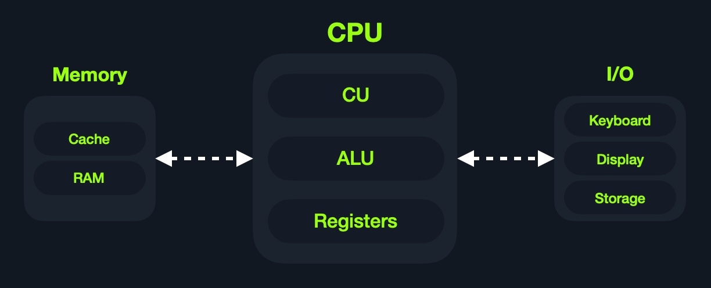

# Architecture des ordinateurs

Aujourd’hui, la plupart des ordinateurs modernes sont construits selon ce qu’on appelle <mark style="color:orange;">l’</mark><mark style="color:orange;">**Architecture de Von Neumann**</mark>, qui a été développée en 1945 par Von Neumann pour permettre la création des **ordinateurs à usage général**, comme les décrivait Alan Turing à l’époque.&#x20;

Alan Turing, à son tour, a basé ses idées sur le concept d’**ordinateur programmable** de Charles Babbage, datant du milieu du XIXe siècle. À noter que toutes ces personnes étaient des mathématiciens.

Cette architecture exécute du code machine pour réaliser des algorithmes spécifiques. Elle se compose principalement des éléments suivants :

* **Unité centrale de traitement (CPU)**  :1234:
* **Mémoire** :floppy\_disk:
* **Périphériques d’entrée/sortie (Input/Output)**&#x20;
* **Unité de stockage de masse**  :minidisc:
* **Clavier**  :keyboard:
* **Écran**  :desktop:

<mark style="color:green;">**En plus, le CPU lui-même se compose de trois éléments principaux :**</mark>

* **Unité de contrôle (CU)** :passport\_control:
* **Unité arithmétique et logique (ALU)**  :heavy\_plus\_sign:
* **Registres**  :package:

<figure><figcaption></figcaption></figure>

***

#### <mark style="color:green;">**Architecture de Von Neumann**</mark>

Bien qu’ancienne, cette architecture reste la base de la plupart des ordinateurs, serveurs, et même des smartphones modernes.

Les langages assembleur travaillent principalement avec le CPU et la mémoire.&#x20;

C’est pourquoi il est crucial de comprendre la conception générale de l’architecture des ordinateurs. Ainsi, lorsque nous utilisons des instructions assembleur pour déplacer ou traiter des données, nous savons d’où elles viennent, où elles vont, et à quelle vitesse (ou coût) chaque instruction est exécutée.

De plus, la compréhension de l’architecture des ordinateurs est indispensable pour l’exploitation binaire, aussi bien basique qu’avancée.&#x20;

Pour des débordements de pile (stack overflow) simples, il suffit de connaître la structure générale. Mais pour des techniques comme le ROP (Return Oriented Programming) ou les attaques sur le tas (Heap), une compréhension plus approfondie est nécessaire.

***

#### <mark style="color:green;">**Mémoire**</mark>

La **mémoire** d’un ordinateur est l<mark style="color:orange;">**’endroit où se trouvent temporairement les données et instructions**</mark> des programmes en cours d’exécution.&#x20;

Elle est aussi appelée **mémoire principale**. C’est le lieu principal d’accès du CPU pour traiter les données. Le CPU accède à la mémoire des **milliards de fois par seconde**, donc elle doit être **extrêmement rapide** pour stocker et récupérer les données.

Il existe deux types principaux de mémoire :

* **Cache**&#x20;
* **Mémoire vive (RAM)**

***

#### <mark style="color:green;">**Cache**</mark>

La **mémoire cache** est généralement intégrée directement dans le CPU, ce qui la rend **extrêmement rapide** comparée à la RAM, car elle fonctionne à la **même vitesse d’horloge** que le CPU. Mais elle est **très limitée** en taille, sophistiquée, et coûteuse à produire, car elle est très proche du cœur du processeur.

Comme la vitesse d’horloge de la RAM est beaucoup plus **lente** et qu’elle est **physiquement plus éloignée** du CPU, si le CPU devait attendre la RAM pour chaque instruction, il fonctionnerait **beaucoup plus lentement**. C’est ici que la mémoire cache est essentielle : elle permet un **accès plus rapide** aux données à venir.

Il existe généralement **trois niveaux de cache**, selon leur proximité du cœur CPU :

<table data-header-hidden data-full-width="true"><thead><tr><th></th><th></th></tr></thead><tbody><tr><td><strong>Niveau</strong></td><td><strong>Description</strong></td></tr><tr><td>Cache Niveau 1</td><td>En kilo-octets, mémoire la plus rapide, présente dans chaque cœur. (Seuls les registres sont plus rapides.)</td></tr><tr><td>Cache Niveau 2</td><td>En méga-octets, très rapide (mais plus lent que L1), partagée entre les cœurs.</td></tr><tr><td>Cache Niveau 3</td><td>Plus grande que L2, plus rapide que la RAM mais plus lente que L1/L2. (Tous les CPU n’ont pas de L3.)</td></tr></tbody></table>

***

#### <mark style="color:green;">**RAM**</mark>

La RAM est **beaucoup plus grande** que la mémoire cache (en giga à téraoctets), mais elle est **plus lente**. Elle est **éloignée du CPU**, et accéder à une donnée dans la RAM nécessite **beaucoup plus de cycles d’horloge**.

Par exemple :

* Une instruction depuis un registre = 1 cycle
* Depuis le cache L1 = quelques cycles
* Depuis la RAM = **environ 200 cycles**

Cette différence a un **impact énorme** sur la vitesse d’exécution globale.

Autrefois, avec des **adresses 32 bits**, la mémoire était limitée à 4 Go (de 0x00000000 à 0xffffffff).\
Aujourd’hui, avec les **adresses 64 bits**, on peut adresser jusqu’à 18,5 exaoctets de RAM, donc le **manque d’adresses** n’est plus un problème.

Quand un programme s’exécute, toutes ses **données et instructions** sont copiées depuis le **stockage** vers la **RAM** pour être utilisées par le CPU. Lorsqu’on ferme le programme, ces données sont libérées.

La RAM est divisée en **quatre segments principaux** :

<table data-header-hidden data-full-width="true"><thead><tr><th></th><th></th></tr></thead><tbody><tr><td><strong>Segment</strong></td><td><strong>Description</strong></td></tr><tr><td><strong>Stack</strong></td><td>Conçu en <strong>pile</strong> (LIFO), taille fixe, accès séquentiel par <code>push</code> et <code>pop</code>.</td></tr><tr><td><strong>Heap</strong></td><td>Structure hiérarchique, plus grande et flexible, permet accès aléatoire (plus lent).</td></tr><tr><td><strong>Data</strong></td><td>Contient les <strong>variables</strong> (<code>data</code>) et les <strong>variables non initialisées</strong> (<code>.bss</code>).</td></tr><tr><td><strong>Text</strong></td><td>Contient le <strong>code assembleur principal</strong> à exécuter par le CPU.</td></tr></tbody></table>

Chaque application reçoit sa **propre mémoire virtuelle**, avec ses propres segments stack, heap, data et text.

<figure><figcaption></figcaption></figure>

***

#### <mark style="color:green;">**Entrées/Sorties & Stockage**</mark>

Les **périphériques d’entrée/sortie** incluent le **clavier**, l’**écran** et l’**unité de stockage** (ou mémoire secondaire).\
Le processeur communique avec ces périphériques via des **interfaces de bus**, qui agissent comme des **autoroutes de données**, en transportant des bits via des charges électriques.

Chaque **bus** transporte un nombre fixe de bits (souvent des multiples de 4, jusqu’à 128 bits). Ils servent aussi à accéder à la mémoire et à d’autres composants **hors du CPU**.\
Sur une carte mère ou un processeur, on peut **voir** ces bus.

Contrairement à la mémoire principale, **volatile** et temporaire, le **stockage** conserve les **données permanentes** (OS, applications, fichiers...).

Le stockage est le **plus lent** à accéder, car il est très éloigné du CPU (via **SATA**, **USB**...) et conçu pour **gérer de gros volumes de données**, donc moins rapide.

Aujourd’hui, on passe des anciens disques magnétiques (**bandes, HDD**) vers les **disques SSD**, qui utilisent des **circuits non volatils** similaires à la RAM.\
Les SSD sont **beaucoup plus rapides**, mais restent plus lents que la RAM, car ils sont encore physiquement **loin du CPU**.

***

#### <mark style="color:green;">**Vitesse**</mark>

Plus un composant est **éloigné du cœur du CPU**, plus il est **lent**.\
Et plus il peut **contenir de données**, plus il est lent, car il y a **plus de données à parcourir**.

<table data-header-hidden data-full-width="true"><thead><tr><th></th><th></th><th></th></tr></thead><tbody><tr><td><strong>Composant</strong></td><td><strong>Vitesse</strong></td><td><strong>Taille</strong></td></tr><tr><td>Registres</td><td><strong>Plus rapide</strong></td><td>En octets</td></tr><tr><td>Cache L1</td><td>Presque aussi rapide</td><td>En kilo-octets</td></tr><tr><td>Cache L2</td><td>Très rapide</td><td>En méga-octets</td></tr><tr><td>Cache L3</td><td>Rapide</td><td>En méga-octets</td></tr><tr><td>RAM</td><td>Beaucoup plus lente</td><td>De Go à To</td></tr><tr><td>Stockage</td><td><strong>Le plus lent</strong></td><td>To et plus</td></tr></tbody></table>

La vitesse est **relative** à la fréquence du processeur.

***
