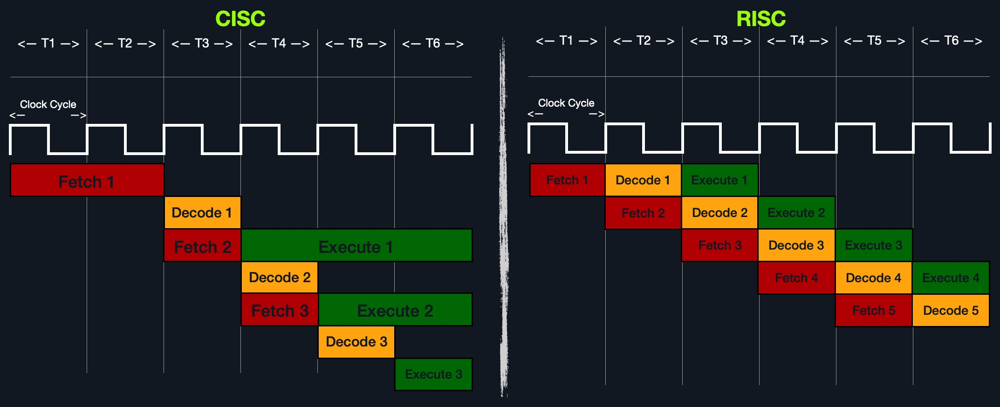

# Architectures de Jeu d’Instructions (Instruction Set Architectures)

***

### <mark style="color:red;">🔠</mark> <mark style="color:red;"></mark><mark style="color:red;">**Architectures de Jeu d’Instructions (Instruction Set Architectures)**</mark>

***

Une <mark style="color:green;">I</mark><mark style="color:green;">**nstruction Set Architecture (ISA)**</mark> spécifie la syntaxe et la sémantique du langage assembleur sur chaque architecture.\
Ce n’est pas seulement une syntaxe différente, mais cela est intégré dans la **conception fondamentale du processeur**, car cela affecte **la manière et l’ordre dans lequel les instructions sont exécutées**, ainsi que leur **niveau de complexité**.

L’ISA se compose principalement des composants suivants :

* **Instructions**
* **Registres**
* **Adresses mémoire**
* **Types de données**

***

| Composant            | Description                                                                                                       | Exemple                                  |
| -------------------- | ----------------------------------------------------------------------------------------------------------------- | ---------------------------------------- |
| **Instructions**     | L’instruction à être traitée dans le format `opcode operand_list`.                                                | `add rax, 1`, `mov rsp, rax`, `push rax` |
| **Registres**        | Utilisés pour stocker des opérandes, des adresses ou des instructions temporairement.                             | `rax`, `rsp`, `rip`                      |
| **Adresses mémoire** | L’adresse dans laquelle des données ou instructions sont stockées. Peut pointer vers la mémoire ou les registres. | `0xffffffffaa8a25ff`, `0x44d0`, `$rax`   |
| **Types de données** | Le type de donnée stockée.                                                                                        | `byte`, `word`, `double word`            |

***

Ce sont les **composants principaux** qui **différencient les différentes ISA** et **langages assembleur**.\
Nous allons aborder **chacun d’entre eux plus en profondeur** dans les sections à venir, et apprendre à utiliser diverses instructions.

***

Il existe <mark style="color:green;">**deux principales Architectures de Jeu d’Instructions**</mark> qui sont largement utilisées :

* <mark style="color:green;">**CISC (Complex Instruction Set Computer)**</mark> – Utilisée dans les processeurs **Intel et AMD** dans la majorité des ordinateurs et serveurs.
* <mark style="color:green;">**RISC (Reduced Instruction Set Computer)**</mark> – Utilisée dans les processeurs **ARM et Apple**, dans la majorité des **smartphones** et certains **ordinateurs portables modernes**.

Voyons maintenant les **avantages et inconvénients** de chacune, ainsi que leurs **principales différences**.

***

### <mark style="color:blue;">🧱</mark> <mark style="color:blue;"></mark><mark style="color:blue;">**CISC**</mark>

L’**architecture CISC** fut l’une des **premières ISA jamais développées**.\
Comme son nom l’indique, l’architecture CISC privilégie l’exécution d’**instructions plus complexes en une seule fois** pour **réduire le nombre total d’instructions**.\
Cela est fait afin de **déléguer le plus possible au CPU** en combinant plusieurs petites instructions en **instructions plus complexes**.

Par exemple, supposons que nous voulons additionner deux registres avec l’instruction :

```asm
add rax, rbx
```

Dans ce cas, un processeur **CISC** peut le faire dans **un seul cycle**\
`Fetch → Decode → Execute → Store`\
Sans avoir à séparer ça en plusieurs instructions (comme récupérer `rax`, puis `rbx`, les additionner, puis stocker dans `rax`), chacune nécessitant son propre cycle d’instruction.

***

<mark style="color:green;">**Deux raisons principales**</mark> <mark style="color:green;"></mark><mark style="color:green;">ont motivé cela :</mark>

1. **Permettre à plus d’instructions d’être exécutées à la fois**, en concevant le processeur pour faire tourner des instructions avancées directement dans son cœur.
2. Dans le passé, **la mémoire et les transistors étaient limités**, donc il valait mieux **écrire des programmes plus courts** en combinant plusieurs instructions en une seule.

***

Cependant, pour permettre au processeur d’exécuter ces instructions complexes, **la conception du processeur devient plus compliquée**,\
car il est conçu pour exécuter un grand nombre d’instructions complexes différentes,\
**chacune ayant sa propre unité d’exécution**.

***

En outre, même si **chaque instruction complexe ne prend qu’un seul cycle d’instruction**,\
comme les instructions sont **plus complexes**, **chaque cycle d’instruction prend plus de cycles d’horloge**.

➡️ Cela conduit à **plus de consommation d’énergie** et **plus de chaleur** pour exécuter chaque instruction.

***

### <mark style="color:blue;">🧩</mark> <mark style="color:blue;"></mark><mark style="color:blue;">**RISC**</mark>

L’**architecture RISC** privilégie la **décomposition des instructions en plus petites instructions**,\
et donc le **CPU est conçu pour ne gérer que des instructions simples**.\
Cela a pour but de **transférer l’optimisation vers le logiciel**, en écrivant du code assembleur **le plus optimisé possible**.

***

Par exemple, l’instruction suivante sur un processeur **RISC** :

```asm
add r1, r2, r3
```

Serait décomposée comme suit :

* Récupérer `r2`
* Récupérer `r3`
* Les additionner
* Stocker le résultat dans `r1`

**Chaque étape** ci-dessus **prend un cycle complet** :\
`Fetch → Decode → Execute → Store`

Cela mène donc à un **plus grand nombre total d’instructions par programme**,\
et donc un **code assembleur plus long**.

***

En ne prenant **pas en charge les types variés d’instructions complexes**,\
les processeurs **RISC** ne prennent en charge **qu’un nombre limité d’instructions** (\~200),\
comparé aux processeurs **CISC** (\~1500).

➡️ Donc, pour exécuter une instruction complexe, cela doit être **fait par une combinaison d’instructions simples en assembleur**.

***

> On dit que l’on peut construire un **ordinateur généraliste avec un processeur ne supportant qu’une seule instruction** !\
> Cela signifie que l’on peut créer des **instructions très complexes en utilisant seulement des sous-instructions**.\
> Peux-tu imaginer **comment cela serait possible** ?

***

Par ailleurs, **un avantage à découper les instructions complexes en petites instructions** est que\
**toutes les instructions ont la même longueur** : soit **32 bits** soit **64 bits**.

➡️ Cela permet de **concevoir la vitesse d’horloge du CPU autour de cette longueur d’instruction**,\
de sorte que **chaque étape du cycle d’instruction prenne exactement un cycle machine.**

***

<mark style="color:green;">**Le diagramme ci-dessous montre comment :**</mark>

* Les instructions **CISC** prennent une **quantité variable de cycles d’horloge**,
* Tandis que les instructions **RISC** prennent une **quantité fixe**,\
  avec **chevauchement des étapes** grâce au **pipeline**.

<figure><figcaption></figcaption></figure>

***

➡️ Le fait que chaque étape d’une instruction **s’exécute en un seul cycle**,\
et que seules des instructions simples soient utilisées,\
fait que **les processeurs RISC consomment beaucoup moins d’énergie** que les processeurs CISC.

➡️ Cela les rend **idéaux pour les appareils fonctionnant sur batterie**,\
comme les **smartphones** et **ordinateurs portables**.

***

### <mark style="color:blue;">⚔️</mark> <mark style="color:blue;"></mark><mark style="color:blue;">**Comparaison CISC vs RISC**</mark>

<table data-header-hidden data-full-width="true"><thead><tr><th></th><th></th><th></th></tr></thead><tbody><tr><td>Domaine</td><td><strong>CISC</strong></td><td><strong>RISC</strong></td></tr><tr><td><strong>Complexité</strong></td><td>Privilégie les instructions complexes</td><td>Privilégie les instructions simples</td></tr><tr><td><strong>Longueur des instructions</strong></td><td>Longues – longueur variable (multiples de 8 bits)</td><td>Courtes – longueur fixe (32 bits / 64 bits)</td></tr><tr><td><strong>Instructions totales</strong></td><td>Moins d’instructions – code plus court</td><td>Plus d’instructions – code plus long</td></tr><tr><td><strong>Optimisation</strong></td><td>Repose sur l’optimisation matérielle (CPU)</td><td>Repose sur l’optimisation logicielle (ASM)</td></tr><tr><td><strong>Temps d’exécution</strong></td><td>Variable – plusieurs cycles d’horloge</td><td>Fixe – un seul cycle d’horloge</td></tr><tr><td><strong>Instructions supportées</strong></td><td>Beaucoup (~1500)</td><td>Moins (~200)</td></tr><tr><td><strong>Consommation énergétique</strong></td><td>Élevée</td><td>Très faible</td></tr><tr><td><strong>Exemples</strong></td><td>Intel, AMD</td><td>ARM, Apple</td></tr></tbody></table>

***

Dans le passé, avoir un **code assembleur plus long** à cause du **plus grand nombre d’instructions** était un gros inconvénient pour RISC,\
en raison des **ressources limitées en mémoire et stockage**.

Mais aujourd’hui, **cela n’est plus vraiment un problème**,\
car la **mémoire et le stockage sont bien moins chers et limités** qu’auparavant.

***

De plus, avec de **nouveaux assembleurs et compilateurs** capables d’écrire du code extrêmement optimisé,\
les processeurs **RISC deviennent plus rapides** que les **CISC**,\
même dans l’exécution d’**applications lourdes**,\
tout en **consommant beaucoup moins d’énergie**.

***

👉 Tout cela rend les **processeurs RISC de plus en plus courants** ces dernières années.\
Il est probable que **RISC devienne l’architecture dominante** dans les années à venir.

Mais **actuellement**, la **grande majorité des ordinateurs et serveurs que nous allons pentester**\
fonctionnent sur des **processeurs Intel/AMD** avec l’architecture **CISC**.

***
