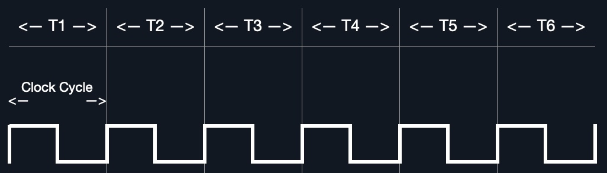
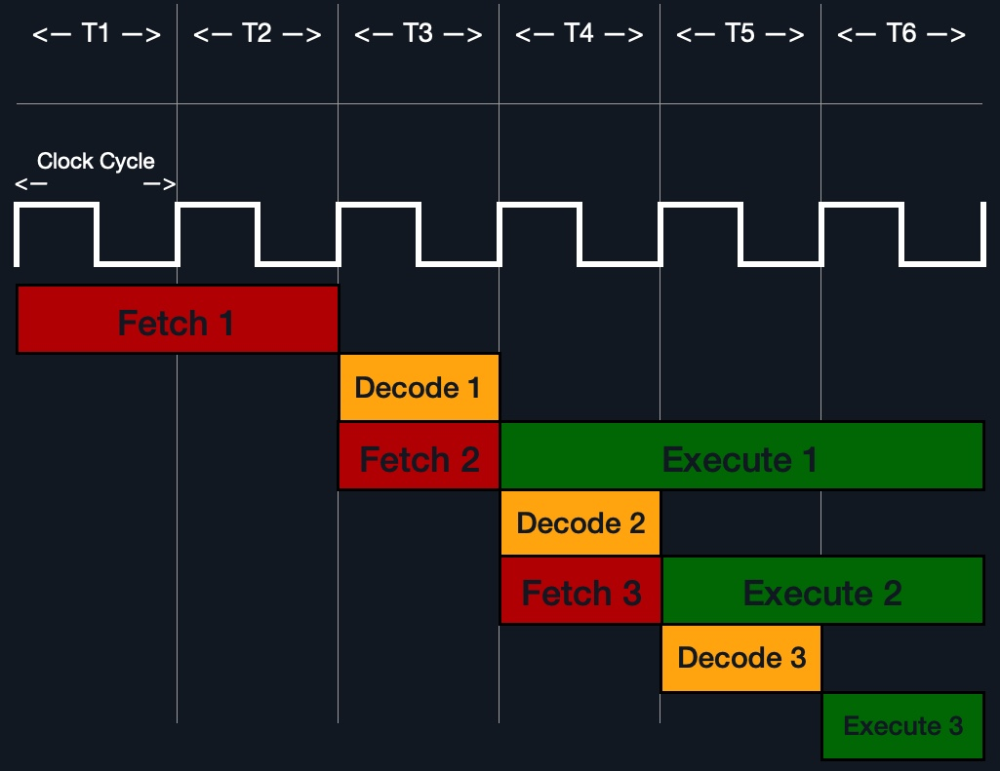

# CPU Architecture

***

### <mark style="color:red;">🖥️</mark> <mark style="color:red;"></mark><mark style="color:red;">**Architecture du CPU**</mark>

<mark style="color:green;">**Le processeur central (CPU)**</mark> est l’unité principale de traitement dans un ordinateur.&#x20;

Le **CPU contient à la fois l**<mark style="color:green;">**’Unité de Contrôle (CU)**</mark>, qui est responsable du déplacement et du contrôle des données, et l’<mark style="color:green;">**Unité Arithmétique/Logique (ALU)**</mark>, qui est responsable d’exécuter divers calculs arithmétiques et logiques comme demandé par un programme à travers les instructions en assembleur.

La manière dont, et à quel point efficacement, un CPU traite ses instructions dépend de son <mark style="color:green;">**Architecture de Jeu d’Instructions (ISA)**</mark>. Il existe plusieurs **ISA** dans l’industrie, chacun ayant sa propre manière de traiter les données.&#x20;

<mark style="color:green;">**L’architecture RISC**</mark> est basée sur le traitement d’instructions plus simples, ce qui prend plus de cycles, mais chaque cycle est plus court et consomme moins d’énergie.&#x20;

<mark style="color:green;">**L’architecture CISC**</mark> est basée sur moins d’instructions, plus complexes, qui peuvent terminer les instructions demandées en moins de cycles, mais chaque instruction prend plus de temps et d’énergie à être traitée.

***

### <mark style="color:blue;">🕒</mark> <mark style="color:blue;"></mark><mark style="color:blue;">**Vitesse d’horloge & Cycle d’horloge**</mark>

Chaque CPU possède une **vitesse d’horloge** qui indique sa vitesse globale.&#x20;

Chaque **tick** de l’horloge exécute un **cycle d’horloge** qui traite une instruction de base, comme récupérer une adresse ou stocker une adresse. Ceci est spécifiquement effectué par la **CU ou l’ALU**.

La fréquence à laquelle les cycles se produisent est comptée en **cycles par seconde (Hertz)**. Si un CPU a une vitesse de **3.0 GHz**, il peut exécuter **3 milliards de cycles chaque seconde** (par cœur).

<figure><figcaption></figcaption></figure>

_(Diagramme d’un cycle d’horloge avec six phases étiquetées T1 à T6, montrant un motif d’onde répété.)_

Les **processeurs modernes** ont une conception multi-cœurs, leur permettant d’avoir plusieurs cycles en même temps.

***

### <mark style="color:red;">🔁</mark> <mark style="color:red;"></mark><mark style="color:red;">**Cycle d’instruction**</mark>

Un **cycle d’instruction** est le cycle nécessaire au CPU pour traiter une seule instruction machine.

_(Diagramme du cycle CPU montrant les étapes : Fetch, Decode, Execute, et Store, dans un flux circulaire autour d’une icône de CPU.)_

<figure><figcaption></figcaption></figure>

Un cycle d’instruction consiste en **quatre étapes** :

<table data-full-width="true"><thead><tr><th>Instruction</th><th>Description</th></tr></thead><tbody><tr><td>1. <strong>Fetch</strong></td><td>Récupère l’adresse de l’instruction suivante depuis le <strong>Registre d’Adresse d’Instruction (IAR)</strong>, qui lui indique où se trouve l’instruction suivante.</td></tr><tr><td>2. <strong>Decode</strong></td><td>Récupère l’instruction depuis le IAR, et la décode depuis le binaire pour voir ce qui doit être exécuté.</td></tr><tr><td>3. <strong>Execute</strong></td><td>Récupère les opérandes de l’instruction depuis les registres/la mémoire, et traite l’instruction dans l’ALU ou CU.</td></tr><tr><td>4. <strong>Store</strong></td><td>Stocke la nouvelle valeur dans l’opérande de destination.</td></tr></tbody></table>

Toutes les étapes dans le cycle d’instruction sont effectuées par l’**Unité de Contrôle**, sauf lorsque des instructions arithmétiques doivent être exécutées (`add`, `sub`, etc.), lesquelles sont exécutées par l’**ALU**.

Chaque cycle d’instruction prend **plusieurs cycles d’horloge** pour s’achever, selon l’architecture du CPU et la complexité de l’instruction. Une fois qu’un **cycle d’instruction** unique est terminé, la **CU passe à l’instruction suivante** et exécute le même cycle dessus, et ainsi de suite.

_(Diagramme d’un cycle d’horloge avec six phases, T1 à T6. Les étapes incluent Fetch en rouge, Decode en orange, et Execute en vert, alignées avec le motif d’onde.)_

<figure><figcaption></figcaption></figure>

***

### <mark style="color:blue;">💡</mark> <mark style="color:blue;"></mark><mark style="color:blue;">**Exemple : instruction assembleur**</mark>

Par exemple, si nous devions exécuter l’instruction assembleur suivante :

```asm
add rax, 1
```

Elle passerait par un **cycle d’instruction** :

1. Récupérer (Fetch) l’instruction depuis le registre `rip` : `48 83 C0 01` (en binaire).
2. Décoder `48 83 C0 01` pour savoir qu’il faut effectuer une addition de 1 à la valeur contenue dans `rax`.
3. Récupérer la valeur actuelle de `rax` (par la CU), y ajouter 1 (par l’ALU).
4. Stocker la nouvelle valeur dans `rax`.

***

Dans le passé, les processeurs **exécutaient les instructions de manière séquentielle**, ils devaient donc attendre qu’une instruction se termine pour commencer la suivante.\
À l’inverse, les processeurs modernes peuvent **traiter plusieurs instructions en parallèle** en ayant plusieurs cycles d’instruction/cycles d’horloge **qui tournent en même temps**.\
Cela est rendu possible grâce à une conception <mark style="color:orange;">**multi-thread et multi-cœur**</mark><mark style="color:orange;">.</mark>

_(Diagramme d’un cycle d’horloge avec six phases, T1 à T6. Les étapes incluent Fetch 1, Decode 1, Execute 1, Fetch 2, Decode 2, Execute 2, etc., alignées avec le motif d’onde.)_

<figure><figcaption></figcaption></figure>

***

### <mark style="color:red;">🧬</mark> <mark style="color:red;"></mark><mark style="color:red;">**Spécificité selon le processeur**</mark>

Comme mentionné précédemment, chaque processeur comprend un **ensemble différent d’instructions**.

Par exemple :

* Un processeur Intel basé sur l’**architecture x86 64 bits** peut interpréter le code machine `4883C001` comme :

```asm
add rax, 1
```

* Tandis qu’un processeur **ARM** traduit le **même code machine** comme l’instruction :

```asm
biceq r8, r0, r8, asr #6
```

Comme nous pouvons le voir, le **même code machine** effectue une **instruction complètement différente** selon le processeur.

***

Cela est dû au fait que chaque type de processeur possède une **architecture assembleur bas niveau différente**, appelée **Architecture de Jeu d’Instructions (ISA)**.

Par exemple, l’instruction `add rax, 1` vue plus haut est pour les processeurs **Intel x86 64 bits**.

La même instruction écrite pour l’assembleur ARM serait :

```asm
add r1, r1, 1
```

***

Il est important de comprendre que **chaque processeur** a son propre ensemble d’instructions **et le code machine correspondant**.

De plus, une seule **ISA** peut avoir **plusieurs syntaxes d’interprétation** pour le même code assembleur.

Par exemple, l’instruction `add rax, 1` est basée sur l’architecture x86, **prise en charge** par plusieurs processeurs comme **Intel**, **AMD**, et les anciens processeurs **AT\&T**.

L’instruction est écrite :

* En **syntaxe Intel** : `add rax, 1`
* En **syntaxe AT\&T** : `addb $0x1,%rax`

***

Comme nous pouvons le voir, **même si** nous pouvons dire que les deux instructions sont similaires et font la même chose, leur **syntaxe est différente**, et **les positions des opérandes source et destination sont également inversées**.

Cependant, **les deux codes sont assemblés** en le **même code machine** et **exécutent la même instruction**.

***

Donc, **chaque type de processeur** a son **propre ISA**, et **chaque ISA** peut être **représentée par plusieurs formats de syntaxe**.

***

### <mark style="color:red;">🖥️ Ce module se concentre principalement sur :</mark>

* Le **langage assembleur Intel x86 64 bits** (aussi connu sous le nom de **x86\_64** et **AMD64**)
* Car **la majorité des ordinateurs et serveurs modernes** tournent sur cette architecture.
* Nous utiliserons **la syntaxe Intel**.

***

#### <mark style="color:green;">🧪 Pour vérifier l’architecture x86\_64 sur un système Linux :</mark>

```bash
lscpu
```

Exemple de sortie :

```
Architecture:                    x86_64
Modes opératoires du CPU :      32-bit, 64-bit
Ordre des octets :              Little Endian
```

***

On peut aussi utiliser cette commande :

```bash
uname -m
```

Cela affiche aussi l’architecture du processeur.

***

Dans la prochaine section, nous parlerons des deux **architectures ISA les plus communes** :

* **CISC**
* **RISC**

***

<mark style="color:green;">**🎯 LA DIFFÉRENCE CLÉ :**</mark>

<table data-full-width="true"><thead><tr><th>Question</th><th>RISC</th><th>CISC</th></tr></thead><tbody><tr><td>Qui découpe les tâches complexes en instructions simples ?</td><td>Le <strong>programmeur</strong> ou le <strong>compilateur</strong></td><td>Le <strong>processeur lui-même</strong>, à l’exécution</td></tr><tr><td>Combien de travail le processeur fait pour "comprendre" une instruction ?</td><td>Très peu (c’est simple)</td><td>Beaucoup (il doit analyser et "découper" l’instruction)</td></tr><tr><td>Le matériel du CPU est-il plus simple ?</td><td>✅ Oui</td><td>❌ Non, plus complexe</td></tr></tbody></table>


***

**🔧 EXEMPLE RÉEL**

Imaginons que tu veux faire :

`A = B + C`

#### En **RISC** (style ARM) :

Tu écris **4 instructions simples** :

```asm
LOAD R1, B      ; charge B en R1
LOAD R2, C      ; charge C en R2
ADD R3, R1, R2  ; R3 = R1 + R2
STORE A, R3     ; stocke R3 dans A
```

🟢 C’est **clair**, **rapide à exécuter**, et **le processeur comprend vite**.

***

#### En **CISC** (style x86) :

Tu écris **1 instruction complexe** :

```asm
ADD A, B, C  ; additionne B et C et met le résultat dans A (en mémoire)
```

🔴 Le processeur doit :

* Lire cette instruction
* La **décoder** (c’est compliqué)
* La **transformer en micro-opérations internes**\
  comme :
  * LOAD B
  * LOAD C
  * ADD
  * STORE A

C’est exactement ce que tu faisais _toi-même_ en RISC.\
Mais ici, c’est le **processeur** qui fait le découpage — **en temps réel**.

***

**✅ Résumé final**

* RISC = **instructions simples** = pas de surprises, rapides, tu fais les étapes toi-même.
* CISC = **instructions complexes** = le CPU doit réfléchir plus, mais tu écris moins de code.
* Le **travail est le même**, mais **le partage du travail est différent** :
  * En **RISC**, c’est **le compilateur/programmeur** qui découpe.
  * En **CISC**, c’est **le processeur** qui le fait (plus de boulot à chaque instruction).

***

