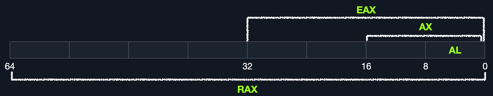

# Registres, Adresses et Types de Données

***

### <mark style="color:blue;">**Registres**</mark>

Comme mentionné précédemment, chaque cœur de CPU possède un ensemble de **registres**.\
<mark style="color:green;">**Les registres sont les composants les plus rapides dans un ordinateur, car ils sont construits à l’intérieur du cœur du CPU.**</mark>

\
Cependant, les registres sont **très limités en taille** et ne peuvent contenir que quelques octets de données à la fois.

Il existe **de nombreux registres** dans l’architecture **x86**,mais nous allons seulement nous concentrer sur ceux qui sont **nécessaires pour apprendre l’assembleur de base**, et **essentiels pour l’exploitation binaire** à l’avenir.

***

Il existe **deux types principaux de registres** sur lesquels nous allons nous concentrer :\
<mark style="color:orange;">**les registres de données**</mark> et <mark style="color:orange;">**les registres de pointeurs**</mark>.

<table data-header-hidden data-full-width="true"><thead><tr><th></th><th></th></tr></thead><tbody><tr><td><strong>Registres de données</strong></td><td><strong>Registres de pointeurs</strong></td></tr><tr><td><code>rax</code></td><td><code>rbp</code></td></tr><tr><td><code>rbx</code></td><td><code>rsp</code></td></tr><tr><td><code>rcx</code></td><td><code>rip</code></td></tr><tr><td><code>rdx</code></td><td></td></tr><tr><td><code>r8</code></td><td></td></tr><tr><td><code>r9</code></td><td></td></tr><tr><td><code>r10</code></td><td></td></tr></tbody></table>

***

* **Registres de données** <mark style="color:green;">– sont généralement utilisés pour</mark> <mark style="color:green;"></mark><mark style="color:green;">**stocker les arguments d’instruction ou de syscall**</mark><mark style="color:green;">.</mark>\
  Les registres principaux de données sont : `rax`, `rbx`, `rcx` et `rdx`.\
  Les registres `rdi` et `rsi` existent aussi, et sont souvent utilisés comme **opérandes de destination et source**.\
  Ensuite, nous avons des **registres de données secondaires**, utilisés lorsque tous les registres principaux sont déjà utilisés : `r8`, `r9`, et `r10`.
* <mark style="color:green;">**Registres de pointeurs**</mark> – sont utilisés pour **stocker des adresses importantes spécifiques** :
  * Le **Base Stack Pointer** `rbp`, qui pointe vers le **début de la pile (Stack)**.
  * Le **Current Stack Pointer** `rsp`, qui pointe vers la **position actuelle dans la pile** (le sommet de la Stack).
  * Le **Instruction Pointer** `rip`, qui contient **l’adresse de la prochaine instruction**.

***

### <mark style="color:blue;">**Sous-registres**</mark>

Chaque **registre 64 bits** peut être divisé en **sous-registres plus petits** contenant les bits inférieurs :

* sur **1 octet (8 bits)**,
* **2 octets (16 bits)**,
* **4 octets (32 bits)**.

Chaque sous-registre peut être utilisé et accédé indépendamment.\
Donc, **on n’a pas besoin d’utiliser les 64 bits complets** si on a juste besoin d’un petit morceau.

<figure><figcaption></figcaption></figure>

***

**Diagramme d’un registre 64 bits montrant les subdivisions** :

* `RAX (64 bits)`,
* `EAX (32 bits)`,
* `AX (16 bits)`,
* `AL (8 bits)`.

***

#### Les sous-registres peuvent être accédés comme :

<table data-full-width="true"><thead><tr><th>Taille en bits</th><th>Taille en octets</th><th>Nom</th><th>Exemple</th></tr></thead><tbody><tr><td>16 bits</td><td>2 octets</td><td>nom de base</td><td><code>ax</code></td></tr><tr><td>8 bits</td><td>1 octet</td><td>nom + <code>l</code></td><td><code>al</code></td></tr><tr><td>32 bits</td><td>4 octets</td><td><code>e</code> + nom</td><td><code>eax</code></td></tr><tr><td>64 bits</td><td>8 octets</td><td><code>r</code> + nom</td><td><code>rax</code></td></tr></tbody></table>

***

Exemple avec `bx` :

* le 16-bit est `bx`,
* le 8-bit est `bl`,
* le 32-bit est `ebx`,
* le 64-bit est `rbx`.

Même logique pour les registres pointeurs :\
Exemple avec `bp` :

* le 16-bit est `bp`,
* le 8-bit est `bpl`,
* le 32-bit est `ebp`,
* le 64-bit est `rbp`.

***

#### <mark style="color:green;">Voici les noms des sous-registres pour les registres essentiels en x86\_64 :</mark>

<table data-full-width="true"><thead><tr><th>Description</th><th>Registre 64-bit</th><th>32-bit</th><th>16-bit</th><th>8-bit</th></tr></thead><tbody><tr><td>Registres de données / arguments</td><td></td><td></td><td></td><td></td></tr><tr><td>Numéro de syscall / valeur de retour</td><td><code>rax</code></td><td><code>eax</code></td><td><code>ax</code></td><td><code>al</code></td></tr><tr><td>Sauvegarde par le sous-programme</td><td><code>rbx</code></td><td><code>ebx</code></td><td><code>bx</code></td><td><code>bl</code></td></tr><tr><td>1er arg – Opérande destination</td><td><code>rdi</code></td><td><code>edi</code></td><td><code>di</code></td><td><code>dil</code></td></tr><tr><td>2e arg – Opérande source</td><td><code>rsi</code></td><td><code>esi</code></td><td><code>si</code></td><td><code>sil</code></td></tr><tr><td>3e argument</td><td><code>rdx</code></td><td><code>edx</code></td><td><code>dx</code></td><td><code>dl</code></td></tr><tr><td>4e arg – Compteur de boucle</td><td><code>rcx</code></td><td><code>ecx</code></td><td><code>cx</code></td><td><code>cl</code></td></tr><tr><td>5e argument</td><td><code>r8</code></td><td><code>r8d</code></td><td><code>r8w</code></td><td><code>r8b</code></td></tr><tr><td>6e argument</td><td><code>r9</code></td><td><code>r9d</code></td><td><code>r9w</code></td><td><code>r9b</code></td></tr><tr><td>Registres pointeurs</td><td></td><td></td><td></td><td></td></tr><tr><td>Base de la pile (Stack)</td><td><code>rbp</code></td><td><code>ebp</code></td><td><code>bp</code></td><td><code>bpl</code></td></tr><tr><td>Sommet / position actuelle de la pile</td><td><code>rsp</code></td><td><code>esp</code></td><td><code>sp</code></td><td><code>spl</code></td></tr><tr><td>Instruction Pointer (pour <code>call</code> uniquement)</td><td><code>rip</code></td><td><code>eip</code></td><td><code>ip</code></td><td><code>ipl</code></td></tr></tbody></table>

***

Tout au long du module, nous verrons **comment utiliser chacun de ces registres**.


Il existe **d’autres registres**, mais **nous ne les verrons pas ici**, car **non nécessaires pour l’assembleur de base**.\
Par exemple, il y a le registre **`RFLAGS`**, qui maintient **des indicateurs utilisés par le CPU**, comme le **flag zéro `ZF`** utilisé pour les instructions conditionnelles.


***

### <mark style="color:blue;">**Adresses Mémoire**</mark>

Comme mentionné précédemment, les **processeurs x86 64 bits** ont des adresses **sur 64 bits** allant de `0x0` à `0xffffffffffffffff`.\
Donc, on s’attend à ce que les adresses soient dans cette plage.

Cependant, la RAM est **segmentée en plusieurs régions**, comme :

* la **pile (Stack)**,
* le **tas (Heap)**,
* d’autres **zones spécifiques au programme ou au noyau**.

Chaque région a des **permissions spécifiques** de **lecture, écriture, exécution**,\
qui définissent si on peut lire, écrire ou appeler une adresse à cet endroit.

***

Lorsqu’une instruction passe dans le **cycle d’instruction**, la **première étape** est de **récupérer (fetch)** l’instruction **depuis l’adresse où elle se trouve**.

Il existe plusieurs **types d’adressage** (addressing modes) dans x86 :

<table data-full-width="true"><thead><tr><th>Mode d’adressage</th><th>Description</th><th>Exemple</th></tr></thead><tbody><tr><td><strong>Immédiat</strong></td><td>La valeur est fournie dans l’instruction</td><td><code>add 2</code></td></tr><tr><td><strong>Registre</strong></td><td>Le nom du registre contenant la valeur est donné</td><td><code>add rax</code></td></tr><tr><td><strong>Direct</strong></td><td>L’adresse complète est donnée</td><td><code>call 0xffffffffaa8a25ff</code></td></tr><tr><td><strong>Indirect</strong></td><td>Un pointeur de référence est donné</td><td><code>call 0x44d000</code> ou <code>[rax]</code></td></tr><tr><td><strong>Pile (Stack)</strong></td><td>L’adresse est au sommet de la pile</td><td><code>add rsp</code></td></tr></tbody></table>

***

### <mark style="color:blue;">**Endianness des adresses**</mark>

L’**Endianness** est **l’ordre des octets** dans lequel ils sont **stockés ou récupérés depuis la mémoire**.\
Il y a **deux types d’endian** :

* **Little-Endian**
* **Big-Endian**
* En **Little-Endian**, le **plus petit octet** est stocké en premier (de **droite à gauche**).
* En **Big-Endian**, le **plus grand octet** est stocké en premier (**gauche à droite**).

***

**Exemple :**

Adresse à stocker : `0x0011223344556677`

*   Sur un **processeur little-endian** :

    * 0x77 → stocké en **adresse 0**
    * ensuite 0x66, 0x55, ..., jusqu’à 0x00

    Le tout devient :\
    `0x7766554433221100` (ordre inversé)

Quand on lit, le CPU lit aussi en little-endian, donc on **retrouve la valeur correcte**.

***

Autre exemple : valeur binaire.

Supposons qu’on ait un **entier 2 octets** : `426`\
Sa forme binaire : `00000001 10101010`

* Si on inverse : `10101010 00000001`\
  → Sa valeur devient **43521** (pas la même !)
* Les **processeurs big-endian** stockent : `00000001 10101010` (gauche → droite)
* Les **processeurs little-endian** : `10101010 00000001` (droite → gauche)

➡️ Il est **crucial de respecter l’endian utilisé**, sinon **on récupère une mauvaise valeur**.

***

#### Exemple visuel&#x20;

<table data-header-hidden data-full-width="true"><thead><tr><th></th><th></th><th></th><th></th><th></th><th></th><th></th><th></th><th></th><th></th></tr></thead><tbody><tr><td><strong>Address</strong></td><td><strong>0</strong></td><td><strong>1</strong></td><td><strong>2</strong></td><td><strong>3</strong></td><td><strong>4</strong></td><td><strong>5</strong></td><td><strong>6</strong></td><td><strong>7</strong></td><td><strong>Address Value</strong></td></tr><tr><td><strong>Little Endian</strong></td><td>77</td><td>66</td><td>55</td><td>44</td><td>33</td><td>22</td><td>11</td><td>00</td><td>0x7766775566445533442233112200</td></tr><tr><td><strong>Big Endian</strong></td><td>00</td><td>11</td><td>22</td><td>33</td><td>44</td><td>55</td><td>66</td><td>77</td><td>0x0022113322443355446655776677</td></tr></tbody></table>

Adresse : `0x0011223344556677`

***

➡️ Une adresse **écrite en little ou big endian** pointe vers **des emplacements différents**, car l’interprétation change.

***

Dans ce module, **nous utiliserons toujours le little-endian**,car il est utilisé avec **Intel/AMD x86** sur la **plupart des OS modernes**.Donc, **le shellcode est toujours représenté de droite à gauche**.

***

Ce qu’il faut **retenir absolument**  **nos octets sont stockés en mémoire de droite à gauche**.

➡️ Donc si on pousse une adresse ou une chaîne de caractères, **on la pousse à l’envers**.

Exemple avec `"Hello"` → on pousse les octets dans cet ordre :\
`o`, `l`, `l`, `e`, `H`.

***

Cela peut sembler **contre-intuitif**,car nous avons **l’habitude de lire de gauche à droite**, mais cela offre **des avantages importants** :

* Accès rapide aux sous-registres
* Calculs arithmétiques en bon ordre (droite → gauche)

***

### <mark style="color:blue;">**Types de Données**</mark>

Enfin, l’architecture x86 supporte **différentes tailles de données**,utilisables avec diverses instructions.

Voici les **types les plus courants** :

<table data-full-width="true"><thead><tr><th>Composant</th><th>Longueur</th><th>Exemple</th></tr></thead><tbody><tr><td><strong>byte</strong></td><td>8 bits</td><td><code>0xab</code></td></tr><tr><td><strong>word</strong></td><td>16 bits – 2 octets</td><td><code>0xabcd</code></td></tr><tr><td><strong>dword</strong></td><td>32 bits – 4 octets</td><td><code>0xabcdef12</code></td></tr><tr><td><strong>qword</strong></td><td>64 bits – 8 octets</td><td><code>0xabcdef1234567890</code></td></tr></tbody></table>

***


Quand on utilise une **variable avec un type**, ou une instruction avec des opérandes,\
**ils doivent être de la même taille**.

Par exemple, on ne peut pas utiliser une **variable de type byte** avec **`rax`** (qui fait 8 octets).\
Il faut utiliser `al` (1 octet).


***

<table data-full-width="true"><thead><tr><th>Sous-registre</th><th>Type de donnée</th></tr></thead><tbody><tr><td><code>al</code></td><td><code>byte</code></td></tr><tr><td><code>ax</code></td><td><code>word</code></td></tr><tr><td><code>eax</code></td><td><code>dword</code></td></tr><tr><td><code>rax</code></td><td><code>qword</code></td></tr></tbody></table>

***

***
