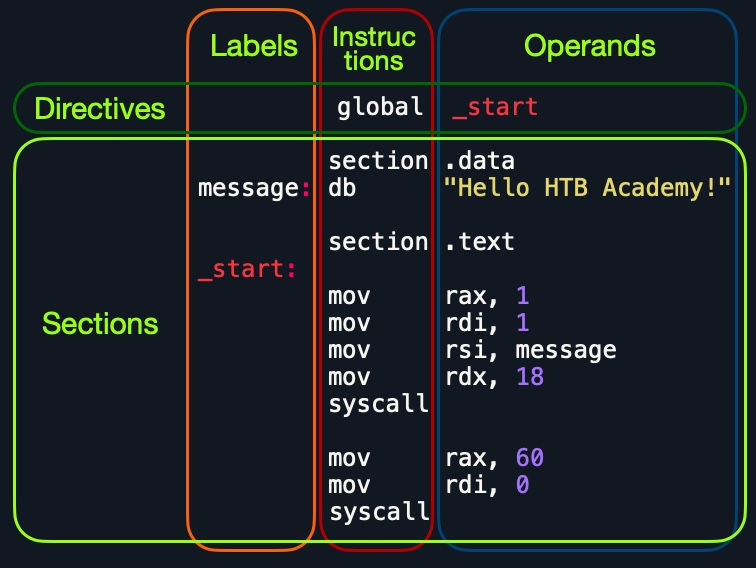

# Structure d’un fichier Assembleur

***

#### <mark style="color:green;">💾</mark> <mark style="color:green;"></mark><mark style="color:green;">**Code (nasm)**</mark>

```nasm
global  _start

section .data
message: db      "Hello HTB Academy!"

section .text
_start:
    mov     rax, 1
    mov     rdi, 1
    mov     rsi, message
    mov     rdx, 18
    syscall

    mov     rax, 60
    mov     rdi, 0
    syscall
```

***

### <mark style="color:blue;">🧱 Structure d’un fichier assembleur</mark>

<figure><figcaption></figcaption></figure>

***

***

En regardant les **parties verticales** du code, chaque ligne peut contenir **trois éléments** :

#### 1. **Labels**

#### 2. **Instructions**

#### 3. **Opérandes**

***

En plus de cela, nous pouvons **définir une étiquette (label)** à chaque ligne.Chaque étiquette peut être **appelée** par des instructions ou des directives.

***

Ensuite, si nous **regardons le code ligne par ligne**, on remarque qu’il y a **trois parties principales** :

| Section         | Description                                                                                               |
| --------------- | --------------------------------------------------------------------------------------------------------- |
| `global _start` | C’est une **directive** qui dit au code de commencer l’exécution à l’étiquette `_start` définie plus bas. |
| `section .data` | C’est la **section de données**, qui contient toutes les **variables**.                                   |
| `section .text` | C’est la **section de code**, contenant toutes les **instructions** à exécuter.                           |

Les sections `.data` et `.text` font référence aux **segments mémoire de données et de texte**,\
où ces instructions seront stockées.

***

### <mark style="color:blue;">🧾 Directives</mark>

Un fichier assembleur est **basé sur des lignes** : le fichier est traité **ligne par ligne**, en exécutant **chaque instruction**.

On voit à la première ligne une directive :

```nasm
global _start
```

Cela indique à la machine de **commencer à traiter les instructions** après l’étiquette `_start`.

Donc, la machine **saute à l’étiquette `_start`** et commence à **exécuter les instructions là-bas**, ce qui **affichera le message à l’écran**.Ce sera **vu plus en détail** dans la section **Control Instructions**.

***

### <mark style="color:blue;">📦 Variables</mark>

Ensuite, on a la section :

```nasm
section .data
```

Cette **section contient les variables**. Elle nous permet de **définir des variables** et de **les réutiliser** sans devoir **les réécrire plusieurs fois**.

***

Quand on exécute le programme, **toutes les variables sont chargées en mémoire** dans le **segment de données**.

***

On verra plus tard dans le module que, au moment où l’on commence à exécuter les instructions à l’étiquette `_start`,\
**toutes nos variables sont déjà chargées** en mémoire.

***

On peut **définir des variables** avec :

* `db` (listes d’octets)
* `dw` (listes de mots)
* `dd` (listes de nombres), etc.

On peut aussi **étiqueter** nos variables pour les **référencer plus tard**.

***

#### Exemples :

| Instruction                         | Description                                           |
| ----------------------------------- | ----------------------------------------------------- |
| `db 0x0a`                           | Définit l’octet `0x0a`, qui est un saut de ligne.     |
| `message db 0x41, 0x42, 0x43, 0x0a` | Définit l’étiquette `message` → correspond à `ABC\n`. |
| `message db "Hello World!", 0x0a`   | Définit `message` → correspond à `Hello World!\n`.    |

***

On peut aussi utiliser l’instruction `equ` avec le symbole `$` pour **évaluer une expression**,comme la **longueur d’une chaîne**.

Les étiquettes définies avec `equ` sont des **constantes** : **elles ne peuvent pas être changées plus tard**.

***

#### Exemple :

```nasm
section .data
    message db "Hello World!", 0x0a
    length  equ $-message
```

📌 **Note** : le symbole `$` indique la **position actuelle** dans la section.Ici, comme `message` est au début de la section `.data`,la valeur de `$` **correspond à la longueur de la chaîne**.

Dans ce module, **on utilise `$` uniquement pour calculer la longueur des chaînes**,comme montré ci-dessus.

***

### <mark style="color:blue;">💻 Code</mark>

La deuxième (et la plus importante) section est :

```nasm
section .text
```

Cette section contient **toutes les instructions assembleur** et les charge dans le **segment texte en mémoire**.

Une fois que tout est chargé dans `.text`, le **processeur exécute les instructions une par une**.

***

La convention par défaut est de **commencer la section `.text`** avec l’étiquette `_start`.\
Et comme on a la directive `global _start`, cela signifie que c’est là que **l’exécution commence**.

***

On peut aussi définir **d’autres étiquettes** dans `.text` pour faire des **boucles** ou des **fonctions**.

***

🧠 Le segment `.text` est **en lecture seule** → on ne peut **pas y écrire de variables**.

Le segment `.data` lui est **lecture/écriture**,donc c’est là qu’on **écrit les variables**.

Mais **le segment `.data` n’est pas exécutable** : On ne peut **pas y écrire du code à exécuter**.

➡️ Cette **séparation mémoire** est une **protection de sécurité**, contre les attaques comme **les buffer overflows** ou **l’exploitation binaire**.

***

💡 **Astuce** :\
On peut ajouter des **commentaires** dans le code avec un `;` :

```nasm
mov rax, 1   ; appel au syscall write
```

Les commentaires servent à **expliquer chaque ligne**,\
et t’aident beaucoup quand tu reviens plus tard lire ton code.

***


RESUME

* `global` → indique le point d’entrée
* `.data` → variables
* `.text` → code
* `db`, `dw` → déclarations de données
* `_start:` → étiquette où l’exécution commence
* `mov`, `syscall` → instructions
* `;` → commentaire


***
